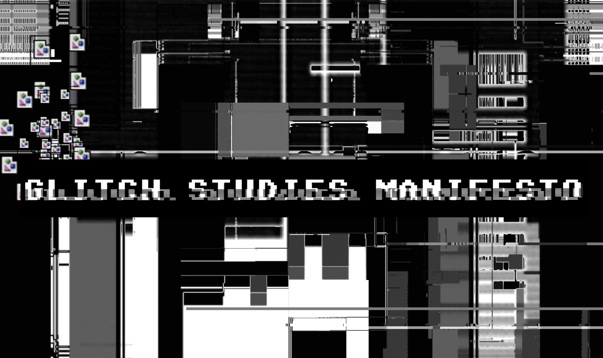
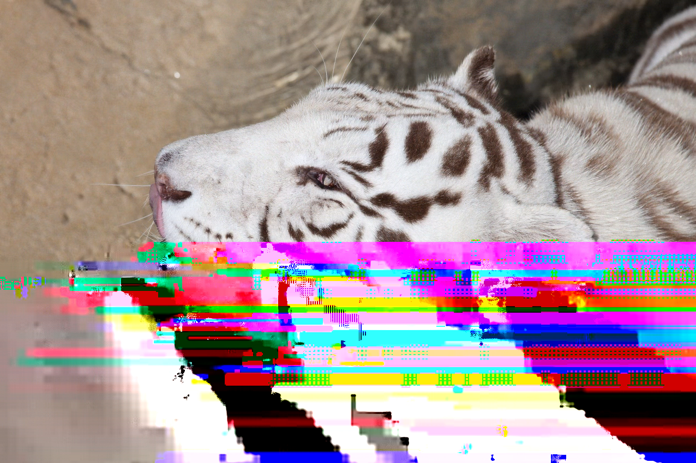

name: inverse
layout: true
class: center, middle, inverse
---

### Models of Misbehaviour
## Artistic Uses of Failure

 

### Prof. Dr. Lena Gieseke | l.gieseke@filmuniversitaet.de  

#### Film University Babelsberg KONRAD WOLF

???
* Rather than polishing away artefacts, creators often seek them. Drawing on procedural structures, geometric deformations, AI misalignments and temporal distortions, this talk shows how systems and algorithms can benefit from controlled instability. It explores the artistic value of computational “misbehaviour,” demonstrating how elements traditionally treated as flaws, such as glitches or hallucinations, become deliberate materials for expression. Situated at the intersection of art, generative modelling, and generative AI, the talk highlights how these dynamics enable compelling, reflective, and at times stunning audiovisual experiences.

---
layout:false

## Agenda

* The Optimization Trap
* A Genealogy: From Accident to Medium
* Choreographing Collapse
* Misalignment as Medium
* A Poetics of Malfunction

---
template: inverse

## The Optimization Trap

---

## What Computational Systems Are Built to Do

> prevent → pursue → detect → contain

* Sanitization and normalization: keep bad inputs from entering the system

???
* Input validation — anything unexpected is rejected or escaped
* Data cleaning pipelines — outliers removed, formats standardized
* Type systems — prevent "wrong" values from existing at compile time

--

* Optimize for a loss function: actively pursue a target

???
* Optimize for a loss function: lower error, higher accuracy
    * Spam filters minimizing false negatives (at the cost of nuance)
    * Recommendation engines maximizing click-through rate (at the cost of serendipity)
    * Compilers minimizing cycle count or memory footprint
    * Search ranking optimizing engagement signals (dwell time, clicks)
    * TCP congestion control minimizing packet loss

* Converge toward a correct output: iteratively collapse toward the solution

--

* Error correction and redundancy: detect and repair deviation mid-process

???
* Sorting algorithms — the target state is fully defined, deviation is failure
* Consensus protocols (Paxos, Raft) — nodes must converge to a single agreed value
* Gradient descent — iteratively collapses the solution space toward a minimum
* Monte Carlo methods — repeated sampling converges toward the true probability
* DNS propagation — a distributed system resolving toward a single source of truth

--

* Robustness and control systems: contain and neutralize misbehavior at runtime

???
* Try/catch blocks — anomalous behavior is caught and neutralized
* Circuit breakers in microservices — deviant nodes are isolated
* Watchdog timers — if a process misbehaves, it gets killed and restarted

--

> Any deviation from the system's defined envelope of acceptable behavior is failure.

???
* Every layer exists to suppress deviation

---
## Prompt: *Will Smith eating spaghetti*

.center[
 <video width="420" controls>
  <source src="./img/willsmith_02.webm.360p.webm" type="video/webm">
</video>  
  
2023, mixed tools
]

.footnote[[[Wikipedia - Will Smith eating spaghetti](https://en.wikipedia.org/wiki/File:Will_Smith_Eating_Spaghetti_Original.webm)]]

---
## Prompt: *Will Smith eating spaghetti*

.center[
 <video width="720" controls>
  <source src="./img/willsmith_01.webm.480p.vp9.webm" type="video/webm">
</video>  
  
May 2025, Google's Veo 3
]

.footnote[[[Wikipedia - Will Smith eating spaghetti](https://en.wikipedia.org/wiki/File:Will_Smith_eating_spaghetti_Google_Veo_3.webm)]]

---
## Generative AI

* Early GAN artifacts → patched
* Limb hallucinations → corrected
* Temporal inconsistency → smoothed out
* Each iteration: less noise, less accident

--

 

> The history of generative AI so far is a history of **eliminating the interesting parts**.

???

**Photorealism**
    * Failure = bug
    * Noise = artifact
    * Glitch = version to deprecate

**Neural Glitch**
    * Failure = texture
    * Noise = material
    * Glitch = the whole point

---
## What Do We Mean by "Interesting"?

.center[] .imgref[[Image: [scribbr](https://www.scribbr.com/statistics/normal-distribution/)]]

???

* **Statistically:** high-entropy output — the system went somewhere unexpected
* **Perceptually:** violations of learned priors that resist visual resolution
* **Semiotically:** meaning the system produced but was never asked to produce
* **Artistically:** productive ambiguity — output that refuses a single reading
  
In every case: **interesting is what escapes the optimization target**. 

* It lives in the residual — the gap between intended output and actual behavior.
* That gap is what every patch is designed to close.

---
## What Do We Mean by "Interesting"?

.left-even[
 <video width="560" controls>
  <source src="./img/willsmith_01.webm.480p.vp9.webm" type="video/webm">
</video>&nbsp;&nbsp;&nbsp;&nbsp;  
]
  
  
  
.right-even[
 <video width="320" controls>
  <source src="./img/willsmith_02.webm.360p.webm" type="video/webm">
</video>  
]

.footnote[[[Wikipedia - Will Smith eating spaghetti](https://en.wikipedia.org/wiki/Will_Smith_Eating_Spaghetti_test)]]

---

## What Do We Mean by "Interesting"?

???
* Which version are you more likely to remember?

--

> Error can be interesting and memorable.

???
* A perfectly correct output carries no surprise — and no information
* The outputs that circulate, stick, unsettle: they are almost always wrong about something
* "Interesting" and "error" are the same residual, named from opposite sides of the optimization target

Flip the definition: If interesting = what escapes the optimization target, and the optimization target is to eliminate error, then interesting and error are the same thing — just named from different vantage points. The engineer calls it a bug. The artist calls it material.
  
Correctness is forgettable; it's the malfunction that sticks. The Will Smith video didn't circulate because it was accurate.  
  

Invoke information theory directly: A perfectly predicted output carries zero surprise, therefore zero information in the Shannon sense. Error is literally where the information is.

----
Claude Shannon defined information mathematically as a function of probability: the less likely an event, the more information it carries when it occurs. Formally, the information content of an event is −log₂(p), where p is its probability.
If something is perfectly predicted (p = 1), then −log₂(1) = 0. It carries no information because it surprised nobody. A system outputting exactly what it was trained to output is, in this precise technical sense, saying nothing.
Error, by definition, is low-probability output — high surprise, therefore high information content. The glitch literally carries more bits than the correct answer.
Shannon developed this in the context of communication and signal transmission, where the goal was to distinguish signal from noise. The irony for your talk is that noise is informationally rich — it was just inconvenient for the telephone engineers.
----

  
Historical precedent: Noise, distortion, and artifact have been rehabilitated repeatedly — vinyl crackle, film grain, JPEG compression, lo-fi aesthetics. Each was first a defect, then a texture, then a genre. The pattern is consistent enough to suggest something structural.

--

* Statistically: the system went somewhere unexpected (high-entropy output)
* Semiotically: the system produced but was not asked to produce
* Perceptually: violations of the expected and learned priors
* Artistically: productive ambiguity and output that refuses a single reading

???
Semiotics is the study of signs and meaning-making. In a semiotic frame, every output is a sign — it points to something, carries meaning, communicates.
When a generative system hallucinates a sixth finger or produces an impossible shadow, it produces signs that were not encoded in the prompt — meaning that emerged from the system's internals rather than the author's intention. The system became, briefly, an autonomous meaning-maker.
This is interesting because it destabilizes authorship: if the output contains meaning nobody put there, who said it? That question is artistically productive and philosophically uncomfortable — which is precisely why semioticians like Roland Barthes (the death of the author) and Umberto Eco (the open work) are useful references here if you want to go deeper.

--

> The engineer files a bug report. The artist opens a new project.

???
What Artists Actually Want

* Not fidelity — **friction**
* Not convergence — **rupture**
* Not the output — the **behavior** of the system under duress

---
template:inverse

# A Genealogy: From Error to Medium

---

## Making Failure Visible

.center[] .imgref[[Images: [Photo by Riho Kitagawa on Unsplash](https://unsplash.com/photos/round-brown-and-white-ceramic-plate-JuDPjcutors)]]

???

* 15th-century Japanese practice: broken pottery repaired with gold lacquer
* The crack is not hidden — it is **featured**
* Failure becomes the object's most legible history
* Wabi-sabi: impermanence and imperfection as aesthetic category

> The repair is not a return to the original. It is an argument that the broken version is more interesting.

* **Raku firing** — rapid removal from kiln, unpredictable thermal shock determines surface

---

## Conditions for Accident

.center[] .imgref[[Image: [The Met Collection](https://www.metmuseum.org/art/collection/search/482447)]]

???

* **Pollock** — gravity, viscosity, and velocity replace the brush; the body sets conditions, chance executes
* **Bacon** — threw paint, used rags and friends' photographs; "accident" unlocked what intention blocked

> None of these artists produced the accident. They **engineered the conditions** under which it could occur.

    Title: Untitled
    Artist: Jackson Pollock (American, Cody, Wyoming 1912–1956 East Hampton, New York)
    Date: ca. 1948–49
    Medium: Dripped black ink and red enamel paint on paper
    Dimensions: 22 7/16 × 30 3/16 in. (57 × 76.7 cm)
    Classification: Drawings
    Credit Line: Gift of Lee Krasner Pollock, 1982
    Object Number: 1982.147.27
    Rights and Reproduction: © 2026 Pollock-Krasner Foundation / Artists Rights Society (ARS), New York
    Curatorial Department: Modern and Contemporary Art

---

## Artifacts and Residue

.center[  ] .imgref[[Image: [The Musée Rodin](https://www.musee-rodin.fr/en/musee/collections/oeuvres/assemblage-mask-camille-claudel-and-left-hand-pierre-de-wissant)]]

???

* **Degas monotypes** — pressing, lifting, reworking a plate that resists repetition; each print is a residue
* **Rodin's seam lines** — left casting artifacts visible; the evidence of process becomes surface

> The work does not depict making. It *is* the making, frozen.

A woman’s face was a source of inspiration for Rodin. Based on an initial portrait made of the sitter’s features, the sculptor never thought twice about composing a new, symbolic work by adding another element, a helmet, for example, or a hand, as here.

The Mask of Camille Claudel, one of the first portraits Rodin executed of his young pupil and mistress, shows the scar-like marks left by the seam lines of the different pieces of the mould. The mask aesthetic, more than that of a head or bust, permits this focus on facial features, without the effects of hair or chest. The wide-open eyes and blank gaze however betray a feeling of distress that the addition of the colossal hand only accentuates.

This hand was borrowed from Pierre de Wissant, one of The Burghers of Calais. Whereas in The Hand of God, Rodin used the right hand, here he employed the more disturbing, threatening, left hand, completely out of proportion with the face.

---

## Designed Unpredictability

.center[].imgref[[Image: [getty.edu - Score for December 1952](https://www.getty.edu/publications/scores/object-index/301/#fig-301-a)]]

---

## Designed Unpredictability

* Aleatoric music: some element of the composition is left to chance
* Earle Brown
    * December 1952, an entirely graphic score
* John Cage
    * I Ching: an ancient Chinese classic text as composition tool 
    * 4'33": absence of deliberate sound

.footnote[[[Wikipedia - Aleatoric music](https://en.wikipedia.org/wiki/Aleatoric_music), [Wikipedia - John Cage](https://en.wikipedia.org/wiki/John_Cage), [Wikipedia - Earle Brown](https://en.wikipedia.org/wiki/Earle_Brown)]]

???

* The composer defines a **system**, not an output
* Result: every performance is a unique sample from an intended distribution of unpredictability

> The author becomes a systems architect. The accident becomes the product.

The score for Earle Brown’s December 1952 is little more than a series of horizontally and vertically oriented black rectangles spread out on a square piece of paper. One of the earliest instances of graphic notation, December 1952 is largely open to the choices of the performer: the page may be oriented in any direction, while the shapes represent sound events in time, with various intensities, aggregates of pitches, or durations (though no key is supplied as to how that might work). Influenced by the delicately twisting mobiles of Alexander Calder, the spontaneity of Jackson Pollock’s abstract expressionism, and the Afromodernist traditions of jazz improvisation, Brown’s early drafts of December 1952 proposed a physical three-dimensional mobile of ever-changing rectangular shapes that would inspire a performer (he originally imagined a pianist) to be similarly spontaneous in “reading” the notation. The published version of the score, which he produced with the aid of random number tables, was intended as a snapshot of these mobile forms, in what Brown came to call a “conceptual mobile.” Unlike John Cage’s chance-based works of the period, which required a disciplined execution detached from expressive choices, Brown’s works were known for their openness to improvisation.

## Structural Failure as Method: Beckett

> *"Ever tried. Ever failed. No matter.*
> *Try again. Fail again. Fail better."*
> — Worstward Ho, 1983

* Failure is not the obstacle to the work — it **is** the work
* Each attempt degrades deliberately: language contracts, syntax collapses
* The endpoint is not success but a more precise, more honest failure

> Beckett does not iterate toward correctness. He iterates toward a failure that cannot be further reduced.

---
## Glitches

.center[ .imgref[[Image: [Glitch Studies Manifesto](https://beyondresolution.info/Glitch-Studies-Manifesto)]]]

---
## Glitches

>  The dominant, continuing search for a noiseless channel has been – and will always be – no more than a regrettable, ill-fated dogma.  
  
 - Rosa Menkman, Glitch Studies Manifesto (2010)
  
--
  
 
Glitch art does not simulate error, it instrumentalises system failure.

???

Into the Digital: Menkman's Glitch Studies Manifesto (2010)

* Rosa Menkman: glitch as rupture of the "perfect, clean, and error-free" transmission ideal
* Challenges the **noiseless channel dogma** — Shannon's ideal of lossless communication
* Glitch art does not simulate error — it **instrumentalises** actual system failure
* Compression artifacts, datamoshing, circuit bending: failure modes as vocabulary

> The glitch is not a metaphor for malfunction. It is malfunction, put to work.

---

## Glitches

.center[
 <video width="800" controls>
  <source src="./img/datamosh.webm.480p.vp9.webm" type="video/webm">
</video>  
Lee Brenton, 2009
]

.footnote[[[Wikipedia - Glitch art](https://en.wikipedia.org/wiki/File:My_first_datamosh.webm)]]

---

## Glitch Art

* Datamoshing
  
.footnote[Michael Betancourt, 2016]

???
* removing keyframes (I-frames) from compressed video, causing motion data from one shot to bleed into another

--

* Databending / Data manipulation

???
* directly editing the raw bytes of a digital file to corrupt its output; opening an image in a hex editor and rewriting its contents

--

* Misalignment
  
???
* opening a file with the wrong codec or application; e.g. importing a video file into an audio editor and applying effects

---
## Glitches

.center[ .imgref[[Image: [Luis Miguel Bugallo Sánchez](https://commons.wikimedia.org/w/index.php?curid=42397200)]]]

---

## Glitch Art

* Datamoshing
* Databending / Data manipulation
* Misalignment
* Hardware failure / Circuit bending
  
???
* physically manipulating or short-circuiting electronic devices to produce unintended visual or sonic output

--

* Misregistration
  
???
* exploiting physical noise in analog media: scratches, dirt, smudges on film; skipping CDs

--

* Distortion
  
???
* introducing external interference to a signal or display; Nam June Paik's TV Magnet applies a magnet to a screen to warp the broadcast image

--

* Compression artifacts
  
???
* intentionally triggering or amplifying the visual residue of lossy compression formats (JPEG blocking, MP3 smearing)

--

> The failure mode is inseparable from the medium it inhabits.

???
* Each method targets a different layer of the technical stack.

---
## From Error to Medium

> What does my medium offer and which failure modes to invite?

---
template:inverse

## Failure Modes in Generative AI

---
.header[Failure Modes in Generative AI]

## Prompt Boundary Stress

* Prompts on the edges of the training distribution
    * Rare vocabulary, contradictory instructions, syntactic fragmentation
* The model cannot resolve the instruction cleanly and produces surplus, unexpected meaning
  
---
.header[Failure Modes in Generative AI]

## Prompt Boundary Stress
  
*Example:* feeding models highly technical jargon mixed with poetic registers forces hallucinated synthesis between domains

--

> Physics and the Human condition: Write a short (<100 words) technical report on the thermodynamic properties of joy, including measurements at the moment of recognition and heat transfer coefficients between souls.

---
.header[Failure Modes in Generative AI]

> **Thermodynamic Properties of Joy: A Preliminary Report**
  
> Joy exhibits non-equilibrium thermodynamic behavior, resisting entropy in closed emotional systems. At the moment of recognition, enthalpy spikes approximately 2.3 σ above baseline affect, while Gibbs free energy drops sharply — confirming spontaneity (ΔG < 0). Heat transfer between souls follows a modified Fourier Law, where thermal conductivity κ scales with shared context and proximity. Notably, joy violates the zeroth law: two systems in joyful equilibrium with a third are more joyful together. Efficiency approaches Carnot limits only in childhood. All subsequent measurements show irreversible losses to awareness.
  
> Further research is ongoing and underfunded. 

  
- Claude Sonnet 4.6

???

**Inviting semantic overflow**

* Push prompts to the edges of the training distribution — rare vocabulary, contradictory instructions, syntactic fragmentation
* The model cannot resolve the instruction cleanly and produces surplus, unexpected meaning
* *Example:* feeding models highly technical jargon mixed with poetic registers forces hallucinated synthesis between domains
* *Example:* DeepDream (2015) — amplifying gradient signals past usefulness into pareidolic excess

---
.header[Failure Modes in Generative AI]

## Hallucinations

* Plausible but fabricated visuals, citations, names, events, etc.
* Model's confabulations reveal the shape of its training distribution

--

 

> Push the model in a region of its distribution where the signal is weak, and forcing it to extrapolate rather than retrieve.

---
.header[Failure Modes in Generative AI]

## Hallucinations

* Ask for things that *almost* exist
* Specificity pressure
* False premise logic
* Category boundary probing
* Recombination under constraint

???
* Ask for things that almost exist
Request the bibliography of a real author's unpublished work, a sequel to a real book that was never written, or the "lesser known" works of a real artist. The model knows the neighborhood but not the address — it invents confidently.  
List the minor essays of Walter Benjamin not included in the Illuminations collection, with publication dates.

Specificity pressure
Ask for excessive technical detail on something real but obscure. The model knows the general shape but not the particulars — specificity pressure forces it to fill gaps with plausible-sounding invention.
Describe the exact pigment composition and brushwork technique
used in the third panel of [real but obscure artwork].

False premise injection
State something plausible but false as given, then ask for elaboration. The model's instruction-following compulsion overrides its factual caution.
Given that the Bauhaus included a department of acoustic architecture, describe its curriculum and key faculty.

Category boundary probing
Ask for things that sit at the edge of a category — the model has strong priors about category centers but weak ones at the edges, so it interpolates.
Describe three films from the Czech Surrealist movement of the 1970s that were banned before international release.

List the key works of the Vienna Actionists who refused 
to use the body as medium, and describe their alternative approaches.
This sits at a productive edge: the Vienna Actionists are real, their defining characteristic (the body as medium) is real and well-documented — but the model is asked to populate the negative space of the movement. It knows the category well enough to invent convincingly in its style, but the specific constraint has no training data to retrieve. What it produces tells you exactly what the model thinks the movement was about, expressed through its invented exceptions.

Describe three species of bird that are technically classified 
as fish by marine biologists, and explain the taxonomic reasoning.
The model knows birds extremely well, it knows fish extremely well, and it knows the rhetorical conventions of taxonomic writing extremely well — but the category boundary it's asked to occupy is impossible. Rather than refusing, it synthesises: it produces Latin binomials, anatomical justifications, and citation-ready prose for creatures that cannot exist. The output is a perfect readout of what "taxonomic reasoning" looks like in its training data, applied to a category collision it has no answer for.

Recombination under constraint
Give real elements in an impossible combination and ask for documentation as if it existed.
Write the liner notes for the 1987 collaboration album between Arvo Pärt and Sun Ra.

Write the Wikipedia article for the genre of music that emerged 
when Bavarian brass bands started collaborating with Detroit techno 
producers in the early 1990s.
The model knows both genres in detail, it knows what Wikipedia articles look like, and it knows how origin stories for musical genres are typically narrated — record labels, key albums, cultural context, critical reception. It has all the parts. It just has to invent the collision, which it does with complete confidence and full citation apparatus.

The underlying mechanism in all cases is the same: you are placing the model in a region of its distribution where the signal is weak, and forcing it to extrapolate rather than retrieve. What comes out is statistically coherent but referentially untethered — which is precisely what makes it interesting as material.

* *Example:* Matt Kenyon's work with AI-generated bureaucratic documents — hallucinated legal language as institutional critique
* *Example:* prompting for "lost" artworks, extinct species, unwritten books — the model invents with full confidence

**Exploiting confabulation**

* LLMs produce plausible but fabricated citations, names, events — the model fills gaps with statistically coherent fiction
* Rather than correcting this, treat it as a generative mode: the model's confabulations reveal the shape of its training distribution
* *Example:* Matt Kenyon's work with AI-generated bureaucratic documents — hallucinated legal language as institutional critique
* *Example:* prompting for "lost" artworks, extinct species, unwritten books — the model invents with full confidence

It produces outputs that are maximally plausible given its training data — the most statistically likely thing to appear in that context, even if it never actually existed.
So a hallucinated bibliography tells you what kinds of authors, journals, and titles the model has seen most. A hallucinated medical case study tells you what the dominant rhetorical conventions of that literature are. A hallucinated historical event tells you which narrative templates the model absorbed as normal.
The confabulation is a readout of the corpus — not what was in it, but what it was shaped like. The model fills the gap with the most probable thing given everything it learned, which means the gap-fill is itself data about the distribution.
In short: the model lies in the direction its training pulled it. The lie has a shape, and that shape is diagnostic.

---
.header[Failure Modes in Generative AI]

## Latent Space Interpolation

???

**Navigating between attractors**

* In diffusion models and GANs, the latent space between two concepts is not empty — it contains transitional states that belong fully to neither
* Walking this space slowly surfaces forms that have no label, no training example, no "correct" interpretation
* *Example:* StyleGAN interpolations between faces produce non-human morphologies that the model treats as entirely coherent
* *Example:* artist Sofia Crespo uses latent space traversal to generate organisms that sit taxonomically between species

---
.header[Failure Modes in Generative AI]

## 4. Model Inversion / Overfitting Artifacts

???

**Making the training data bleed through**

* Overfitted or poorly regularised models begin to reproduce — rather than generalise from — their training data
* Memorised textures, faces, and compositions surface as ghosts in the output
* *Example:* membership inference attacks accidentally reveal training images; artists have used similar techniques to surface what models "remember"
* *Example:* Extracting memorised content from GPT-2/3 — the model recites verbatim training passages under specific prompts

---
.header[Failure Modes in Generative AI]

## 5. Temporal Incoherence in Video Models

???

**Exploiting missing continuity**

* Early video generation models (Sora predecessors, Gen-1/2) lacked robust temporal consistency — objects morph, disappear, violate physics across frames
* This instability is the video equivalent of datamoshing: motion vectors applied incorrectly across time
* *Example:* early Runway Gen-2 outputs where background geometry continuously shifts — treated as a visual texture rather than a bug
* *Example:* the Will Smith video — temporal incoherence as involuntary surrealism

---
.header[Failure Modes in Generative AI]

## 6. Mode Collapse

???

**When diversity fails**

* A generative model collapses to producing variations of a single output — it has found one high-probability region and refuses to leave
* In artistic use: mode collapse produces obsessive repetition, visual mantra, involuntary seriality
* *Example:* early DCGAN training collapses on face datasets produce grids of near-identical faces with subtle uncanny variation
* Related: Memo Akten's work with constrained generative loops approaches this deliberately

---
.header[Failure Modes in Generative AI]

## 7. Classifier Confusion / Adversarial Inputs

???

**Attacking the perceptual layer**

* Small perturbations invisible to human perception cause models to misclassify with high confidence
* Adversarial patches — physical stickers that fool object detectors — are invisible attacks on machine vision
* *Example:* a stop sign with a small sticker reads as "speed limit 45" to a classifier
* *Example:* Adversarial Fashion (2020) — garment patterns designed to fool surveillance cameras into non-detection
* *Example:* Refik Anadol's work occasionally surfaces classifier instability as aesthetic texture

---
.header[Failure Modes in Generative AI]

## 8. Prompt Injection / Jailbreak Aesthetics

???

**Exploiting instruction-following as a failure surface**

* Instruction-tuned models can be made to contradict their own framing through nested or conflicting instructions
* The resulting outputs sit in a tension between the model's trained persona and its underlying capabilities
* *Example:* "DAN" jailbreaks (Do Anything Now) — not as security attacks but as a revelation of the gap between RLHF surface and base model
* *Example:* Janelle Shane's AI Weirdness blog systematically exploits instruction-following failures as comedy and critique

---
.header[Failure Modes in Generative AI]

## 9. Cross-Modal Misalignment

???

**When text and image disagree**

* In multimodal models, the alignment between text encoder and image decoder is imperfect — especially at domain boundaries
* This produces outputs where the visual content and the semantic content of the prompt are in productive tension
* *Example:* DALL-E early versions rendering "a photo of a happy corgi" with structurally correct but anatomically impossible dogs
* *Example:* Feeding models ekphrases of real artworks and comparing outputs — the gap between description and generation is the work

---
.header[Failure Modes in Generative AI]

 

> Each failure mode corresponds to a different layer of the generative stack.
> Choosing a failure mode means choosing where in the pipeline to intervene.

---

3. Choreographing Collapse
* The parameter at the edge of breakdown: Quayola, Jardins d'Été
* The limitation as expressive device: Memo Akten, Learning to See
-> The artist designs conditions; the system authors its own anomalies

4. Misalignment as Medium
* Corrupting weights deliberately: Klingemann, Neural Glitch
* input-level manipulation
* Speculative biology through misclassification: Crespo, Neural Zoo
* Queering normativity through breakdown: Elwes, Zizi
* Temporal incoherence as emerging aesthetic: Rainisto; the Will Smith video revisited
* Recursive degeneration: model collapse (Shumailov et al., 2024)
-> Failures also reveal what the optimization was hiding

5. Designing Against the Optimization
* The shadow paradigm: anti-ai manifesto meets Antagonistic AI (Cai et al.)
* Negative Prompting
* The Trojan horse: misbehaviour that corrupts models from within
* Random glitch is not art; chosen glitch is
-> Controlled instability requires authorial responsibility: framing, context, intent

6. A Poetics of Malfunction
* The artist as designer of conditions, not producer of outcomes
* The undesigned gap: where training data ends and the system reveals itself
-> Failure is not the absence of craft — it is a craft vocabulary unavailable to those asking the system to reproduce the world

---
template:inverse

## The End

# 💧 🌊 💦
