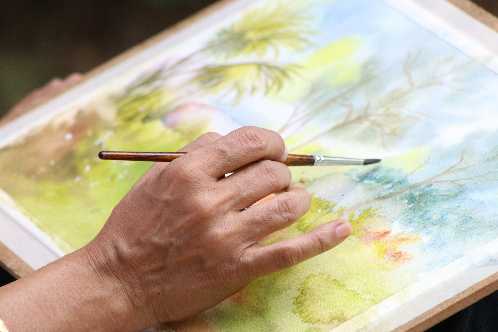
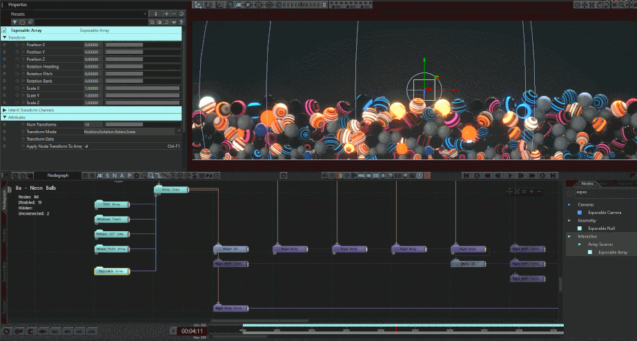
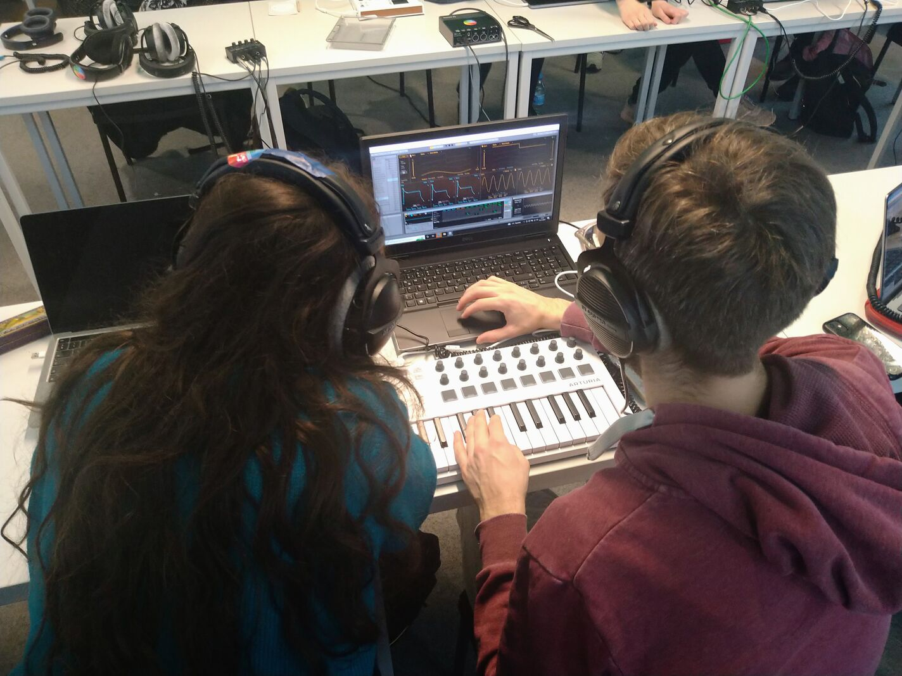
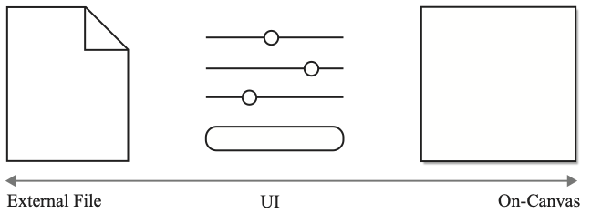
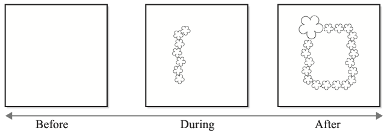
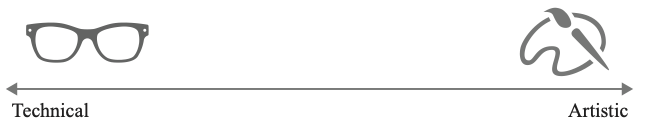
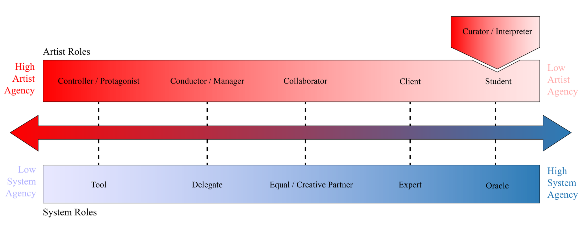

name: inverse
layout: true
class: center, middle, inverse
---

### How, What, Where, When, Who
## Mechanisms for Creative Control

 
### Prof. Dr. Lena Gieseke | l.gieseke@filmuniversitaet.de  

#### Film University Babelsberg KONRAD WOLF

???

> Creativity as something you can specify rather than merely vibe-check.

**Take-home:** "Creative control" is not a diffuse property but something that can be precisely described, designed for, and evaluated.

**Storyline:** CS publications routinely claim their systems are "artist-friendly" or "creatively usable" and validate those claims with small user studies. User studies, when executed properly, are a legitimate form of validation — but they are not the only one, and on their own they leave the underlying question underspecified: what does creative usability actually consist of? The field has made previous attempts to answer this. We examine those attempts, identify what they leave open, and propose that creative control is a configuration space of five interacting dimensions: How, What, Where, When, and Who. The aesthetic qualities that emerge from any creative system — algorithmic or analog — are shaped by how those dimensions are configured and how they interact. These dimensions also give researchers and practitioners a shared vocabulary for asking more precise questions about what a system actually affords.

---
layout:false

.center[].imgref[[Image: [pexels, Fahad Puthawala](https://www.pexels.com/photo/close-up-of-hand-painting-a-watercolor-landscape-29559075/)]]

???
ASK: Look at the following interface / activity: How would you describe the interaction and the creative control the artist has?

  
* How is input given? 
* What does the artist provide? 
* Where does it act? 
* When in the process? 
* And who is in control? 

No answers yet — only the questions. These are not questions about medium. They are questions about the structure of any creative act.

---

.center[].imgref[[Image: [interactiveimmersive.io: Scaling Interactive Notch Content in TouchDesigner](https://interactiveimmersive.io/blog/touchdesigner-resources/scaling-interactive-notch-content-in-touchdesigner/)]]

???
ASK: Look at the following interface / activity: How would you describe the interaction and the creative control the artist has?
  
* How is input given? 
* What does the artist provide? 
* Where does it act? 
* When in the process? 
* And who is in control? 

No answers yet — only the questions. These are not questions about medium. They are questions about the structure of any creative act.  

---

.center[].imgref[[Image: [Filmuniversität](https://www.filmuniversitaet.de/studium/studienangebot/masterstudiengaenge/creative-technologies/projekte/making-waves)]]

???
ASK: Look at the following interface / activity: How would you describe the interaction and the creative control the artist has?
  

* How is input given? 
* What does the artist provide? 
* Where does it act? 
* When in the process? 
* And who is in control? 

The point: the questions still map. What changes is not the structure of creative control but its implementation. This talk investigates what happens to each dimension when the medium becomes computational — and what that means for authorship and expression.

---
layout:false

## Who am I?

--

* Master in Fine Art (MFA Dramatic Media)
* Phd in Computer Science (Dr. rer. nat. Computer Graphic)

--

 

* Film University Babelsberg KONRAD WOLF, Potsdam, Germany
* Professor for Image-based Media Technologies
* MA Creative Technologies

> Computer Science meets Creativity, Art & Film...

---
.header[MA Creative Technologies]

.center[]

---
.header[MA Creative Technologies]

.center[]

---
template:inverse

### How, What, Where, When, Who
## Mechanisms for Creative Control

---
## Agenda

--

* *Artist friendly* is not enough

--

* Defining Creative Control

--
  
    * Navigation
    * Transparency
    * Variation
    * Stimulation

???
* The Problem of Defining Creative Usability

---
## Agenda

* *Artist friendly* is not enough
* Defining Creative Control
* Authorship as Configuration

--

    * How
    * What
    * Where
    * When
    * Who

---
## Agenda

* *Artist friendly* is not enough
* Defining Creative Control
* Authorship as Configuration

???
* From measuring feelings to specifying mechanisms...

---
template:inverse

### *We need system-level vocabulary for creative control that complements user studies.*

???

* Oftentimes things in the interface are already heavily constrained by the underlying algorithm
* Different groups: developer vs. Interface designer
* We need more suitable validation on the developer side
* because ‘artist-friendly’ is otherwise not falsifiable

---

## Creative Control Systems

--

.left-quarter[]

--

.right-quarter[

   
   
Balancing

* the efficiency and accuracy of computation, and
* the control and quality of manual creation.

]

???
.task[COMMENT:]  

* The repetitive nature of patterns is well-suited to algorithmic creation and automation, an artist needs more flexible control mechanisms for adaptable and inventive designs.

---
template:inverse

# Defining Creative Control

---
## Defining Creative Control

--

> ...artist-usable!  
> ...creatively controllable!

---
.header[Defining Creative Control]

## "Artist-Friendly" Isn't Good Enough

We should strive for a realistic discussion and towards defining such terms more systematically.

???
  

* Little attention, however, has been paid to overall creative workflows, which need to strike a balance, giving users needed power without burdening them with unwanted details. Often, techniques that are claimed to be artist-controllable turn out not to be so.

* Why are we doing what we are doing?

--

 
One approach: 

* Define relevant characteristics of underlying algorithms,

--

* motivated by an artist’s perspective.

???

* Again also making this question available to the developers of the underlying system.
* We include interface design aspects but they are not the focus of this survey

CS and HCI publications routinely claim their systems are "artist-friendly" or "creatively usable" — and validate those claims with user studies. When executed properly, user studies are a legitimate form of validation. But they leave the underlying question underspecified: what does creative usability actually consist of? What are we measuring when we say a system supports creativity?

The problem is not a lack of seriousness. It is a definitional one. Creativity is:
- Ill-defined as a construct, and
- A topic that draws insights from psychology, cognitive science, philosophy, and HCI simultaneously — making it notoriously difficult to operationalize.

Source: Frich et al. (2018, 2019), Remy et al. (2020) — a sequence of meta-studies calling for more rigorous evaluation and clearer definitions of creativity in HCI research.

---
.header[Defining Creative Control]

## Creativity

???
ASK: How would you define creativity?

--

Creativity is

--
* ill-defined, and

--
* involves insights from various disciplines,
  
--
  
making is notoriously difficult topic to address.

 

> How can we make *creative control* more manageable?

---
.header[Defining Creative Control]

## HCI Research

???
* Human Computer Interaction 

--

.caps[Shneiderman, Ben]. **Creativity Support Tools: Accelerating Discovery and Innovation**. *Communications of the ACM* 50.12 (2007), 20–32

???
* The field of Creativity Support Tools (CSTs) has been central to HCI since Shneiderman's foundational 2007 paper. The ambition: design tools that accelerate discovery and lower the threshold for creative production. 

--

.small[
* .caps[Frich, Jonas, Mose Biskjaer, Michael, and Dalsgaard, Peter]. **Twenty Years of Creativity Research in Human- Computer Interaction: Current State and Future Directions**. Proceedings of the 2018 Designing Interactive Systems Conference. ACM, 2018, 1235–1257
* .caps[Frich, Jonas, Macdonald Vermeulen, Lindsay, Remy, Christian, et al.] **Mapping the Landscape of Creativity Support Tools in HCI**. Proceedings of the 2019 CHI Conference on Human Factors in Computing Systems. ACM, 2019, 1–1
* .caps[Remy, Christian, Macdonald Vermeulen, Lindsay, Frich, Jonas, et al.] **Evaluating Creativity Support Tools in HCI Research**. Proceedings of the 2020 ACM Designing Interactive Systems Conference. ACM, 2020, 457–47
]

???
* The challenge: CST research has historically conflated two distinct questions — whether a tool enables creative outcomes, and whether the tool itself is the source of creative agency.

---
.header[Defining Creative Control]

## HCI Research

>  ...asking for more rigorous evaluation in regard to claimed creativity support.  
  
--
  
 
> ...clearer definitions of creativity.

???

Source: Shneiderman (2007). Visual: timeline of CST research from 2000–2020 showing volume of publications and the growing methodological critique.

Frich et al. (2018) surveyed twenty years of creativity research in HCI and identified a persistent gap: most studies assess whether users feel creative, not whether the system's architecture enables or constrains creative control. Remy et al. (2020) sharpen this: evaluation methods for CSTs remain inconsistent, and user-perceived creativity does not reliably track with the structural affordances of the system being studied.

The implication: we need evaluation on an algorithmic level — a vocabulary that describes what a system structurally affords, as a subset of (not a replacement for) user-study-based assessment.

---
.header[Defining Creative Control]

## Creativity Support Index (CSI)

.caps[Cherry, Erin and Latulipe, Celine]. **Quantifying the Creativity Support of Digital Tools Through the Creativity Support Index**. *ACM Transactions on Computer-Human Interaction* 21.4 (2014), 21:1– 21:25 

--

* Measures how well a tool enables creativity based on a psychometric survey
* *Exploration*, *expressiveness*, *immersion*, *enjoyment*, *results worth effort*, *collaboration*
  
  
--
  
We are looking for

* an evaluation on an algorithmic level,
* as a subset of a more general and user-study-based classification.

???
The most widely used instrument for evaluating creativity support is the Creativity Support Index (CSI), developed by Cherry and Latulipe (2014). CSI is a psychometric survey instrument that measures how well a tool enables creativity across six dimensions: exploration, expressiveness, immersion, enjoyment, results worth effort, and collaboration.

CSI is rigorous within its own register — it provides quantifiable, comparable scores across tools. But it operates entirely at the user-experience level. It tells us how users feel about the system. It does not describe the system's internal architecture or explain why those feelings arise. As a diagnostic tool for system design, it is post-hoc: it can tell you that your system scored low on exploration, but not where in the architecture the problem lives.

Source: Cherry and Latulipe (2014).

---
.header[Defining Creative Control]

## Theoretical Basis

.caps[Weisberg, Robert]. **Creativity: Understanding Innovation in Problem Solving, Science, Invention, and the Arts**. *Wiley*, 2006  

.caps[Boden, Margaret A.]. **Creativity and Art: Three Roads to Surprise**. Oxford University Press, 2010  

---
.header[Defining Creative Control]

## Theoretical Basis

A creative process

> ...intentionally produces a novel product.  
  

--
 

Novelty 

> ...as a surprising product, one that the creator did not directly anticipate.

---
.header[Defining Creative Control]

## Discussion Basis

.caps[Gieseke, Lena, Paul Asente, Radomír Měch, Bedrich Benes, and Martin Fuchs]. **A Survey of Control Mechanisms for Creative Pattern Generation**. Computer Graphics Forum, vol. 40, no. 2, pp. 585–609. Eurographics STAR – State of the Art Report. Wiley, 2021.

<!-- * The general controllability necessary for navigating a design space

> There are many different roads in the landscape.
 
* Transparency of that navigation and the understanding of cause and effect when using the tool

> I have the map to the landscape and know how to get from one point to another. -->

--

 
Vocabulary for system-level analysis:

* Navigation
* Transparency
* Variation
* Stimulation

???
This framework is significantly more structural than CSI. It gives researchers and practitioners a vocabulary for system-level analysis rather than user-feeling assessment.

-> not user feelings, not UI polish, but the system’s affordance structure.

---
.header[Defining Creative Control]

## Navigation

--

> Navigation describes both whether a creation processes is efficiently manageable and the extent of the controllability.

--

* Interactive
* Number of Controls
* Navigation History

???
Navigation describes both whether a creation processes is efficiently manageable and the extent of the controllability.

* Interactive: Refers to the lack of noticeable delays when executing controls and computing results. Lengthy, non-creative configuration requirements are potentially distracting. Hence, a thorough analysis should consider the whole process an artist has to go through to produce a result.
* Number of Controls: Indicates how flexible and controllable a technique is by counting the number of different controls that can be adjusted for one output. Ideally, this category would refer to the ratio in the possible output of visual features that are relevant to humans to controllable features. This would ensure that the controls cover all necessary features and that they complement each other. However, the identification of generally describable, perceptually relevant visual features is out of the scope of this survey and left to future work.
* Navigation History: Describes the ability to go back and forth in one’s own creation process, such as using an eraser.

---
.header[Defining Creative Control]

## Transparency

--

> Transparency describes how clear the understanding of cause and effect within the system is.

--

* Control Domain
* Control Communication
* Control Consistency

???
* **Transparency** — clarity of cause-and-effect within the system. Sub-dimensions: control domain (what does a control affect?), control communication (how legibly is that effect conveyed?).

* Control Domain: Refers to how well controls are mapped to visual features and how well they cover the possible design range of each feature. A high-quality control should not have any overlapping effects with other controls.
* Control Communication: Describes how well controls (e.g., with a visualization and/or little abstraction) represent their effects on the result. For artist-centered tools this could mean that controls should be visual and directly on the canvas.

---
.header[Defining Creative Control]

## Variation

--

> Variation indicates how visually different the results can be.

--

* Size of the Design Space
* Openness of the Design Space

???
* **Variation** — how visually different the achievable results can be. Sub-dimensions: size of the design space, openness of the design space.

* Size of the Design Space: This is limited if all results look rather similar to each other and are part of a specific design class. A large design space of one technique allows, for example, combining different texture classes such as stochastic and structural creation.
* Openness of the Design Space: Refers to the limitlessness of possible designs and that there is no attachment of the technique to a specific design class. An open design space enables an artist to come up with a distinctive individual style. Different artists can create inherently different and unique results with the same tool if it has a open design space.
  
We do understand that a clear definition of the available different design classes is needed. However, these depend solely on the design task.

---
.header[Defining Creative Control]

## Stimulation

--

> The means of stimulation indicate how well an artist can enter a pleasurable and stimulating workflow.

--

* Immersion
* Stimuli

???
* **Stimulation** — how well a system supports pleasurable, immersive creative workflow. Sub-dimensions: immersion, stimuli.

* Immersion: How natural and enjoyable the usage of a system feels. An immersive technique needs navigation to be fluent, controls to be intuitive, and the design space large enough to not to hit its boundaries while using the tool.
* Stimuli: The support for finding surprising results—for example, with design suggestions or variations of the input. Options to support stimulation are still underrepresented but on the rise with machine learning techniques. A clear definition of this category is not feasible at this point.

TODO: Add links to Siggraph GenAI talk?

---
.header[Defining Creative Control]

## Specifying Mechanisms

* Based on properties of systems
* Evaluable during development

???
From Measuring Feelings to Specifying Mechanisms

* CSI: measures user-perceived creativity (useful, but post-hoc)
* 4D: describes evaluative properties of systems

--

> Which algorithmic mechanisms support Navigation, Transparency, Variation and Stimulation?

???

* The general controllability necessary for navigating a design space
> There are many different roads in the landscape.
* Transparency of that navigation and the understanding of cause and effect when using the tool
> I have the map to the landscape and know how to get from one point to another.

* Navigation
    * Interactive
    * Number of Controls
    * Navigation History
* Transparency
    * Control Domain
    * Control Communication
* Variation
    * Size of the Design Space
    * Openness of the Design Space
* Stimulation
    * Immersion
    * Stimuli

???
These four dimensions describe what a well-designed system achieves.
  
They do not describe what decisions produce it.
  
Navigation doesn't tell you how to build navigability.  
Transparency doesn't tell you what to make transparent.  
Variation doesn't tell you where variation should be available.  
Stimulation doesn't tell you when the artist should be in the loop.
  
And none of them ask: *who* is in control?

The Gieseke framework scores the map, but the five dimensions describe the territory. Configure HOW, WHAT, WHERE, WHEN, and WHO deliberately — and Navigation, Transparency, Variation, Stimulation follow as consequences. That reframing makes the transition feel earned rather than abrupt.

---
template:inverse

# Configuring Creative Control

---

## Configuring Creative Control

To design for creative control, we need to ask:

--

* **How** does the artist act?

--

* **What** does the artist provide?

--

* **Where** does the input take effect?

--

* **When** can the artist intervene?

--

* **Who** holds agency?

--

These are *control characteristics* we need to decide on for our systems on algorithmic level.

---

## Configuring Creative Control

To design for creative control, we need to ask:

* **How** does the artist act?
* **What** does the artist provide?
* **Where** does the input take effect?
* **When** can the artist intervene?
* **Who** holds agency?

> *How* and *What* are separated in theory, but many interfaces bundle them.

???

* *How* and *What* are orthogonal in theory, but many interfaces bundle them. That’s not a flaw. It’s a design choice.
* The separation is conceptually clean, but many examples blur: e.g., “sketch-based input” is both modality and content.

---
## Configuring Creative Control

This following framework was developed for visual and graphics systems.

But ultimately they describe **control structures**.

???
The dimensions are not medium-specific, not pixels.

--

 
* In graphics, we shape for example *geometry, color, spatial composition*.

--

* In sonic systems, we shape for example *timbre, rhythm, temporal flow*.

???

The structure shifts.
The control logic does not.

Your task is not to translate images into sound.

--

 
> It is your task is to map the following onto sonic interaction design!

???
The challenge is to identify where control lies and how it propagates.

Where does a gesture enter the DSP chain?
When can a performer perturb the system state?
Who stabilizes the mix, the model, the machine?

If a visual system exposes parameters, a sonic system exposes time.

---
template:inverse

# *How?*
### The Modality of Input

---

.header[Control Characteristics]

## How 

> How is a control executed or an input given by an artist?

 
.center[]

???

- User Interaction

How asks: by what physical or computational act does the artist exert control? In traditional media the answer is direct and embodied — a brushstroke, a chisel strike, a placement. In computational systems, the same question opens into a design problem: the artist must decide how to make control available, not just how to use it. Source: Gieseke et al. (2021): the distinction between on-canvas and separate UI as the two primary modalities, and their different levels of indirection between artist action and output effect.

---
.header[Control Characteristics]

## How

--

* File

--

* Separate UI
    * Sliders, parameters, menus
    * Need translation between input and effect

--

* On-Canvas
    * Drawing, placing, guiding
    * Usually local, limited in their effect

???
File: The control is externally given, such as with code or a configuration file.
Separate UI: A separate UI is given through which an artist gives input and activates states. Separate UIs are often in close proximity to the canvas, carefully designed and easily usable. However, because they detach the work from the actual output, separate UIs have a level of indirection. An artist must actively translate the interaction with the separate UI to the resulting output on the canvas.
* On-Canvas: Controls are executed directly on the output canvas. Most of them require activating or selecting a tool in a separate UI, such as selecting a pen for drawing on a canvas. 
* There are cases where controls cannot clearly be classified as either separate UI or on-canvas. A pen, for example, can have different characteristics that an artist needs to set in the UI. The adjustment of settings should be as seamlessly integrated into an on-canvas tool as possible (e.g., with choices appearing as tool tips).

On-canvas control: the artist acts directly on the output surface — drawing, placing, guiding. Separate UI: the artist works through detached controls (sliders, parameters, menus) that require translation between input and effect. Key insight from Gieseke et al.: separate UIs introduce indirection; an artist must actively translate their action into an imagined result. On-canvas controls reduce this cognitive gap — but impose their own constraints on what is expressible. Visual: a parameter panel on the left, a direct sketch-on-canvas interface on the right.

## Direct vs. Indirect Input
Another axis orthogonal to on-canvas/separate UI: how directly does the artist's action map to the output? A drawn stroke that becomes a visual element is more direct than a numerical seed that propagates through multiple algorithmic layers. Thesis link: the distinction between text-based environments (high abstraction, indirect path from code to canvas) and node-based environments (spatialized, more transparent data flow, intermediate states visible) as two architectures of HOW. Neither is superior — they enable different creative relationships with the system.

---
.header[Control Characteristics | How]

## Sketch-Based Input 

Combination of local, direct control and global effect through computation.

--

* Areas of operation, outlines, layouts

--

* Directions, guidance fields

--
* Autocompletion

--

> For hierarchical composition!

???
Sketch-based input occupies a privileged position at the intersection of embodied and algorithmic authorship. The Gieseke et al. (2017) ornament system is the canonical example: a vector field drawn by hand governs the growth direction of a procedurally generated ornament. This collapses the gap between the artist's embodied act and the system's behavior — and scores exceptionally well on Transparency, because cause and effect are spatially identical. Worth noting: this is also where HOW directly shapes WHO. When the hand governs, authorship stays firmly with the artist even as the system generates.

---
.header[Control Characteristics | How]

## How

How the input is given

--

* Determines *Transparency* making cause and effect legible when input and effect share the same space

--

* Changes what creative acts are possible

--

> The modality of input is not neutral with respect to aesthetics!

???
These are aesthetic decisions, not just UX ones. 

* It is not about making the interface friendlier — it is about expanding the expressive range of what can be said.
* A system where the artist draws a density field to control particle distribution affords different expressions than one where they type a float value. Same underlying algorithm; completely different authorial relationship. 
    * On-canvas HOW modalities score high on Transparency almost automatically, because the control domain and the output domain are spatially identical.

---
template:inverse

# *What?*
### Content and Level of Abstraction

---

.header[Control Characteristics]

## What

> What does an artist give as input?

 
.center[]

---

.header[Control Characteristics]

## What

What is the level of abstraction of the content that an artist works with?

* Code
* Value
* Intermediate
* Element

???
* Code: Input is a syntactically structured formal language.
* Value: The input is a single value, chosen from a range—for example, with a slider.
* Intermediate: The input is visual but abstract, such as sketching a mask or arrows for directionality Artists still have to interpret how the input affects the result.
* Element: The input is a component of the resulting pattern

What asks: what does the artist actually provide as creative input? This is a question of content and abstraction. At one extreme: a single numeric value (opacity = 0.7). At the other: a full exemplar image, a semantic description, or a drawn motif. The level of abstraction is not a technical detail — it determines the granularity of creative intent that can be expressed and the degree to which the system completes, extends, or overrides that intent.

---
.header[Control Characteristics | What]

## Exemplars

* Image
* Element Arrangement
* Element

???
* Image: An example image that should be matched in its entirety. Examples are usually pixel data.
* Element Arrangement: An example element arrangement that should be matched in its entirety. Elements in the arrangement are usually separate shapes and might carry additional data.
* Element: One specific, individual asset that becomes part of the result. Elements can be shapes or pixel data.

Gieseke et al. (2021) identify a set of input content types for pattern generation: exemplar-based (providing a reference pattern the system learns from), parameterized (numerical or slider-based control over separately addressable characteristics), image-based (pixel data used as indirect control), sketch/shape-based (visual structures given as scaffolding), and placing/guiding (explicit positional information). Visual: a diagram placing these on a spectrum from low abstraction (raw values) to high abstraction (reference image or semantic intent).

---
.header[Control Characteristics | What]

## Parameterization

Parameter usually represent certain visual characteristics and their prominence.

--

* Often non-intuitive, representing abstract system internals rather than perceptual qualities

--
    * Parameter space vs. design space

--

* Too many are tedious, too few limit design space

--

> Notoriously difficult to develop!

???
* Parameterization — the process of identifying and exposing controllable variables of a system — is the most prevalent strategy for managing WHAT in generative practice. From the thesis: parameters "represent certain visual characteristics and their prominence" and a few can control many details. But the challenge is equally clear: parameters are often non-intuitive, representing abstract system internals rather than perceptual qualities. The gap between parameter space and design space is a persistent creative friction. The artist must develop fluency in a language that is not visual.

Parameterization
* Visual Output: Parameters that can adjust visual features directly in the output.
* System/Generation: Parameters that influence the output indirectly, such as parameters for an optimization algorithm or constraints.

The response to non-intuitive parameters is remapping: translating abstract system variables into content that corresponds more closely to a visual or spatial intuition. From the thesis: control textures, procedurally generated fields, and hierarchically grouped parameter bundles all serve this function. From Gieseke et al.: image-based control maps pixel data (brightness, hue, gradient) to system behaviors, providing "transparent control for filling a space." WHAT the artist gives is redesigned to fit the artist's actual mode of thinking. This is not just UX work — it is aesthetic work. Note the connection to Gieseke et al.'s Navigation dimension: the size and legibility of the navigable space is partly a function of how WHAT is structured.

---
.header[Control Characteristics | What]

## Parameterization

> Identify the properties you want to expose, then remap them into controls that match artists’ mental models.

???
* fields, masks, grouped parameters

--

Examples

* Noise Frequency → *Brush Detail* / *Pigment Granulation* / *Paper Grain* 

???
Latent property (system space):
Perlin noise frequency controlling texture granularity.

Typical parameter:
noiseScale = 0.0037

Remap into mental model:
Slider labeled “Brush Detail”
Low → smooth wash
High → fine grain / paper texture

--

* Kernel Size in Blur → *Softness*

???
Latent property: Gaussian kernel radius.
  
Typical parameter: kernelSize = 17
  
Remap: Slider labeled “Softness”

--
* Random Seed → *New Variation*

???
Latent property: Seed for pseudo-random number generator.
  
Typical parameter: seed = 847362
  
Remap: Button labeled “New Variation”
  
Same mechanism, radically different authorship framing.
  
The seed stops being a number and becomes an exploratory gesture.

---
.header[Control Characteristics | What]

## What

The content level of interaction determines the expressive vocabulary available.

???

* Numeric parameters → precise but abstract; the artist must speak in system language
* Sketches, images, spatial structures → embodied and relational; the artist speaks in visual language

--

* We need *meaningful interface metaphors*.

???
* — input that carries creative intent without loss in translation

--

> The artist provides the **vocabulary**. The system provides the **grammar**.

???
* But vocabularies can be impoverished or rich.

The metaphor of vocabulary vs. grammar is the core takeaway. A system that only exposes numeric parameters forces the artist to translate every creative impulse into an abstraction — the expressive range is not limited by the algorithm, but by the language available to address it. Meaningful interface metaphors are the design response: finding representational forms for input that map onto how artists actually think. This connects directly back to Transparency in the Gieseke framework — if the artist cannot read the relationship between what they give and what they get, the vocabulary is effectively impoverished regardless of its theoretical richness.

---
template:inverse

# *Where?*
### The Spatial Scope of Control

---
.header[Control Characteristics]

## Where - Canvas

> Where does the input have an effect and what is the area of influence?

 
.center[]

???
* The input can have global influence, regional, e.g., on a drawn curve or local, e.g., on one specific element.
* Does a control act on the **entire output** — or on a **specific region**?

Global control: one decision shapes everything — scale, density, color shift applied uniformly. Local control: the artist can target specific regions, elements, or layers with different behaviors. Gieseke et al. identify several mechanisms for spatial targeting: curves and paths drawn on the canvas, masks (regions defined by shapes or images), and flow fields (directional controls that vary spatially). Visual: the same generative pattern with global parameter change on the left, region-specific mask-based control on the right — dramatically different expressive results.

---
.header[Control Characteristics | Where]

## Where

* In traditional media: almost always local and direct
    * A brushstroke affects exactly where it lands.

--

* In computational systems: the default is often the opposite
    * A single parameter value governs the entire canvas.

--

* It is a spectrum from *automatic / global* to *manual / local*

???

* WHERE is therefore a design dimension that must be **explicitly addressed** — it does not emerge by default
* The inversion is the key provocation here: traditional media is local by default, computational systems are global by default. This means spatial targeting is not a feature that comes for free — it has to be deliberately designed into the system architecture before the artist can use it. The Gieseke spectrum from automatic/global to manual/local is the organizing structure for the next three slides.

---
.header[Control Characteristics | Where]

## Global-to-Local Strategies

Artists routinely work global-to-local: establish overall character first, refine local detail second.

???
* This is not a limitation — it mirrors how any skilled visual artist builds structure before detail

--

> Computationally the global to local spectrum must be **architecturally planned in advance**.

???
The critical insight is the asymmetry between traditional and computational practice. A painter can decide mid-process to work locally — they just move the brush. A generative artist cannot decide mid-process to have local control if the system was not designed for it. This makes WHERE a front-loaded architectural decision with downstream aesthetic consequences. The Variation link is worth lingering on: a system with only global control can produce a wide range of global looks, but its compositional range — the ability to produce spatially differentiated, hierarchically organized work — is structurally capped.

---
.header[Control Characteristics | Where]

## Where

A design space becomes more open when control can act on different levels of spatial regions and with that influences the *Variation* of the system.

--

> Trade-off between global automation and local manual manufacturing!
  

???

* The degree of spatial targeting available in a system shapes what kinds of compositions are possible. Systems with only global control can produce internally consistent but spatially homogeneous outputs. 

* Systems with rich spatial targeting can produce differentiated, hierarchically organized, and locally responsive work. 

* Gieseke et al. identify this as one of the key limitations of many current procedural systems: the "trade-off between global automation and local manual manufacturing" is rarely solved elegantly. WHERE you can act determines the compositional range of what you can make.

---
template:inverse

# *When?*
### The Temporal Position of Control

---
.header[Control Characteristics]

## When - Timeline

> When is the input given and at what time in the creation process is the control executed?

 
.center[]

???
* ASK: How many systems they use actually offer all three intervention points?
* Input can be given before the creation process, during it when parts of the results are already visible, or after, when the result is visible and can be adjusted retrospectively.

---
.header[Control Characteristics | When]

## When

* Initialization
    * Before the system runs
* Execution
    * Real-time interaction during the process
* Post-hoc
    * Curation and post-processing after the fact

---
.header[Control Characteristics | When]

## When

In traditional media: *when* is mostly synonymous with *now*:
* The artist acts in the immediate present.

--

In computational systems: *when* can be freely designed:
* Sequenced, gated, branched, looped, deferred, etc.

???
In traditional media, temporal access to the work is continuous and assumed. In computational systems it is a design decision — and one that is often made implicitly rather than deliberately. A system that only 
allows initialization-stage control forces a speculative, non-dialogic mode of authorship: the artist sets conditions and observes consequences, with no ability to intervene mid-process. The Stimulation link is direct: immersion requires a tight feedback loop, and a tight feedback loop requires that WHEN includes execution-stage access.  

Access patterns:
* Continuous — the artist can intervene at any moment
* Discrete — intervention is possible only at defined checkpoints
* Triggered — intervention is activated by a system event or threshold
* Scheduled — control is time-indexed (e.g., parameter curves, keyframes)

Closure:
* Locked — intervention points are fixed and cannot be added
* Open — the artist can introduce new intervention points at any time

---
.header[Control Characteristics | When]

## Temporal Evolution

--

* Stateless systems
    * Each frame is independent

???
the past leaves no trace

--

* Stateful systems
    * The system accumulates, remembers, responds to prior states

--

> Statefulness is hard, e.g. on the GPU!

???
* E.g., on the GPU: statefulness requires explicit memory management across the render pipeline with buffers, ping-pong textures, persistent render targets.
* The artist sets initial conditions. The system evolves.
* WHEN becomes **distributed across time**: each prior state mediates the next intervention

---
.header[Control Characteristics | When]

## History-Keeping

The ability to return to, compare, and branch from prior states is itself a temporal control mechanism.

???
* History-keeping: enable non-destructive branching/presets to support exploration and curation.

--

* Non-trivial engineering problems! 
* Most creative coding environments underserve this...

???
Statelessness is not a design choice in GPU pipelines — it is the architectural default. Each fragment shader call is independent by design; carrying state forward requires deliberate engineering: ping-pong framebuffers, feedback textures, or hybrid CPU-GPU state management. This means that temporal richness — accumulation, memory, evolution — costs significantly more to implement than a single-frame system. History-keeping compounds this: storing, indexing, and restoring prior states requires persistent memory structures that most real-time environments do not provide out of the box. 

The creative consequence is that many systems that could be temporally rich are stateless by default simply because statefulness is hard — not because it was deliberately chosen.

???
* From the thesis Ch. 4: systems that maintain state across the draw-loop — accumulating, remembering, responding to prior states — introduce a form of temporal agency that is not reducible to any single moment of control. The artist sets initial conditions; the system evolves. Parameters may be animated, accumulated, or driven by external data. This creates a situation where WHEN is distributed across time: the artist acts at multiple points, and the system's own temporal behavior mediates between those interventions. History-keeping as a strategy: the ability to return to, compare, and branch from prior states is a temporal control mechanism that most Creative Coding tools underserve.

---
.header[Control Characteristics | When]

## Creative Coding

--

Using coding for creative, audiovisual output.

--

* Ideation and implementation decisions often happen in parallel 
* Extra cognitive load

???
Code collapses thinking and building into the same moment.

* Avoid where possible

--

Design for:

--

* Fast iteration loops
* Immediate audiovisual feedback
* Non-destructive history (presets, branching, rollback)
* Separation of exploration and stable system structure

    
---
.header[Control Characteristics | When]

## When

> The artist is "in conversation" with the system, and *when* defines the rhythm and density of that conversation.

???

The temporal structure of control determines whether the artist is present as a continuous force or as an initiating architect who then withdraws. Systems with rich real-time WHEN afford ongoing dialogue; systems with locked initialization afford front-loaded intention-setting followed by observation. Neither is superior — they produce different aesthetic relationships between artist and work. But they must be chosen deliberately. The thesis frames this as the dialogic nature of the creative process: the artist is "in conversation" with the system, and WHEN defines the rhythm and density of that conversation.

---
template:inverse

# *Who?*
### Agency, Authorship, and the Co-Agency Spectrum

---
.header[Control Characteristics]

## Who

> Who has the skill set needed to provide the input?

 
.center[]

---
.header[Control Characteristics]

## Who

> Who is authoring: human or system?

???

Gieseke et al. (2021) systematically map HOW, WHAT, WHERE, and WHEN — corresponding, at the system level, to Navigation, Transparency, Variation, and Stimulation as evaluative dimensions. But neither the taxonomy nor the CSI addresses the fifth question: who is in control? This is not an oversight — it is a boundary. WHO belongs to a different register of analysis: not algorithm design but agency theory. The thesis (Ch. 2) provides the framework. Opening provocation: if the system produces behavior the artist did not anticipate — who made that?

--

 
*Generative Systems* as algorithm, mathematical functions or set of rules, designed to generate an output.

.footnote[[Rumpf, T. 2025. Designing for Balance: Creative Intention and the Autonomy of Generative Systems | McCormack, J. 2017. Working with Generative Systems: An Artistic Perspective | Boden, M. and Edmonds, E. 2010. What Is Generative Art?]]

--
 
→ Specified by the process rather than the artifact

---
.header[Control Characteristics | Who]

## Generative Systems

* Can make independent decisions within constraints
* Reducing the artist's total control  

---
.header[Control Characteristics | Who]

## Generative Systems

Systems can have **autonomy** and **agency** to a degree.

--

* Autonomy
    * Operational independence
    * The system runs without intervention

--
* Agency
    * Impact on the creative outcome
    * The system shapes what the work becomes

.footnote[[Rumpf, T. 2025. Designing for Balance: Creative Intention and the Autonomy of Generative Systems.]]

---
.header[Control Characteristics | Who]

## Generative Systems

> A system can be operationally autonomous but have low aesthetic agency — or vice versa.

???
* A batch-rendering pipeline is operationally autonomous — it runs 
unattended — but if it executes exactly what the artist specified, its aesthetic 
agency is near zero. Conversely, a simple random seed introduced into an 
otherwise tightly controlled system has low operational autonomy but potentially 
high aesthetic agency: one value change cascades into a completely different 
output. The implication for design: autonomy is an engineering property; agency 
is an aesthetic one. Designers who conflate them tend to either over-attribute 
creativity to the system or under-recognize how much a small stochastic element 
can shift authorship.

---
.header[Control Characteristics | Who]

## Generative Systems

> How can we both embrace and steer the "out-of-control-ness"?
  

.footnote[[Rumpf, T. 2025. Designing for Balance: Creative Intention and the Autonomy of Generative Systems |  Memelink, M. 2023. Tracing Autonomy & Artistic Significance: An Alternative Framework for Analysing & Comparing Generative Art.]]
  
--
  
*Stimulation* often enhances human creativity.

???

Human-System Co-agency: Authorship is distributed and creativity is augmented (not replaced), no true system autonomy
* Galanter: artist cedes partial control
* Boden: creativity = novel & valuable; indirect control (curation)
* McCormack: artists specify processes rather than outcomes; program “authors what it produces”, artist “author of the program”
* Hu et al.: co-agency spectrum, shifting roles across the process
* Memelink: rank Autonomous Ability & Artistic Significance of parts of the system
* Hertzmann: also AI augments, does not replace human creativity 

???
So, there is a consensus that authorship is not replaced, but distributed when working with generative systems, 
Creativity is augmented
And also that the systems don’t have true autonomy, as the artist is always the initiator and the author of the system. And that is even true for Generative AI as well.So, there is human–system co-agency, which shifts during the process of creation of and with the system

And regarding the process: The process of creative coding is often described as an iterative, sketch-like process where 
both the outcome and the system are continuously evaluated and refined and even ideas reshaped.

---
.header[Control Characteristics | Who]

## The Co-Agency Spectrum

.caps[Rumpf, T.] **Designing for Balance: Creative Intention and the Autonomy of Generative Systems.** Master Thesis, Film University Babelsberg KONRAD WOLF, 2025.

 
  
.caps[Hu, Xi, Yiwen Xing, Xudong Cai, Yihang Zhao, Michael Cook, Rita Borgo, and Timothy Neate]. **Designing Interactions with Generative AI for Art and Creativity: A Systematic Review and Taxonomy.** Proceedings of the 2025 ACM Designing Interactive Systems Conference, pp. 1126–1155. ACM, 2025.

???
The key insight: working with generative systems is not about ceding control — it is about distributing it.
  

* From the thesis: creative work with generative systems is not a binary between the artist controlling the system and the system controlling itself. 
* It is a spectrum — from fully artist-led (the system as obedient tool) to fully system-led (the artist as observer of autonomous behavior). 
* At each position, distinct artist-system relationships emerge:
    * Tool-Protagonist (direct execution), Delegate-Manager (conductor/project manager role), Collaborator (equal creative partner), Curator (responds to what the system produces). 

---
.header[Control Characteristics | Who | The Co-Agency Spectrum]

.center[]

???
The key insight: working with generative systems is not about ceding control — it is about distributing it.
  

* From the thesis: creative work with generative systems is not a binary between the artist controlling the system and the system controlling itself. 
* It is a spectrum — from fully artist-led (the system as obedient tool) to fully system-led (the artist as observer of autonomous behavior). 
* At each position, distinct artist-system relationships emerge:
    * Tool-Protagonist (direct execution), Delegate-Manager (conductor/project manager role), Collaborator (equal creative partner), Curator (responds to what the system produces). 

---
.header[Control Characteristics | Who | The Co-Agency Spectrum]

## Architectural Choices

???
that influence Co-Agency

--

* Randomness
    * Shifts agency toward the system
    * Outputs become partially unpredictable

--

* Rule-based Emergence
    * Local rules produce global behavior that wasn't designed

--

* Agent-based systems
    * Can produce behavior that exceeds the artist's predictive capacity

.footnote[[Rumpf, T. 2025. Designing for Balance: Creative Intention and the Autonomy of Generative Systems.]]

---
.header[Control Characteristics | Who]

## The Co-Agency Spectrum

> The same architecture that produces surprise also redistributes authorship.

???

The WHO question is not answered by intent alone — it is determined by architectural choices. From the thesis Ch. 4: introducing randomness shifts creative agency toward the system; rule-based systems with emergent behavior shift it further; agent-based systems can produce behavior that genuinely exceeds the artist's predictive capacity. The same system architecture that produces surprise also redistributes authorship. The thesis is explicit: "autonomy" describes operational independence; "agency" describes impact on the creative outcome. A system can be operationally autonomous but have low aesthetic agency — or vice versa.

---
.header[Control Characteristics | Who]

## Human Domains

> No matter how autonomous a generative system becomes, **intention** and **curation** should currently no be delegated.

???
* No matter how autonomous a generative system becomes, two dimensions of WHO 
cannot be delegated.

---
.header[Control Characteristics | Who]

## Human Domains

* Intention
    * Initialize and continuously shape the process
    * Defines the space the system explores
    * Divergence-setting

???
* Divergence-setting: establishes the range of possible outcomes
  

* Divergent thinking: generating possibilities, expanding the space, increasing variation. Generative systems are structurally good at this.
* Convergent thinking: evaluating, filtering, selecting, committing. Humans are currently far better at this in aesthetic contexts.

--

* Curation
    * The iterative act of selection and evaluation
    * Narrows possibilities into meaningful choices
    * Convergent thinking

???
* Convergent thinking selects and commits within the generated space

---
.header[Control Characteristics | Who]

## Human Domains

> Even when the artist cannot predict the output, they remain the entity that decides whether it matters.

???

* This is the irreducibly human component of the WHO.

The divergent/convergent pairing is worth making explicit. Generative systems are structurally divergent — they produce variation, proliferate possibilities, explore the space. Curation is the complementary act: collapsing that space back down to a single meaningful choice. This is not a passive or mechanical act. Deciding what matters requires aesthetic judgment, contextual awareness, and intentional framing — none of which the system possesses. Intention operates at both ends of the process: it shapes the initial conditions and it continuously re-frames what counts as a successful output as the work evolves. Together they define the minimum irreducible human presence in any generative authorship — the floor below which WHO cannot be further delegated.

From the thesis: no matter how autonomous a generative system becomes, the artist retains what the thesis calls "artistic control" — the combination of intention (the conceptual framework that initializes and continuously shapes the process) and curation (the iterative act of selection and evaluation). These are the dimensions of WHO that cannot be delegated. Curation is convergent thinking — the creative complement to the system's divergent generation. Even when the artist cannot predict the output, they remain the entity that decides whether it matters. This is the irreducibly human component of the WHO.

  
The distribution of WHO across artist and system is not just a question of authorship — it shapes the kind of meaning the work can carry. A work made by an artist exercising tight intentional control carries a different aesthetic quality than one shaped by emergent system behavior that the artist curates but cannot author. Neither is more valuable, but they are different. The thesis quotes Boden: "The autonomy in the intentional sense of the generative systems does not exist." But something else exists — a form of creative surprise that the artist creates the conditions for, without being able to produce directly. That gap is where generative aesthetics lives.

---
template: inverse

# Authorship as Configuration

???
Now that we have dissected the mechanisms of creative control, we can bring them back together.

Authorship does not reside in the output.

In generative systems, authorship lives one layer deeper:
in the design of the configuration space.

And that configuration space is defined by the dimensions we have just examined.
---

## Authorship as Configuration

* Navigation, Transparency, Variation, Stimulation as **evaluative outcomes**.
* How, What, Where, When, Who — **the design decisions that produce them**.

--

 

> A change in one dimension propagates across all others!

???
Introducing **exemplar-based input** instead of parametric control:

* Changes **HOW** — the artist no longer specifies, they reference
* Changes **WHERE** — the exemplar applies at a different spatial register
* Changes **WHEN** — the input stage shifts earlier in the process
* Redistributes **WHO** — the system's generative latitude increases

Students often treat the five 
dimensions as a checklist — address each one independently and the system is 
well-designed. The reality is that every decision is entangled. Changing WHAT 
ripples immediately into HOW, WHERE, and WHEN, and the WHO redistribution is 
often the least anticipated consequence. The relationship to the Gieseke 
evaluative framework is worth stating explicitly here: if you configure the five 
dimensions well, the four evaluative outcomes follow. They are consequences, not 
goals. And now there is a fifth evaluative criterion the original framework could 
not capture: meaningful authorship.

---
layout: false

.center[]
.imgref[[Image: [pexels, Fahad Puthawala](https://www.pexels.com/photo/close-up-of-hand-painting-a-watercolor-landscape-29559075/)]]

???

HOW — direct, on-canvas, embodied. No indirection between act and effect.
WHAT — pigment, water ratio, pressure. Low-abstraction physical parameters.
WHERE — wherever the brush lands, with bleed that propagates outward unpredictably.
WHEN — continuous, real-time, non-reversible. The loop never closes faster than this.
WHO — fully artist-led, with the material as an agent of unpredictability the 
artist works with but does not control.

The point: digital generative systems do not introduce a new problem. They scale 
the same problem into a design space that must be explicitly and consciously 
architected. The watercolor painter never had to make these decisions — the 
medium made them. The generative artist has no such luxury.

---

## Authorship as Configuration

.left-quarter[]

.right-quarter[

* **How**: Direct, on-canvas, embodied                         
* **What**: Pigment, water ratio, pressure                      
* **Where**: Wherever the brush lands and bleed propagates outward 
* **When** : Continuous, real-time, non-reversible               
* **Who**: Artist-led but material as unpredictable co-agent     

]

---

## Authorship as Configuration

.left-quarter[]

.right-quarter[

* **Navigation**: Immediate and fluid, but irreversible
* **Transparency**: High as cause and effect are spatially aligned
* **Variation**: Rich but physically constrained by material
* **Stimulation**: Strong as material behavior produces surprise
]

---

## Authorship as Configuration

* Digital generative systems do not introduce a new problem.  

--

* They scale the same problem into a space that must be consciously architected.

???
The table is a deliberate callback to the opening provocation — the same five 
questions, now answered for the medium we started with. The punchline is that 
watercolor configures all five dimensions elegantly and implicitly, because the 
medium has been refined over centuries. Computational systems offer vastly more 
freedom — but freedom is not the same as configuration. The generative artist 
must make explicit what the watercolorist receives for free.

---
## Authorship as Configuration

Pick one sonic system you know well.

--

* Write one sentence for each control dimension:  
 **How / What / Where / When / Who**

--

* Based on those, assess the system’s:   
**Navigation / Transparency / Variation / Stimulation**

--

* Identify the mechanism you would change to improve creative control.

???

  
Which single design decision would redistribute agency between artist and system?

Example 1: Random Seed → Variation Button
* Current system: Seed is fixed in code.
* Small architectural change: Expose seed as “New Variation” button.
* Shift in authorship: The artist moves from passive observer to active explorer.
    * Agency shifts toward the human at the selection stage.
* Same algorithm. Different authorship dynamic.
  
Example 2: Global Parameter → Spatial Mask
* Current system: Density controlled by one global slider.
* Small architectural change: Allow painting a grayscale mask that locally controls density.
* Shift in authorship: From system-led uniform behavior to artist-led spatial differentiation.
* We changed WHERE. WHO shifts.

---
## Authorship as Configuration

A change in one control dimension can

 

--
  
→ change the evaluative properties

--
  
→ redistribute agency

--
  
→ shift the aesthetic outcome.

--

 

> Aesthetics follows control, because control determines the expressive vocabulary, the speed and structure of feedback, and the source of variation.

???

We have talked about usability and agency. Now I’m adding a third consequence: aesthetics.

Aesthetic outcome is not “the picture at the end.” It is the characteristic structure of what the system tends to produce: rhythm, density, layering, coherence, surprise, even what kinds of mistakes are possible.

That structure is shaped by the control configuration, because control determines:
* What distinctions can be expressed (the vocabulary).
  
If you only expose global sliders, you get globally consistent results.
If you enable local, spatial control, you can create contrast, hierarchy, and composition.
* What feedback loops exist (the tempo of iteration).
  
Real-time interaction produces incremental, responsive aesthetics.
Deferred, post-hoc control produces “batch aesthetics”: broader jumps, less micro-structure.
* Who contributes variation (artist vs system).

  
More system agency tends to produce surprise and emergent qualities.
More artist agency tends to produce intentional motifs and stable style.

So when we change one control dimension, we are not just changing usability.
We are changing the distribution of decisions that shape form.

That is why aesthetic outcome shifts.

---
## Authorship as Configuration

* ...artist-usable!
* ...it works!

--

> Is not enough...

???
* A system that "works" in the technical sense may still configure its five dimensions poorly — producing low transparency, locked temporal access, impoverished vocabulary, and an unexamined WHO. The five questions are the minimum due diligence for any generative system that claims to support creative authorship.

---
## Authorship as Configuration

Make **explicit decisions** across all five dimensions and answer to:

???
But when designing a system you must

--

* **How** will the artist interact?
* **What** will they provide?
* **Where** will control act?
* **When** in the process will it be available?
* **Who** will hold agency at each stage?

--

These are authorial questions.

--

> The five dimensions are always configured. The question is whether they are configured deliberately.

???
* These are not interface questions. They are not UX questions.

The shift: from **artist-as-craftsperson** to **artist-as-system-architect**

> The system architect makes decisions not about individual outputs —  
> but about the entire **class** of outputs the system can produce.

The craftsperson/architect distinction is the practical takeaway students should 
leave with. A craftsperson makes decisions about the work in front of them. An 
architect makes decisions about the space of possible works — the constraints, 
affordances, and relationships that shape everything the system will ever 
produce. This is a fundamentally different cognitive mode, and it requires a 
fundamentally different vocabulary. The five dimensions are that vocabulary.

---
template:inverse 

.center[

]

# *The End*

### Prof. Dr. Lena Gieseke | l.gieseke@filmuniversitaet.de  

#### Film University Babelsberg KONRAD WOLF

