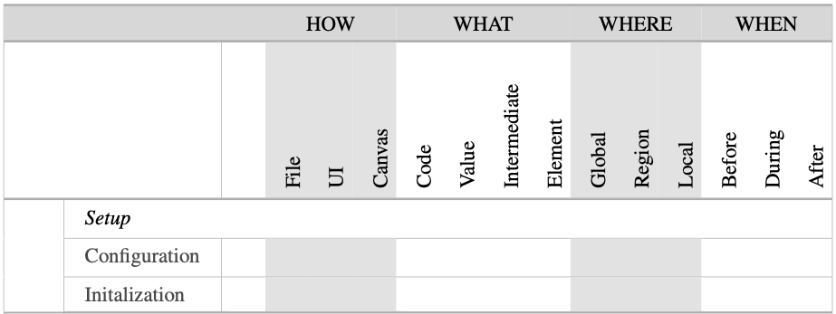
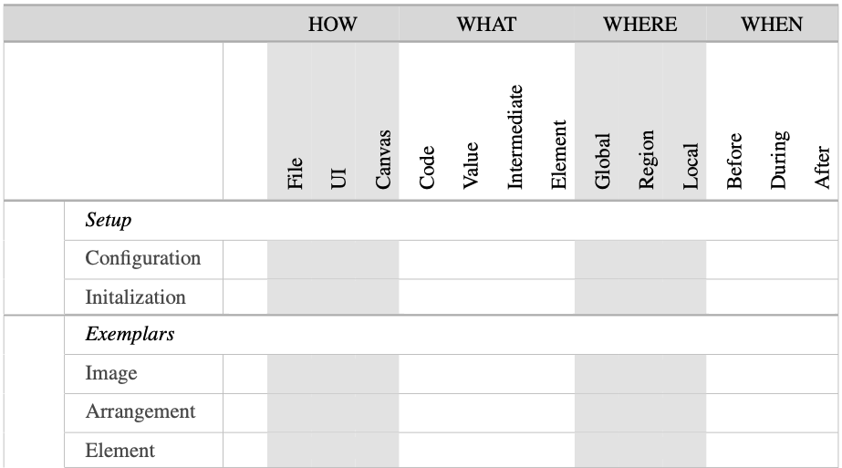
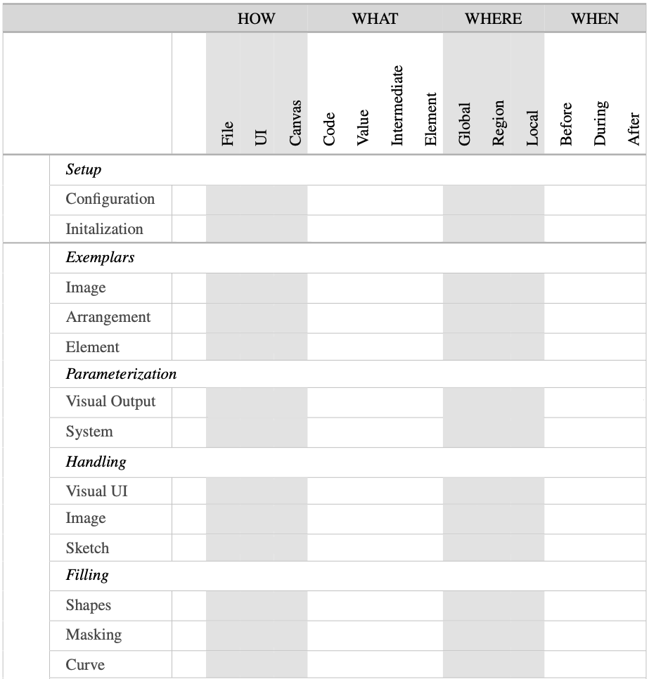
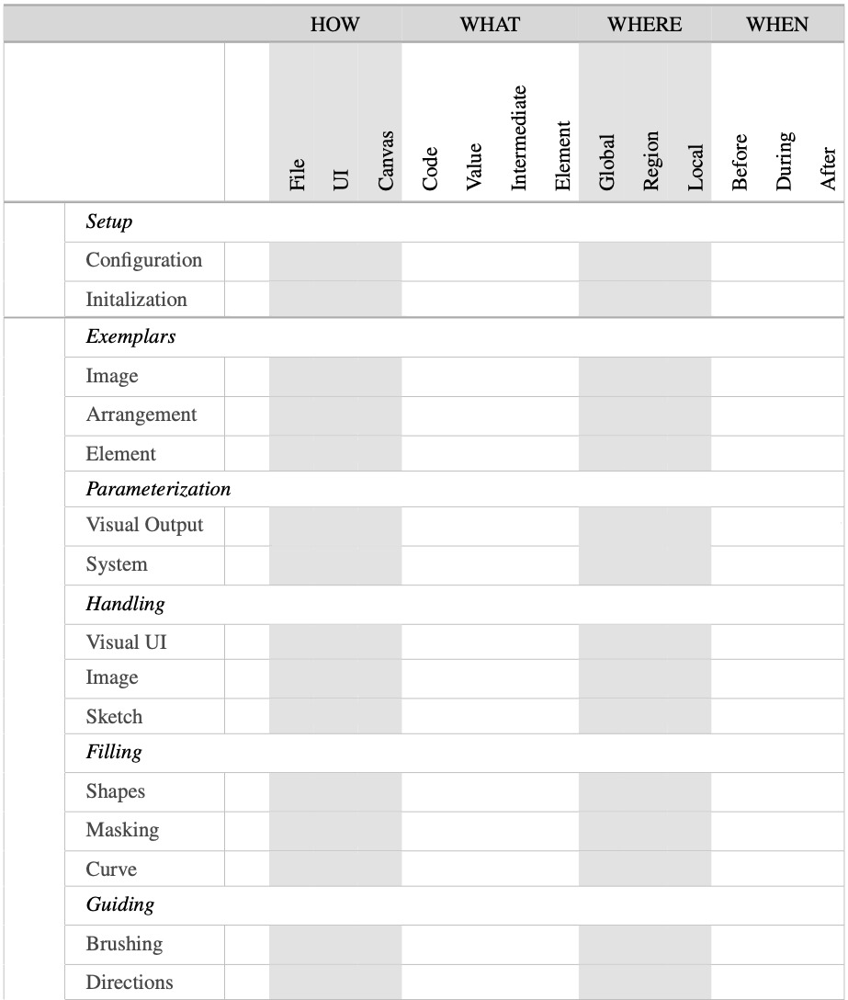
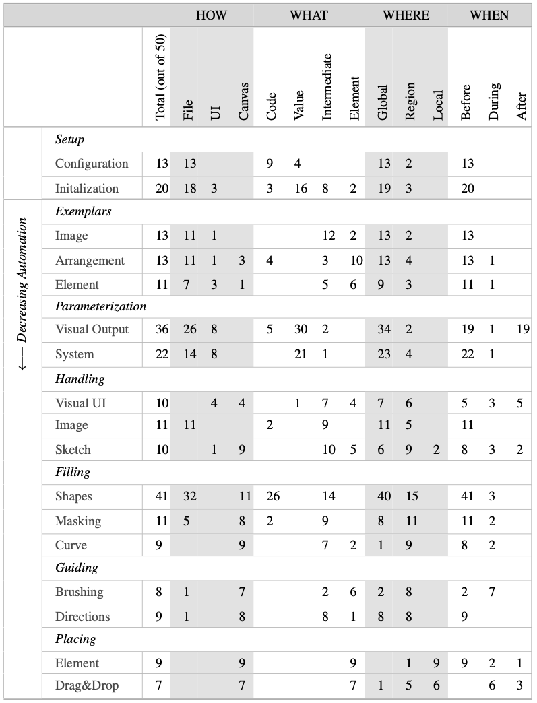
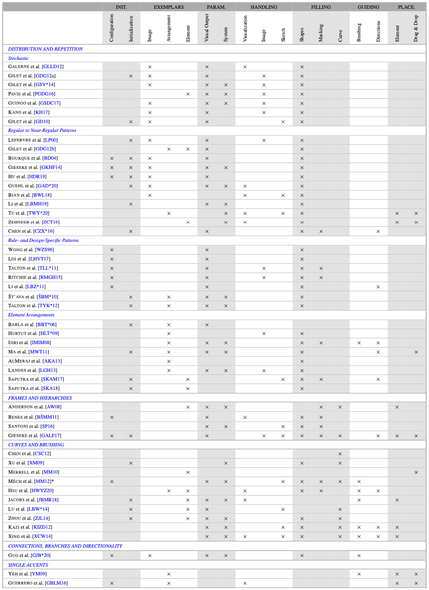
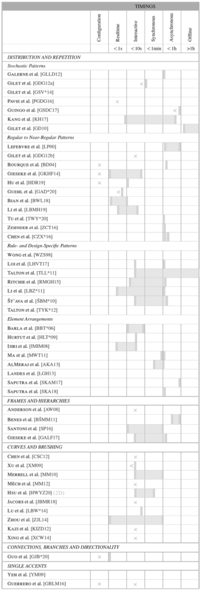

name: inverse
layout: true
class: center, middle, inverse
---

### How, What, Where, When, Who
## Mechanisms for Creative Control

 
### Prof. Dr. Lena Gieseke | l.gieseke@filmuniversitaet.de  

#### Film University Babelsberg KONRAD WOLF

---
layout:false

.center[].imgref[[Image: [pexels, Fahad Puthawala](https://www.pexels.com/photo/close-up-of-hand-painting-a-watercolor-landscape-29559075/)]]

???
ASK: 
* How is input given? 
* What does the artist provide? 
* Where does it act? 
* When in the process? 
* And who is in control? 

---

.center[].imgref[[Image: [Filmuniversität](https://www.filmuniversitaet.de/studium/studienangebot/masterstudiengaenge/creative-technologies/projekte/making-waves)]]

???
ASK: 
* How is input given? 
* What does the artist provide? 
* Where does it act? 
* When in the process? 
* And who is in control? 

---
template:inverse

# Control Mechanisms

???
  

* In computer graphics we are striving to support artists with meaningful digital tools for content generation.
* Many of these techniques are described as...

---
layout: false

## Control Mechanisms

--

> ...artist-usable!  
> ...creatively controllable!

--

We strive for a realistic discussion and towards defining such terms more objectively.

???
  

* Little attention, however, has been paid to overall creative workflows, which need to strike a balance, giving users needed power without burdening them with unwanted details. Often, techniques that are claimed to be artist-controllable turn out not to be so.

* Why are we doing what we are doing?

--

Rooted in the field of computer graphics, 

* we review relevant characteristics of underlying algorithms,

--

* motivated by an artist’s perspective.

???

* We include interface design aspects but they are not the focus of this survey

---
template:inverse

Taxonomy

## How can we describe a creation process?

???
* The following taxonomy lays groundwork for our later evaluation of control mechanisms of the state of the art.
* It is difficult to derive the discussion of means for enabling creativity directly from the related work, as its authors have followed different motivations and have emphasized various aspects when describing their work and results.

---

.header[Taxonomy]

## Control Characteristics

???
  

*  To classify the work in an objective and unified manner and to make it comparable, we analyze general characteristics of control with digital creation tools and then relate the actual presented control mechanisms to them

--

A creation process can be described by answering the questions of 

--

* *How*
* *What*
* *Where*
* *When*
* *Who*

---

.header[Taxonomy | Control Characteristics]

### How - User Interaction

> How is a control executed or an input given by an artist?

* File
* Separate UI
* On-Canvas

---

.header[Taxonomy | Control Characteristics]

### What - Content

> What does an artist give as input?

* Code
* Value
* Intermediate
* Element

---

.header[Taxonomy | Control Characteristics]

### Where - Canvas

> Where does the input have an effect and what is the area of influence?

---

.header[Taxonomy | Control Characteristics]

### When - Timeline

> When is the input given and at what time in the creation process is the control executed?

---

.header[Taxonomy | Control Characteristics]

### Who - User

> Who has the skill set needed to provide the input?

???
  

* This category can be in part derived from the above characteristics of how and what. 
*  The discussion of needed competencies, skills and mindsets, including the accompanying psychological and artistic aspects, is out of the scope of this survey

---

.header[Taxonomy]

## Control Characteristics

.center[]

---
template:inverse

Taxonomy

## How can we classify control mechanisms?

---

.header[Taxonomy]

## Control Mechanisms

* Descriptions of low-level mechanisms as given by the state of the art.  
* Define what an artist can or must work with.

---

.center[]

---

.center[]

---

.center[]

---

.center[]

---

.center[]

---

.center[]

---

.center[]

---

.center[]

---

.center[]

---

.header[Taxonomy]

## Control Mechanisms

.center[]

---

.header[Taxonomy]

## Control Mechanisms

---
template:inverse

## How can we discuss whether a technique is creatively controllable?

---

## Means For Enabling Creativity

Creativity is

* ill-defined, and
* involves insights from various disciplines,
 
making is notoriously difficult topic to address.

---
.header[Means For Enabling Creativity]

## HCI

--

.caps[Shneiderman, Ben]. **Creativity Support Tools: Accelerating Discovery and Innovation**. *Communications of the ACM* 50.12 (2007), 20–32

--

* .caps[Frich, Jonas, Mose Biskjaer, Michael, and Dalsgaard, Peter]. **Twenty Years of Creativity Research in Human- Computer Interaction: Current State and Future Directions**. Proceedings of the 2018 Designing Interactive Systems Conference. ACM, 2018, 1235–1257
* .caps[Frich, Jonas, Macdonald Vermeulen, Lindsay, Remy, Christian, et al.] **Mapping the Landscape of Creativity Support Tools in HCI**. Proceedings of the 2019 CHI Conference on Human Factors in Computing Systems. ACM, 2019, 1–1
* .caps[Remy, Christian, Macdonald Vermeulen, Lindsay, Frich, Jonas, et al.] **Evaluating Creativity Support Tools in HCI Research**. Proceedings of the 2020 ACM Designing Interactive Systems Conference. ACM, 2020, 457–47

--

>  ...asking for more rigorous evaluation in regard to claimed creativity support.  
> ...clearer definitions of creativity.

---
.header[Means For Enabling Creativity]

## Creativity Support Index (CSI)

.caps[Cherry, Erin and Latulipe, Celine]. **Quantifying the Creativity Support of Digital Tools Through the Creativity Support Index**. *ACM Transactions on Computer-Human Interaction* 21.4 (2014), 21:1– 21:25 

--

* Measures how well a tool enables creativity based on a psychometric survey
* *Exploration*, *expressiveness*, *immersion*, *enjoyment*, *results worth effort*, *collaboration*
  
  
--
  
We are looking for

* an evaluation on an algorithmic level,
* as a subset of a more general and user-study-based classification.

---
.header[Means For Enabling Creativity]

## Discussion Basis

.caps[Weisberg, Robert]. **Creativity: Understanding Innovation in Problem Solving, Science, Invention, and the Arts**. *Wiley*, 2006  

.caps[Boden, Margaret A.]. **Creativity and Art: Three Roads to Surprise**. Oxford University Press, 2010  

--

A creative process

> ...intentionally produces a novel product.  

--

Novelty 

> ...as a surprising product, one that the creator did not directly anticipate.

---
.header[Means For Enabling Creativity]

## Discussion Basis

<!-- * The general controllability necessary for navigating a design space

> There are many different roads in the landscape.
 
* Transparency of that navigation and the understanding of cause and effect when using the tool

> I have the map to the landscape and know how to get from one point to another. -->

* Navigation
* Transparency
* Variation
* Stimulation

---
.header[Means For Enabling Creativity]

## Navigation

Navigation describes both whether a creation processes is efficiently manageable and the extent of the controllability.

* Interactive
* Number of Controls
* Navigation History

---
.header[Means For Enabling Creativity]

## Transparency

Transparency describes how clear the understanding of cause and effect within the system is.

* Control Domain
* Control Communication

---
.header[Means For Enabling Creativity]

## Variation

Variation indicates how visually different the results can be.

* Size of the Design Space
* Openness of the Design Space

---
.header[Means For Enabling Creativity]

## Stimulation

The means of stimulation indicate how well an artist can enter a pleasurable and stimulating workflow.

* Immersion
* Stimuli

---
.header[Means For Enabling Creativity]

## Discussion Basis

<!-- * The general controllability necessary for navigating a design space

> There are many different roads in the landscape.
 
* Transparency of that navigation and the understanding of cause and effect when using the tool

> I have the map to the landscape and know how to get from one point to another. -->

* Navigation
    * Interactive
    * Number of Controls
    * Navigation History
* Transparency
    * Control Domain
    * Control Communication
* Variation
    * Size of the Design Space
    * Openness of the Design Space
* Stimulation
    * Immersion
    * Stimuli