name: inverse
layout: true
class: center, middle, inverse
---

<!-- https://conferences.eg.org/eg2021/for-submitters/video-submission/ 

Fast Forward: 20-26s
STARs: 70-75 min

-->

### State Of The Art Report

# A Survey of Control Mechanisms for Creative Pattern Generation

Lena Gieseke - Film University Babelsberg Konrad Wolf  
Paul Asente - Adobe Research  
Radomír Měch - Adobe Research  
Bedrich Benes - Purdue University  
Martin Fuchs - Hochschule der Medien  
  
#   

.center[]

???
.task[COMMENT:]  

* For giving you some insights on what motivated us for this work, lets first have a look at control mechanisms and creative pattern generation separately.
* So, we have "A survey of control mechanisms"

---
template:inverse

## Control Mechanisms

???
.task[COMMENT:]  

* In computer graphics we are striving to support artists with meaningful digital tools for content generation.
* Many of these techniques are described as...

---
layout: false

.header[A Survey of Control Mechanisms for Creative Pattern Generation]

## Control Mechanisms

--

> ...artist-usable!  
> ...creatively controllable!

--

We strive for a realistic discussion and towards defining such terms more objectively.

???
.task[COMMENT:]  

* Little attention, however, has been paid to overall creative workflows, which need to strike a balance, giving users needed power without burdening them with unwanted details. Often, techniques that are claimed to be artist-controllable turn out not to be so.

* Why are we doing what we are doing?

--

Rooted in the field of computer graphics, 

* we review relevant characteristics of underlying algorithms,

--

* motivated by an artist’s perspective.

???
.task[COMMENT:]  

* We include interface design aspects but they are not the focus of this survey

---
template:inverse

## Creative Pattern Generation

???
.task[COMMENT:]  

* So what makes pattern generation to creative pattern generations?

---
.header[A Survey of Control Mechanisms for Creative Pattern Generation]

## Creative Pattern Generation

.center[]

.small[
Left to right:  

* Manuscripts and Archives Division, The New York Public Library. 1450--1475. Historiated initial and another coat of arms.
* Owen Jones. 1867. Examples of Chinese ornament selected from objects in the South Kensington museum and other collections. London: S. & T. Gilbert. 
* The Miriam and Ira D. Wallach Division of Art, Prints and Photographs, The New York Public Library. 1882. Valentine cards utilizing decorative design, depicting flowers, hearts, butterflies and a tree. 
* Spencer Collection, The New York Public Library. 1910. Front doubleur. 
]

???
.task[COMMENT:]  

* France, China, USA, UK, Poland,

---
.header[A Survey of Control Mechanisms for Creative Pattern Generation]

## Creative Pattern Generation

.center[]

.small[
Left to right:  

* The Miriam and Ira D. Wallach Division of Art, Prints and Photographs, The New York Public Library. 1877. Arabesques : mosquée cathédrale de Qous : typan et écoinçons en faïence (XVIe. siècle). 
* William Morris. 1876. African Marigold Printed Textile. Planet Art CD of royalty-free PD images William Morris: Selected Works.
]

???
.task[COMMENT:]  

* Egypt, UK

---
.header[A Survey of Control Mechanisms for Creative Pattern Generation]

## Creative Pattern Generation

.center[]

.small[
Left to right:  
* Colourbox. 2011. Frame with roses. 
* Colourbox. 2013. Illustration of frame in Ukrainian folk style. 
* Izabela Rejke. 2011. Traditional Polish Folk Design. 
* Colourbox. 2013. Ornamental khokhloma oral postcard with seamless stripe.
]

---
.header[A Survey of Control Mechanisms for Creative Pattern Generation]

## A Complex Design Problem

.left-even[]

--

.right-even[
    
* Repetitive and balanced distribution of elements
* Hierarchical structures
* Space-specific designs
* Visual accents
]

---
.header[A Survey of Control Mechanisms for Creative Pattern Generation]

## A Representative Scenario 

--

.left-quarter[]

--

.right-quarter[

Balancing

* the efficiency and accuracy of computation, and
* the control and quality of manual creation.

]

???
.task[COMMENT:]  

* The repetitive nature of patterns is well-suited to algorithmic creation and automation, an artist needs more flexible control mechanisms for adaptable and inventive designs.

---

## A Survey of Control Mechanisms for Creative Pattern Generation

--

> What are the recent advances in 2D pattern generation?
  
--
  
* Focus on procedural models
  
--

> How can we describe a creation process from an artist's perspective?

--
  
* How can we classify control mechanisms?
  
--

> How can we discuss whether a technique is creatively controllable?

???
.task[COMMENT:]  

* Why should you listen?
* What will you gain from listing?

---

## A Survey of Control Mechanisms for Creative Pattern Generation

--

**1.** Theoretical Groundings

* Taxonomy 
    * Control Characteristics  
    * Control Mechanisms
* Means For Enabling Creativity

--
  
**2.** Analysis of the State of the Art

--

**3.** Discussion and Outlook

---
template:inverse

# Taxonomy

???

.task[COMMENT:]  

* The following taxonomy lays groundwork for our later evaluation of control mechanisms of the state of the art.
* It is difficult to derive the discussion of means for enabling creativity directly from the related work, as its authors have followed different motivations and have emphasized various aspects when describing their work and results.

---
template:inverse

Taxonomy

## How can we describe a creation process?

---

.header[Taxonomy]

## Control Characteristics

???
.task[COMMENT:]  

*  To classify the work in an objective and unified manner and to make it comparable, we analyze general characteristics of control with digital creation tools and then relate the actual presented control mechanisms to them

--

A creation process can be described by answering the questions of 

--

* *How*
* *What*
* *Where*
* *When*
* *Who*

---

.header[Taxonomy | Control Characteristics]

### How - User Interaction

> How is a control executed or an input given by an artist?

* File
* Separate UI
* On-Canvas

---

.header[Taxonomy | Control Characteristics]

### What - Content

> What does an artist give as input?

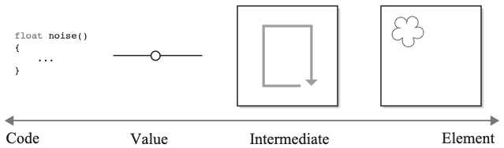

* Code
* Value
* Intermediate
* Element

---

.header[Taxonomy | Control Characteristics]

### Where - Canvas

> Where does the input have an effect and what is the area of influence?

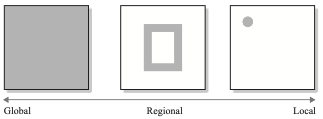

---

.header[Taxonomy | Control Characteristics]

### When - Timeline

> When is the input given and at what time in the creation process is the control executed?

---

.header[Taxonomy | Control Characteristics]

### Who - User

> Who has the skill set needed to provide the input?

???
.task[COMMENT:]  

* This category can be in part derived from the above characteristics of how and what. 
*  The discussion of needed competencies, skills and mindsets, including the accompanying psychological and artistic aspects, is out of the scope of this survey

---

.header[Taxonomy]

## Control Characteristics

.center[]

---
template:inverse

Taxonomy

## How can we classify control mechanisms?

---

.header[Taxonomy]

## Control Mechanisms

* Descriptions of low-level mechanisms as given by the state of the art.  
* Define what an artist can or must work with.

---

.header[Taxonomy | Control Mechanisms]

.center[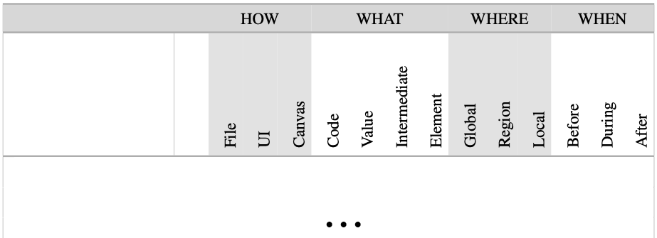]

---

.header[Taxonomy | Control Mechanisms]

.center[]

---

.header[Taxonomy | Control Mechanisms]

.center[]

---

.header[Taxonomy | Control Mechanisms]

.center[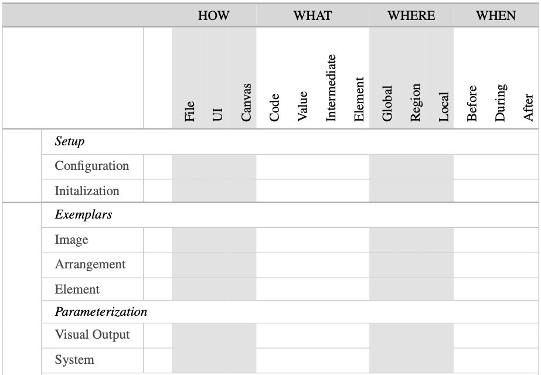]

---

.header[Taxonomy | Control Mechanisms]

.center[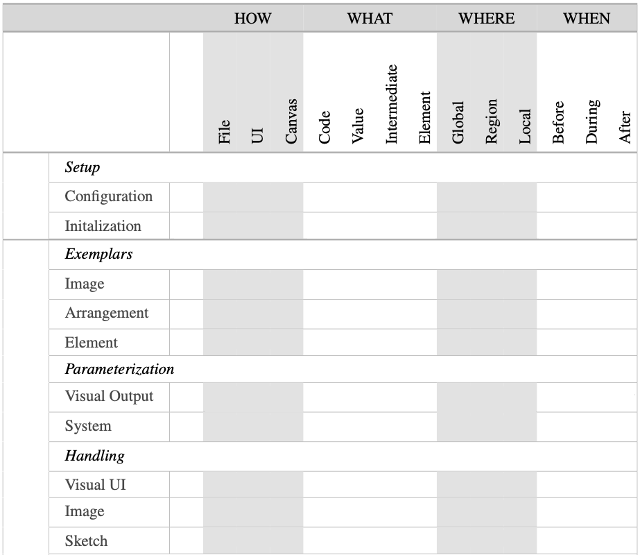]

---

.header[Taxonomy | Control Mechanisms]

.center[]

---

.header[Taxonomy | Control Mechanisms]

.center[]

---

.header[Taxonomy | Control Mechanisms]

.center[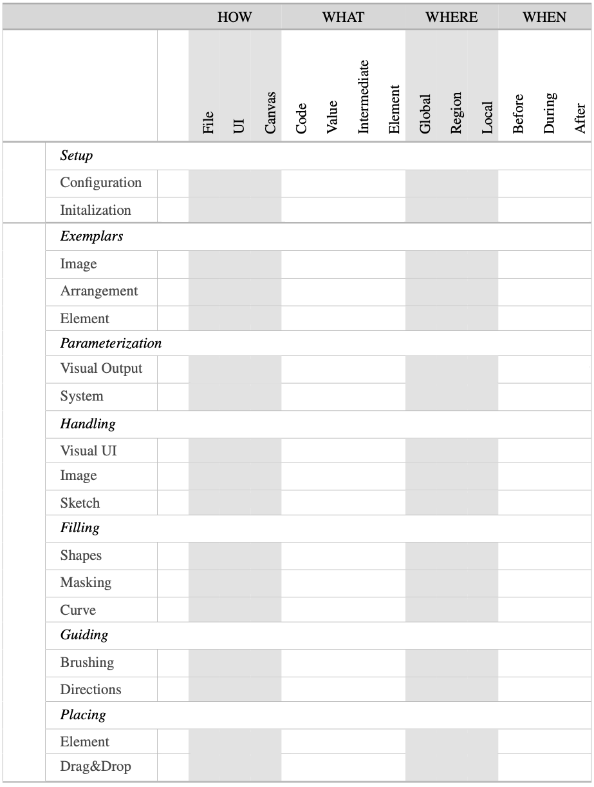]

---

.header[Taxonomy | Control Mechanisms]

.center[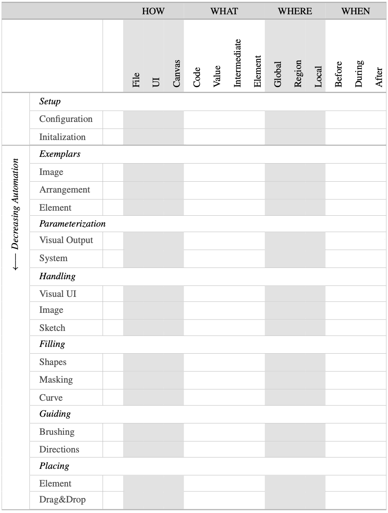]

---

.header[Taxonomy]

## Control Mechanisms

.center[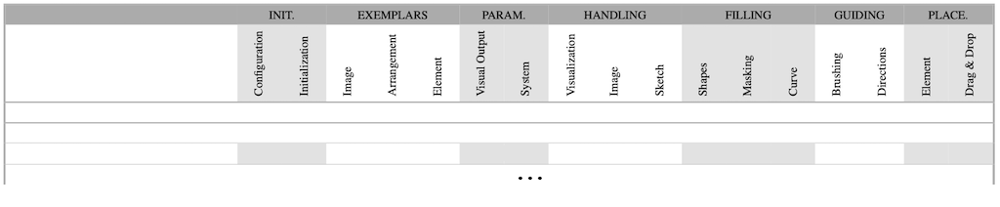]

---

.header[Taxonomy]

## Control Mechanisms

---
template:inverse

## How can we discuss whether a technique is creatively controllable?

---

## Means For Enabling Creativity

Creativity is

* ill-defined, and
* involves insights from various disciplines,
 
making is notoriously difficult topic to address.

---
.header[Means For Enabling Creativity]

## HCI

--

.caps[Shneiderman, Ben]. **Creativity Support Tools: Accelerating Discovery and Innovation**. *Communications of the ACM* 50.12 (2007), 20–32

--

* .caps[Frich, Jonas, Mose Biskjaer, Michael, and Dalsgaard, Peter]. **Twenty Years of Creativity Research in Human- Computer Interaction: Current State and Future Directions**. Proceedings of the 2018 Designing Interactive Systems Conference. ACM, 2018, 1235–1257
* .caps[Frich, Jonas, Macdonald Vermeulen, Lindsay, Remy, Christian, et al.] **Mapping the Landscape of Creativity Support Tools in HCI**. Proceedings of the 2019 CHI Conference on Human Factors in Computing Systems. ACM, 2019, 1–1
* .caps[Remy, Christian, Macdonald Vermeulen, Lindsay, Frich, Jonas, et al.] **Evaluating Creativity Support Tools in HCI Research**. Proceedings of the 2020 ACM Designing Interactive Systems Conference. ACM, 2020, 457–47

--

>  ...asking for more rigorous evaluation in regard to claimed creativity support.  
> ...clearer definitions of creativity.

---
.header[Means For Enabling Creativity]

## Creativity Support Index (CSI)

.caps[Cherry, Erin and Latulipe, Celine]. **Quantifying the Creativity Support of Digital Tools Through the Creativity Support Index**. *ACM Transactions on Computer-Human Interaction* 21.4 (2014), 21:1– 21:25 

--

* Measures how well a tool enables creativity based on a psychometric survey
* *Exploration*, *expressiveness*, *immersion*, *enjoyment*, *results worth effort*, *collaboration*
  
  
--
  
We are looking for

* an evaluation on an algorithmic level,
* as a subset of a more general and user-study-based classification.

---
.header[Means For Enabling Creativity]

## Discussion Basis

.caps[Weisberg, Robert]. **Creativity: Understanding Innovation in Problem Solving, Science, Invention, and the Arts**. *Wiley*, 2006  

.caps[Boden, Margaret A.]. **Creativity and Art: Three Roads to Surprise**. Oxford University Press, 2010  

--

A creative process

> ...intentionally produces a novel product.  

--

Novelty 

> ...as a surprising product, one that the creator did not directly anticipate.

---
.header[Means For Enabling Creativity]

## Discussion Basis

<!-- * The general controllability necessary for navigating a design space

> There are many different roads in the landscape.
 
* Transparency of that navigation and the understanding of cause and effect when using the tool

> I have the map to the landscape and know how to get from one point to another. -->

* Navigation
* Transparency
* Variation
* Stimulation

---
.header[Means For Enabling Creativity]

## Navigation

Navigation describes both whether a creation processes is efficiently manageable and the extent of the controllability.

* Interactive
* Number of Controls
* Navigation History

---
.header[Means For Enabling Creativity]

## Transparency

Transparency describes how clear the understanding of cause and effect within the system is.

* Control Domain
* Control Communication

---
.header[Means For Enabling Creativity]

## Variation

Variation indicates how visually different the results can be.

* Size of the Design Space
* Openness of the Design Space

---
.header[Means For Enabling Creativity]

## Stimulation

The means of stimulation indicate how well an artist can enter a pleasurable and stimulating workflow.

* Immersion
* Stimuli

---
.header[Means For Enabling Creativity]

## Discussion Basis

<!-- * The general controllability necessary for navigating a design space

> There are many different roads in the landscape.
 
* Transparency of that navigation and the understanding of cause and effect when using the tool

> I have the map to the landscape and know how to get from one point to another. -->

* Navigation
    * Interactive
    * Number of Controls
    * Navigation History
* Transparency
    * Control Domain
    * Control Communication
* Variation
    * Size of the Design Space
    * Openness of the Design Space
* Stimulation
    * Immersion
    * Stimuli

<!-- /////////////////////////////////////////////////////////////////////////////////////////// ANALYSIS -->
<!-- /////////////////////////////////////////////////////////////////////////////////////////// ANALYSIS -->
<!-- /////////////////////////////////////////////////////////////////////////////////////////// ANALYSIS -->

---
template:inverse

# Analysis of the State of the Art

???
.task[COMMENT:]  

At this point we have an understanding of what relevant characteristics of a creation process are from an artist's perspective, how to classify control mechanisms and how we can discuss creative controllability on algorithmic level.

In the second part of this presentation we have a look into our summary and analysis of the state of the art.

The analyzed works are further categorized by the design features they can create. Within those design areas we investigate how an artist can create such designs and how control mechanisms are clustered for each design feature. 

---
.header[Analysis of the State of the Art]

## Categorization by Design Features

???

.task[COMMENT:]  

We define the following relevant design features for the state of the art - the features are similar to what we discussed for the historic examples in the introduction this presentation.

--

* Distribution and repetition

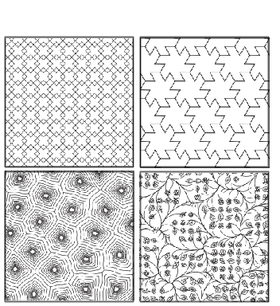

.small[
* Loi, Hugo, Hurtut, Thomas, Vergne, Romain, and Thollot, Joelle. **Programmable 2D Arrangements for Element Texture Design**. *ACM Transactions on Graphics* 36.3 (2017), 27:1–27:17]

???

.task[COMMENT:]  

* Distribution and Repetition refers to an overall distribution of elements and usually results in a homogeneous pattern with a texture-like quality. 

<!--   
* A careful composition of the repeating elements can be used to create a perception of balance and order.
* Compositions are not limited to the repetition of the same element, but different visual qualities such as size or saturation can create various relationships. -->

---
.header[Analysis of the State of the Art]

## Categorization by Design Features

* Distribution and repetition
* Frames and hierarchies

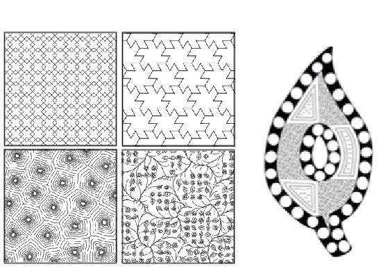

.small[
* Loi, Hugo, Hurtut, Thomas, Vergne, Romain, and Thollot, Joelle. **Programmable 2D Arrangements for Element Texture Design**. *ACM Transactions on Graphics* 36.3 (2017), 27:1–27:17
* Santoni, Christian And Pellacini, Fabio. **gTangle: A Grammar for the Procedural Generation of Tangle Patterns**. *ACM Transactions on Graphics* 35.6 (2016), 182:1–182:11
]

???

.task[COMMENT:]  

* Frames and Hierarchies form compositions that further structure a design by creating contrasts, e.g., foreground vs. background, and accentuating spatial relationships, e.g., framing.

---
.header[Analysis of the State of the Art]

## Categorization by Design Features

* Distribution and repetition
* Frames and hierarchies
* Curves and brushing

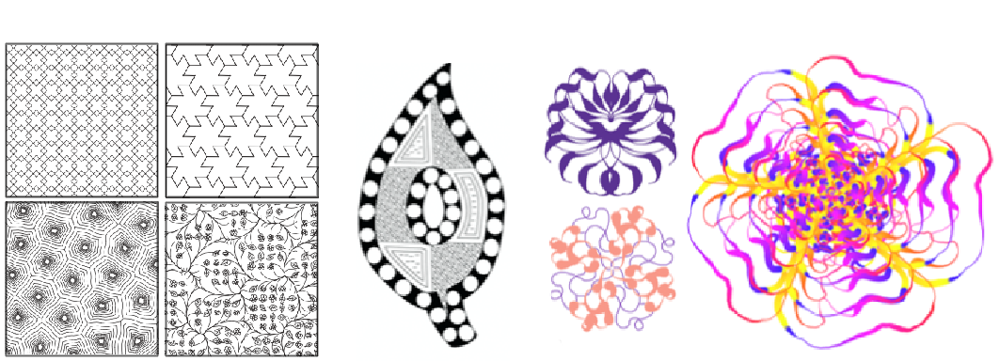

.small[
* Loi, Hugo, Hurtut, Thomas, Vergne, Romain, and Thollot, Joelle. **Programmable 2D Arrangements for Element Texture Design**. *ACM Transactions on Graphics* 36.3 (2017), 27:1–27:17
* Santoni, Christian And Pellacini, Fabio. **gTangle: A Grammar for the Procedural Generation of Tangle Patterns**. *ACM Transactions on Graphics* 35.6 (2016), 182:1–182:11
* Jacobs, Jennifer, Brandt, Joel R., Měch, Radomír, And Resnick, Mitchel. **Dynamic Brushes: Extending Manual Drawing Practices with Artist-Centric Programming Tools**. *Extended Abstracts of the CHI Conference on Human Factors in Computing Systems*. ACM, 2018, D316:1–D316:4
]

???

.task[COMMENT:]  

* Curves, Lines and Brushing refer to artist-defined curved elements, which can be used, for example, as a base element or frame or as a distinct visual element. 
* Brushing usually gives an individual, hand-made quality to a pattern.

---
.header[Analysis of the State of the Art]

## Categorization by Design Features

* Distribution and repetition
* Frames and hierarchies
* Curves and brushing
* Connections, branches and directionality

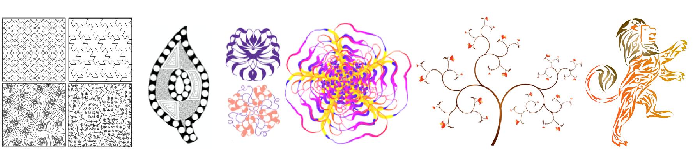

.small[
* Loi, Hugo, Hurtut, Thomas, Vergne, Romain, and Thollot, Joelle. **Programmable 2D Arrangements for Element Texture Design**. *ACM Transactions on Graphics* 36.3 (2017), 27:1–27:17
* Santoni, Christian And Pellacini, Fabio. **gTangle: A Grammar for the Procedural Generation of Tangle Patterns**. *ACM Transactions on Graphics* 35.6 (2016), 182:1–182:11
* Jacobs, Jennifer, Brandt, Joel R., Měch, Radomír, And Resnick, Mitchel. **Dynamic Brushes: Extending Manual Drawing Practices with Artist-Centric Programming Tools**. *Extended Abstracts of the CHI Conference on Human Factors in Computing Systems*. ACM, 2018, D316:1–D316:4
* Guo, Jianwei, Jiang, Haiyong, Benes, Bedrich, et al. **Inverse Procedural Modeling of Branching Structures by Inferring L- Systems**. *ACM Transactions on Graphics* 39.5 (2020)
* Saputra, Reza Adhitya, Kaplan, Craig S., Asente, Paul, and Měch, Radomír. **FLOWPAK: Flow-based Ornamental Element Packing**. Proceedings of the Graphics Interface Conference. Canadian Human-Computer Communications Society, 2017, 8–15
]

???
.task[COMMENT:]  

* Connections, Branches and Directionality between base elements are often used to further emphasize frames and hierarchies and accentuate the form of the space they fill.

---
.header[Analysis of the State of the Art]

## Categorization by Design Features

* Distribution and repetition
* Frames and hierarchies
* Curves and brushing
* Connections, branches and directionality
* Single accents

.center[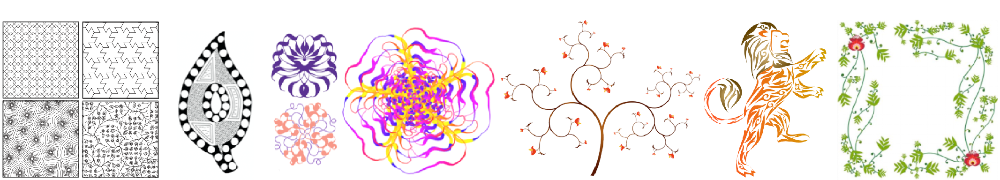]

.small[
* Loi, Hugo, Hurtut, Thomas, Vergne, Romain, and Thollot, Joelle. **Programmable 2D Arrangements for Element Texture Design**. *ACM Transactions on Graphics* 36.3 (2017), 27:1–27:17
* Santoni, Christian And Pellacini, Fabio. **gTangle: A Grammar for the Procedural Generation of Tangle Patterns**. *ACM Transactions on Graphics* 35.6 (2016), 182:1–182:11
* Jacobs, Jennifer, Brandt, Joel R., Měch, Radomír, And Resnick, Mitchel. **Dynamic Brushes: Extending Manual Drawing Practices with Artist-Centric Programming Tools**. *Extended Abstracts of the CHI Conference on Human Factors in Computing Systems*. ACM, 2018, D316:1–D316:4
* Guo, Jianwei, Jiang, Haiyong, Benes, Bedrich, et al. **Inverse Procedural Modeling of Branching Structures by Inferring L- Systems**. *ACM Transactions on Graphics* 39.5 (2020)
* Saputra, Reza Adhitya, Kaplan, Craig S., Asente, Paul, and Měch, Radomír. **FLOWPAK: Flow-based Ornamental Element Packing**. Proceedings of the Graphics Interface Conference. Canadian Human-Computer Communications Society, 2017, 8–15
* Gieseke, Lena, Asente, Paul, Lu, Jingwan, and Fuchs, Martin. **Organized Order in Ornamentation**. *Proceedings of the Symposium on Computational Aesthetics*. ACM, 2017, 4:1–4:9
]

???
.task[COMMENT:]  

* Single Accents refer to visually dominant elements and structures that might not follow the underlying order of a pattern, breaking an otherwise homogeneous appearance. 

--

* Control mechanisms are clustered for each design feature

???
.task[COMMENT:]  

* Within these groups of what is created we analyse the control mechanisms, meaning how something is created and further cluster techniques. 

---
template:inverse

Analysis of the State of the Art

## Distribution and Repetition

---

.header[Analysis of the State of the Art]

## Distribution and Repetition

* Stochastic Pattern
* Regular to Near-Regular Pattern
* Rule-based and Design-Specific Patterns
* Element Arrangements

---

.header[Analysis of the State of the Art | Distribution and Repetition]

### Stochastic Pattern

???
.task[COMMENT:]  

* which are generated with noise functions

--

.center[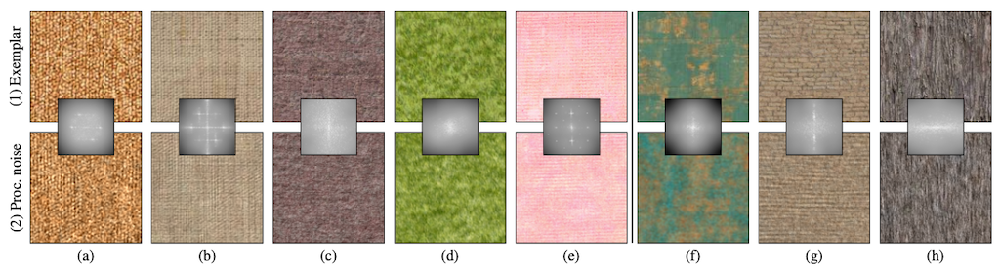]

.caps[Galerne, Bruno, Lagae, Ares, Lefebvre, Sylvain, and Drettakis, George]. **Gabor Noise by Example**. *ACM Transactions on Graphics* 31.4 (2012), 73:1–73:9

---

.header[Analysis of the State of the Art | Distribution and Repetition]

### Stochastic Pattern

.center[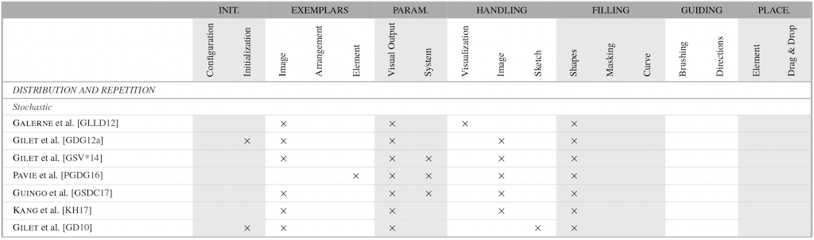]

Cluster

* Example-Based

---

.header[Analysis of the State of the Art | Distribution and Repetition]

### Stochastic Pattern

.center[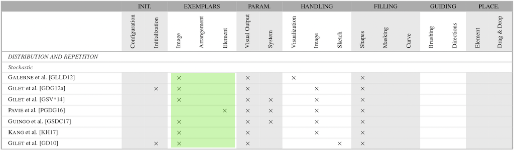]

Cluster

* Example-Based

---

.header[Analysis of the State of the Art | Distribution and Repetition]

### Stochastic Pattern

.center[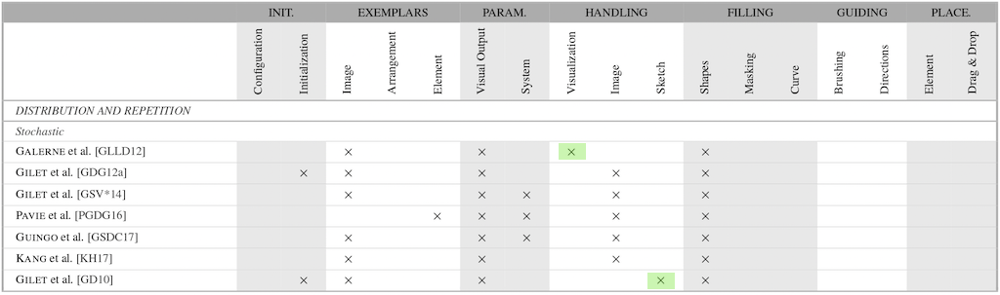]

Cluster

* Example-Based

???
.task[COMMENT:]  

* GILET et al. chooses through sketching a relevant zone for analysis of an exemplar. 

---

.header[Analysis of the State of the Art | Distribution and Repetition]

### Stochastic Pattern

.center[
<video style="padding-top:10px; outline:none; width:80%;" controls>
  <source src="img/galerne_2012_gne_cut.mp4" type="video/mp4">
</video>
]  
  
.caps[Galerne, Bruno, Lagae, Ares, Lefebvre, Sylvain, and Drettakis, George]. **Gabor Noise by Example**. *ACM Transactions on Graphics* 31.4 (2012), 73:1–73:9

???
.task[COMMENT:]  

* GALERNE et al. [GLLD12] add an interactive visual editor for adjusting their Gabor noise to the example fitting. 
* Due to the abstract visual nature of a power spectrum, its connection to the visual features of the noise is not directly intuitive for artists. Hence, the editor has a strong exploratory nature to it. However, as the editing itself is interactive and visually appealing, it is inviting to do so.

---

.header[Analysis of the State of the Art | Distribution and Repetition]

### Regular to Near-Regular Patterns

???
.task[COMMENT:]  

* are usually optimized for specific design goals or even support a variety of procedural models within this class of designs.

--

.center[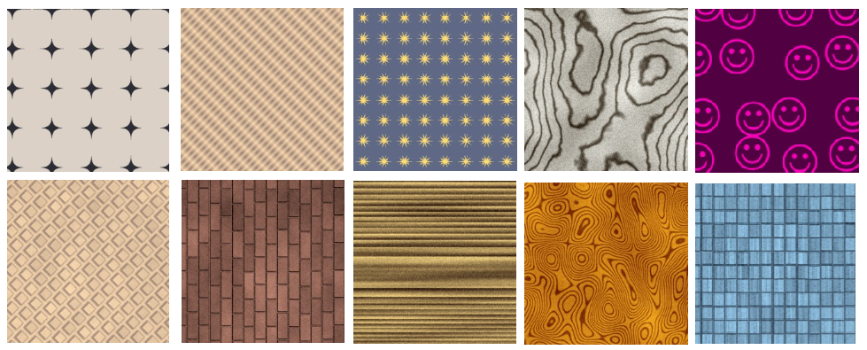]

.caps[Gieseke, L., Koch, S., Hahn, J.-u., and Fuchs, M.] **Interactive Parameter Retrieval for Two-Tone Procedural Textures**. *Computer Graphics Forum* 33.4 (2014), 71–79

---

.header[Analysis of the State of the Art | Distribution and Repetition]

### Regular to Near-Regular Patterns

.center[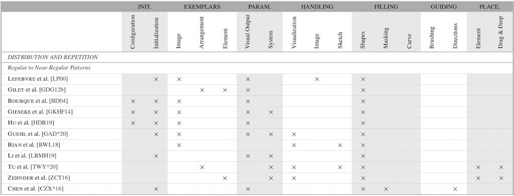]

Cluster

* Example-Based
* Data-Driven

---

.header[Analysis of the State of the Art | Distribution and Repetition]

### Regular to Near-Regular Patterns

.center[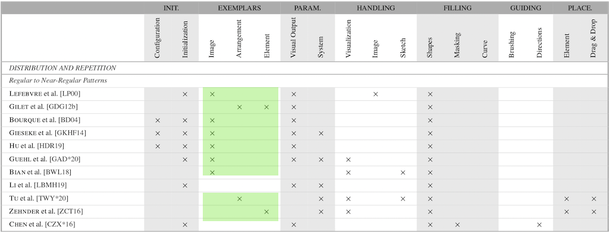]

Cluster

* Example-Based
* Data-Driven

---

.header[Analysis of the State of the Art | Distribution and Repetition]

### Regular to Near-Regular Patterns

.center[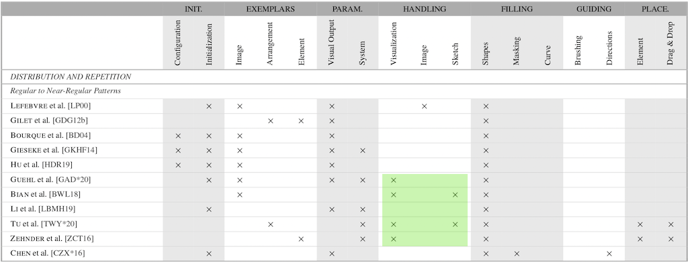]

Cluster

* Example-Based
* Data-Driven

---

.header[Analysis of the State of the Art | Distribution and Repetition]

### Regular to Near-Regular Patterns

.center[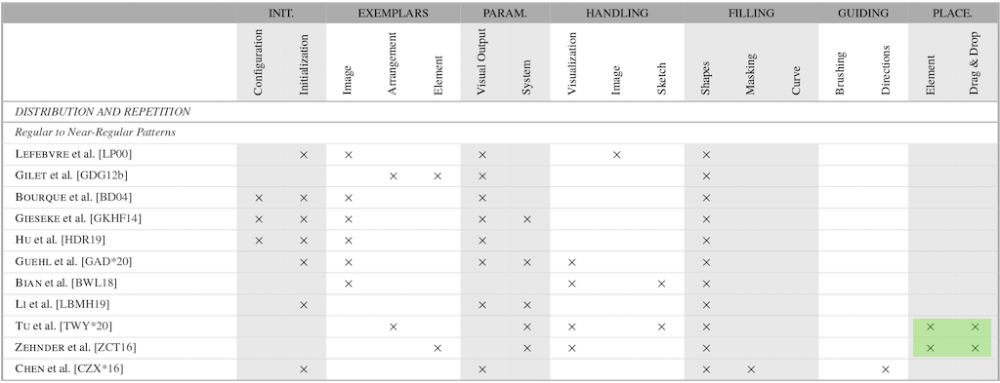]

Cluster

* Example-Based
* Data-Driven

---

.header[Analysis of the State of the Art | Distribution and Repetition]

### Regular to Near-Regular Patterns

<!-- <video style="padding-top:10px; outline:none; width:100%;" controls>
  <source src="img/guehl_2020_stu_cut.mp4" type="video/mp4">
</video>

.caps[Guehl, Pascal, Allègre, Remi, Dischler, Jean- Michel, et al.] **Semi-Procedural Textures Using Point Process Texture Basis Functions**. *Computer Graphics Forum* (2020) -->

<video style="padding-top:10px; outline:none; width:100%;" controls>
  <source src="img/zehnder_2016_dso_cut.mp4" type="video/mp4">
</video>

.caps[Zehnder, Jonas, Coros, Stelian, and Thomaszewski, Bernhard.] **Designing Structurally-sound Ornamental Curve Networks**. *ACM Transactions on Graphics* 35.4 (2016), 99:1–99:10

???
.task[COMMENT:]  

* ZEHNDER et al. [ZCT16] provide artists with a tool to directly assemble structurally sound curve networks on a three-dimensional surface in 3D. The components of the network are spline curves defined by the artist. 
* Components can be placed manually or are repeated semi-automatically. The curves can be moved on the sur- face while having an elastic quality to them, which seems to be a quite engaging task. 
* To prevent structural weaknesses, the system indicates problematic areas and suggests improvements, seamlessly combining the design task with engineering requirements. 
* The performance of the automatic packing highly depends in the number of curves and ranges from seconds up to 15 minutes on average for the presented examples.

---

.header[Analysis of the State of the Art | Distribution and Repetition]

### Rule-Based and Design-Specific Patterns

.center[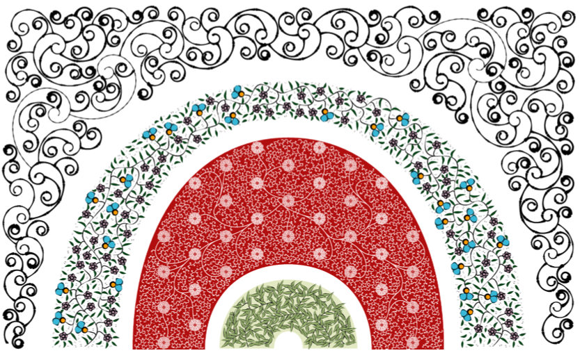]

.caps[Wong, Michael T., Zongker, Douglas E., and Salesin, David H.] **Computer-generated Floral Ornament**. *Proceedings of the Conference on Computer Graphics and Interactive Techniques*. ACM, 1998, 423–434

???
.task[COMMENT:]  

*  are based on a specific set of rules or grammars, as for example the ornamental patterns shown here.

???
.task[COMMENT:]  

* WONG et al. [WZS98] introduced a programmable procedural system that employs a greedy rule-based strategy to generate ornamental patterns.
* All adjustments to the design and layout of an ornament have to be done by writing code. The au- thors do not report any performance times.

---

.header[Analysis of the State of the Art | Distribution and Repetition]

### Rule-Based and Design-Specific Patterns

.center[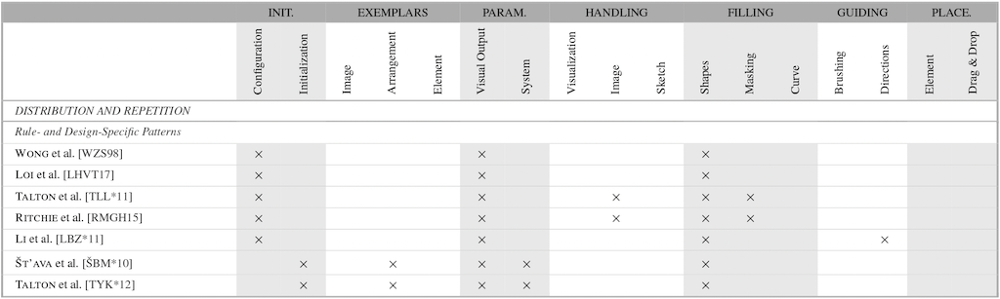]

Cluster

* Example-Based
* Probabilistic Interference
* Fields

---

.header[Analysis of the State of the Art | Distribution and Repetition]

### Rule-Based and Design-Specific Patterns

.center[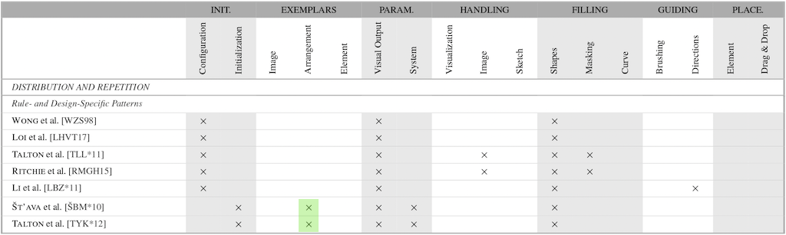]

Cluster

* Example-Based
* Probabilistic Interference
* Fields

---

.header[Analysis of the State of the Art | Distribution and Repetition]

### Rule-Based and Design-Specific Patterns

.center[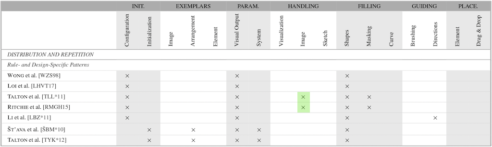]

Cluster

* Example-Based
* Probabilistic Interference
* Fields

---

.header[Analysis of the State of the Art | Distribution and Repetition]

### Rule-Based and Design-Specific Patterns

.center[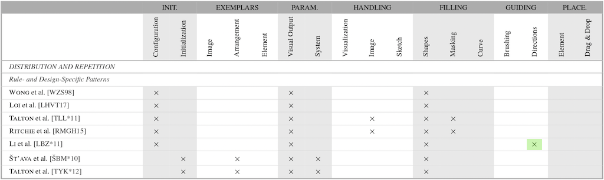]

Cluster

* Example-Based
* Probabilistic Interference
* Fields

???
.task[COMMENT:]  

* these techniques focus on filling global shapes, often supporting masks.

---

.header[Analysis of the State of the Art | Distribution and Repetition]

### Rule-Based and Design-Specific Patterns

.center[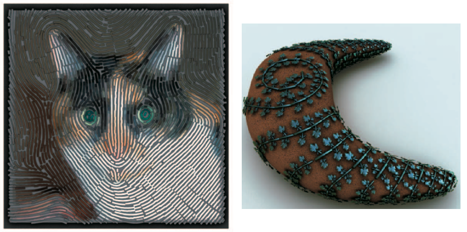]

.caps[Li, Yuanyuan, Bao, Fan, Zhang, Eugene, et al.] **Geometry Synthesis on Surfaces Using Field-Guided Shape Grammars**. *IEEE Transactions on Visualization and Computer Graphics* 17.2 (2011), 231– 243

???
.task[COMMENT:]  

* For repeating structures and filling shapes, LI presents a shape grammar that is guided by either a vector or tensor field with the field being able to influence the grammar. The artist can specify a priori constraints to design the field. 

---

.header[Analysis of the State of the Art | Distribution and Repetition]

### Element Arrangements

.center[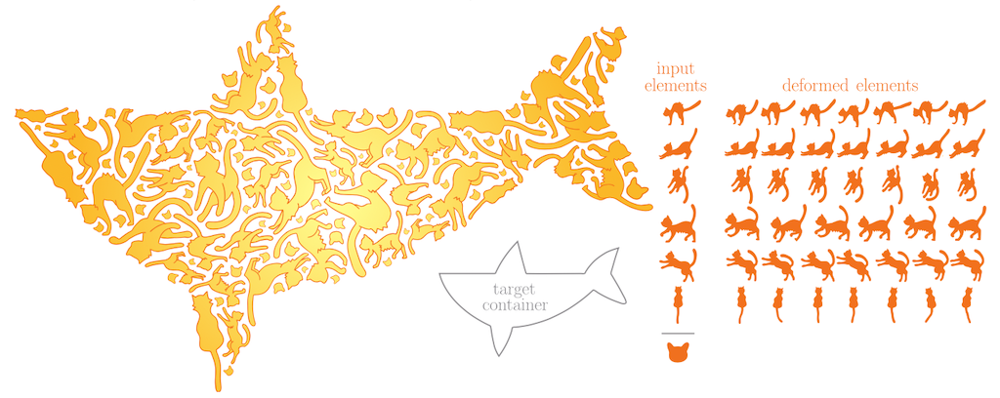]

.caps[Saputra, Rezaadhitya, Kaplan, Craig S.,and Asente, Paul.] **RepulsionPak: Deformation-Driven Element Packing with Re- pulsion Forces**. *Proceedings of the 44th Graphics Interface Conference*. Canadian Human-Computer Communications Society (20180, 10–1

---
.header[Analysis of the State of the Art | Distribution and Repetition]

### Element Arrangements

.center[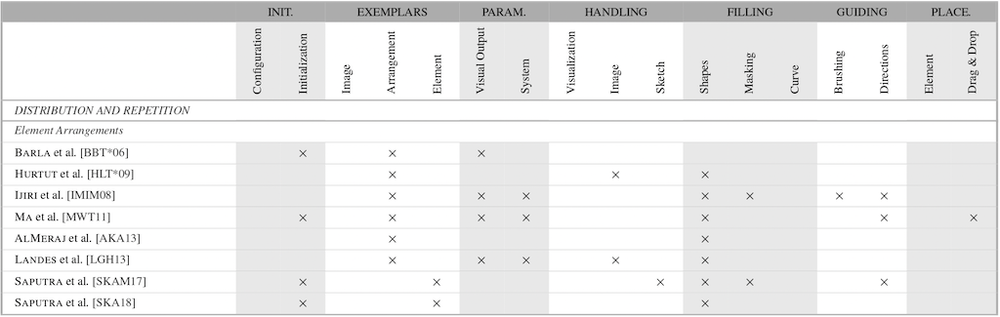]

Cluster

* Example-Based
* Fields
* Data-Driven

---
.header[Analysis of the State of the Art | Distribution and Repetition]

### Element Arrangements

.center[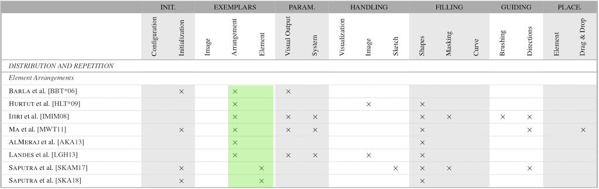]

Cluster

* Example-Based
* Fields
* Data-Driven

---
.header[Analysis of the State of the Art | Distribution and Repetition]

### Element Arrangements

.center[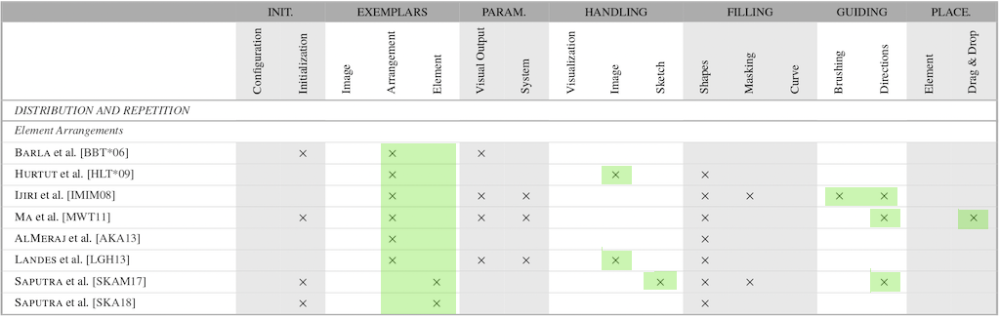]

Cluster

* Example-Based
* Fields
* Data-Driven

---
.header[Analysis of the State of the Art | Distribution and Repetition]

### Element Arrangements

.center[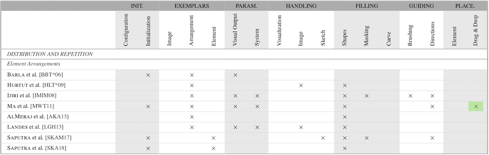]

Cluster

* Example-Based
* Fields
* Data-Driven

---

.header[Analysis of the State of the Art | Distribution and Repetition]

### Element Arrangements

.center[
<video style="padding-top:10px; outline:none; width:80%;" controls>
  <source src="img/ma_2011_det.mp4" type="video/mp4">
</video>
]

.caps[Ma, Chongyang, Wei, Li-yi, and Tong, Xin]. **Discrete Element Textures**. *ACM Transactions on Graphics* 30.4 (2011), 62:1– 62:10

???
.task[COMMENT:]  

* The technique of MA et al. [MWT11] is based on a sample of a discrete element distribution and a shape to fill, both in two and three dimensions. The exemplar has to contain the actual elements in their domain and cannot be pixel data. In order to fill the output shape with elements, an energy optimization is processed with a novel neighborhood similarity metric. 

---
template:inverse

Analysis of the State of the Art

## Frames and Hierarchies

---

.header[Analysis of the State of the Art]

## Frames and Hierarchies

.center[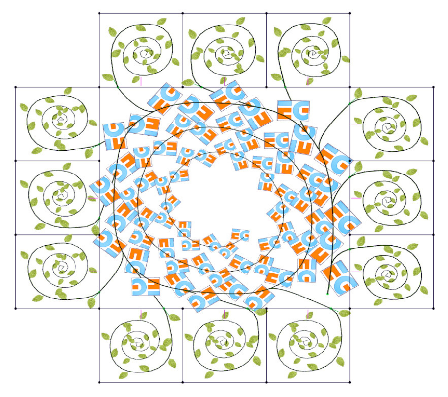]

.caps[Benes,b., Št’ava, O., Měch, R.,and Miller, G.] **Guided Procedural Modeling**. *Computer Graphics Forum* 30.2 (2011), 325– 334

???
.task[COMMENT:]  

* For the design feature of Frames and Hierarchies, results usually consist of different patterns in different areas as shown by the visual example from the work auf Benes and colleguages. They offer a complex shape-filling and masking system for procedural L-system models by dividing a target space into artist-editable guide shapes, which are edited based on a mass-spring system,.

---
.header[Analysis of the State of the Art]

## Frames and Hierarchies

.center[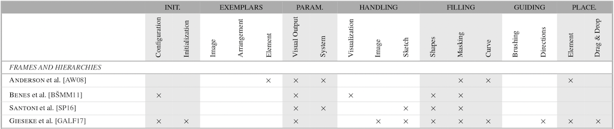]

Cluster

* Curves
* Shapes and Masks
* Curves, Shapes and Masks 

---
.header[Analysis of the State of the Art]

## Frames and Hierarchies

.center[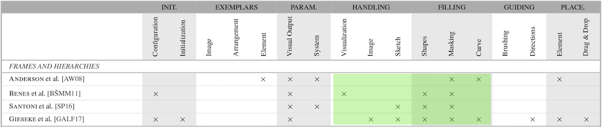]

Cluster

* Curves
* Shapes and Masks
* Curves, Shapes and Masks 

---

.header[Analysis of the State of the Art]

## Frames and Hierarchies

<video style="padding-top:10px; outline:none; width:100%;" controls>
  <source src="img/santoni_2016_ggp_cut.mp4" type="video/mp4">
</video>

.caps[Santoni, Christian And Pellacini, Fabio.] **gTangle: A Grammar for the Procedural Generation of Tangle Patterns**. *ACM Transactions on Graphics* 35.6 (2016), 182:1–182:11

???
.task[COMMENT:]  

* SANTONI et al. [SP16] present the design-specific generation of tangles with a stochastic shape grammar. 
* The authors present an interactive system for creation based on a parameterized artist interface, in- cluding rule re-expansion and sketch-based operator modification. The presented system is a powerful combination of editing operations with procedural generation. The work also includes navigation through the editing history, which is noteworthy as this basic operation needed for creative control is usually overlooked.

---
template:inverse

Analysis of the State of the Art

## Curves and Brushing

---
.header[Analysis of the State of the Art]

## Curves and Brushing

.center[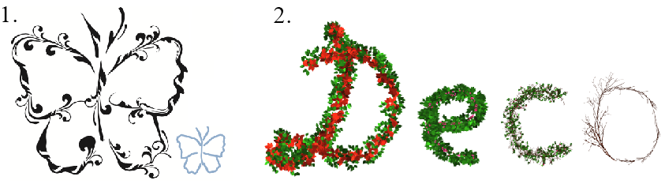]

1. .caps[Lu, Jingwan, Barnes, Connelly, Wan, Connie, et al.] **DecoBrush: Drawing Structured Decorative Patterns by Example**. *ACM Transactions on Graphics* 33.4 (2014), 90:1–90:9
2. .caps[Měch, Radomír and Miller, Gavin.] **The Deco framework for interactive procedural modeling**. *Journal of Computer Graphics Techniques* 1.1 (2012), 43–99.

---
.header[Analysis of the State of the Art]

## Curves and Brushing

.center[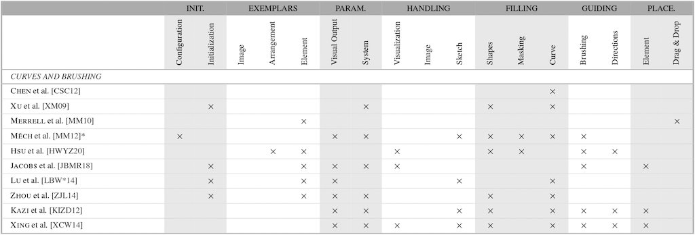]

Cluster

* Data-Driven

---
.header[Analysis of the State of the Art]

## Curves and Brushing

.center[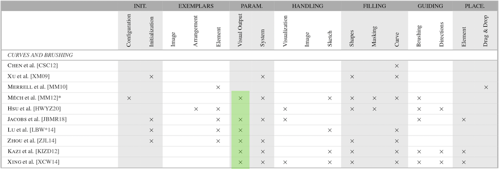]

Cluster

* Data-Driven

---
.header[Analysis of the State of the Art]

## Curves and Brushing

<video style="padding-top:10px; outline:none; width:100%;" controls>
  <source src="img/xing_2014_apr_cut.mp4" type="video/mp4">
</video>

.caps[Xing, Jun, Chen, Hsiang-ting, and Wei, Li-Yi.] **Autocomplete Painting Repetitions**. *ACM Transactions on Graphics* 33.6 (2014), 172:1–172:11

???
.task[COMMENT:]  

* XING et al. [XCW14] automatically detecting and suggesting possible repetitions to the artist, aiming for a less regular, more painting-like quality. The presented system also offers various brush options and navigation tools in order to combine automation with artist control. 

---
template:inverse

Analysis of the State of the Art

## Connections, Branches and Directionality

---
.header[Analysis of the State of the Art]

## Connections, Branches and Directionality

.center[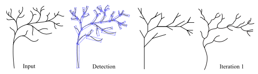]

.caps[Guo, Jianwei, Jiang, Haiyong, Benes, Bedrich, et al.] **Inverse Procedural Modeling of Branching Structures by Inferring L- Systems**. *ACM Transactions on Graphics* 39.5 (2020)

???
.task[COMMENT:]  

* GUO et al. [GJB*20] focus specifically on creat- ing branching structures with an inverse modeling process for in- ferring a generating L-system.
* Beside the exemplar, a user can in- put the length of the rules and the frequency of the repetition.

---
.header[Analysis of the State of the Art]

## Connections, Branches and Directionality

.center[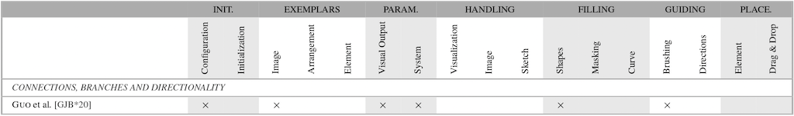]

Cluster

* Fields
* Example-based
* Data-Driven

---
.header[Analysis of the State of the Art]

## Connections, Branches and Directionality

.center[
<video style="padding-top:10px; outline:none; width:75%;" controls>
  <source src="img/gieseke_2017_ooo_cut.mp4" type="video/mp4">
</video>
]

.caps[Gieseke, Lena, Asente, Paul, Lu, Jingwan, and Fuchs, Martin.] **Organized Order in Ornamentation**. *Proceedings of the Symposium on Computational Aesthetics*. ACM, 2017, 4:1–4:9 

???
.task[COMMENT:]  

* Gieseke and collagues enables a sense of directionality by controlling the growth of a pattern through vector fields and directing the connectivity and branching of elements along user-specified paths ans streamlines. 

---
template:inverse

Analysis of the State of the Art

## Single Accents

---
.header[Analysis of the State of the Art]

## Single Accents

.center[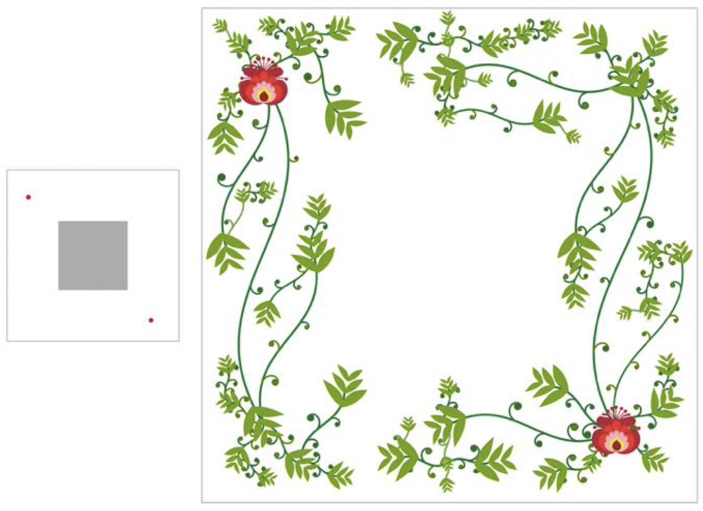]

.caps[Gieseke, Lena, Asente, Paul, Lu, Jingwan, and Fuchs, Martin.] **Organized Order in Ornamentation**. *Proceedings of the Symposium on Computational Aesthetics*. ACM, 2017, 4:1–4:9 

---
.header[Analysis of the State of the Art]

## Single Accents

.center[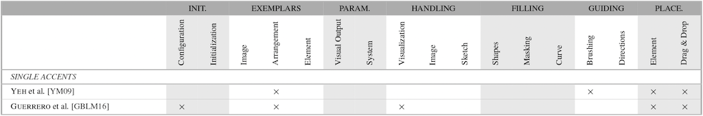]

---
.header[Analysis of the State of the Art]

## Single Accents

.center[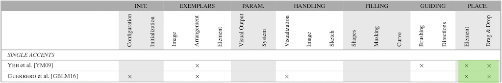]

---
.header[Analysis of the State of the Art]

## Single Accents

.center[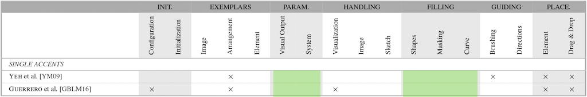]

---
.header[Analysis of the State of the Art]

## Single Accents

<video style="padding-top:10px; outline:none; width:100%;" controls>
  <source src="img/guerrero_2016_pep_cut.mp4" type="video/mp4">
</video>

.caps[Guerrero, Paul, Bernstein, Gilbert, Li, Wilmot, and Mitra, Niloy J.] **PATEX: Exploring Pattern Variations**. *ACM Transactions on Graphics* 35.4 (2016), 48:1–48:13 

???
.task[COMMENT:]  

* The vector pattern generation technique of GUERRERO et al. [GBLM16] also supports single accents while the artist is exploring design variations. An artist can select and continue with one of the offered alternatives.
*  The system constantly re-selects from large space of relevant variations based on the artist’s modifi- cations. The user interface is carefully laid out to offer design vari- ations in an intuitive and efficient manner while not hindering the artist’s own workflow. 

<!-- /////////////////////////////////////////////////////////////////////////////////////////// Summary -->

---
template:inverse

# Summary & Discussion

???

.task[COMMENT:]  

* Now that you had some selectives glimpses into our analysis of the state of the art, we give you some further summerizitions and insights into our disucssion. This is third and final part of this presentation, merging the theoretical grounding of the first part with the analysis of the second part further.

---
.header[Analysis of the State of the Art]

### Control Mechanisms in the State of the Art

.left-even[]
.right-even[
]

???

.task[COMMENT:]  

* When investigating the discussed techniques as a whole, as show in this table, which is sorted in y by design areas and visual features and in x by control mechanisms the following can derived.

---
.header[Analysis of the State of the Art]

### Control Mechanisms in the State of the Art

.left-even[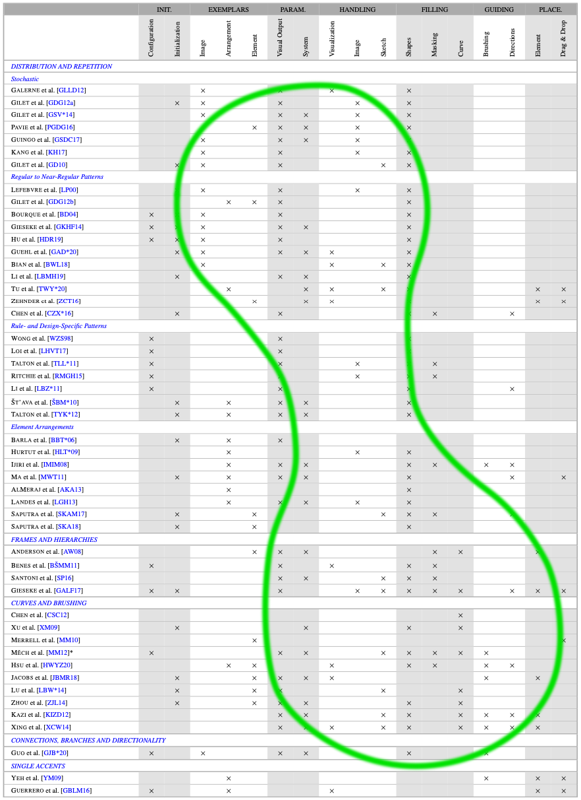]
.right-even[
* Uneven distribution
]

???

.task[COMMENT:]  

* Firstly, we are noticing fairly uneven distribution, with two major groups sorted by design feature, namley...

---
.header[Analysis of the State of the Art]

### Control Mechanisms in the State of the Art

.left-even[]
.right-even[
* Uneven distribution
    * Distribution and Repetition
    * Curves and Brushing
]

???

.task[COMMENT:]  

* Distribution and Repetition focuses on texture like designs, and their creation is often example based and automatic.
* Curves and Brushing, which lets artist manually create distinct but potentially unstructured designs.

---
.header[Analysis of the State of the Art]

### Control Mechanisms in the State of the Art

.left-even[]
.right-even[
* Uneven distribution
    * Distribution and Repetition
    * Curves and Brushing

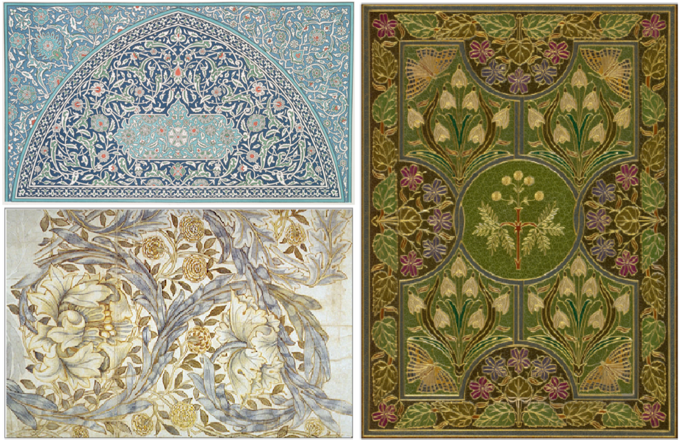
]

???

.task[COMMENT:]  

* However, creative pattern designs, such as the historic and commercial patterns in Figure 1, are rarely uniform nor unstructured, so additional control is needed to let artists create structure and work with design rules. 

---
.header[Analysis of the State of the Art]

### Control Mechanisms in the State of the Art

.left-even[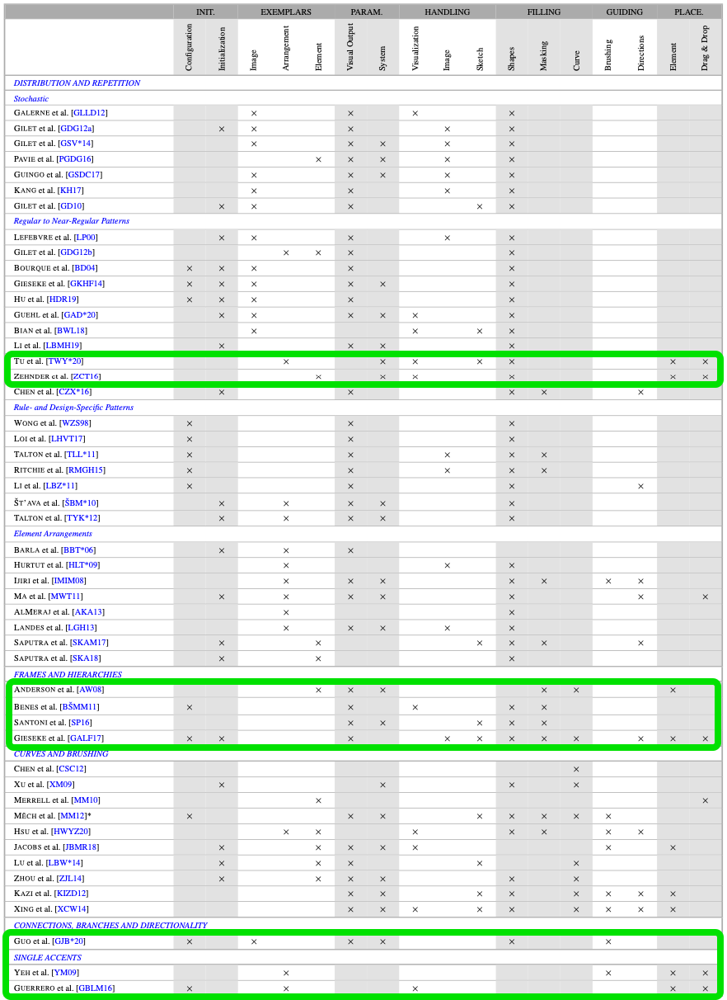]
.right-even[

* Uneven distribution
    * Distribution and Repetition
    * Curves and Brushing
* Combinations
    * Balance between automatization and manual creation
    * Understanding of the space being filled
    * Global planning
]

???

.task[COMMENT:]  

* The categories of Frames and Hierarchies; Connections, Branches, and Directionality; and Single Accents include systems that attempt bridge this gap between reptetions and curves.
* These groups include algorithms that have a greater understanding of the space being filled and/ offer some form of global planning to the artist.
* However in comparion there are fairly few techniques doing so.

---
.header[Analysis of the State of the Art]

### Performance

.left-quarter[]
.right-quarter[

|               |        |
| ------------- | ------ |
| Realtime:     | < 1s   |
| Interactive:  | < 10s  |
| Synchronous:  | < 1min |
| Asynchronous: | < 1h   |
| Offline:      | > 1h   |
]

???

.task[COMMENT:]  

* In terms of performance we categorize techniques coarsely into realtime, interactive, synchronous, asynchronous, and offline. It is noticable that solutions overall as well as different reported times for the results from the same technique do vary. This in itself makes techniques differ in regard to navigation and their creative controllability beyong the visuals and control mechanisms they have to offers.

---
.header[Analysis of the State of the Art]

### Prevalence of Control Mechanisms

.left-even[]
.right-even[]

???

.task[COMMENT:]  

* Coming back to the chracteristics of a creation process and their different modes, we summaraized in total, 50 publications, the discussed state of the art, for an understanding of these characteristics.
* Please note that the total for each overall chracteristics of how, what, where, when can exceed the total of publications in one category because the same category can be implemented in multiple ways.

---
.header[Analysis of the State of the Art]

### Prevalence of Control Mechanisms

.left-even[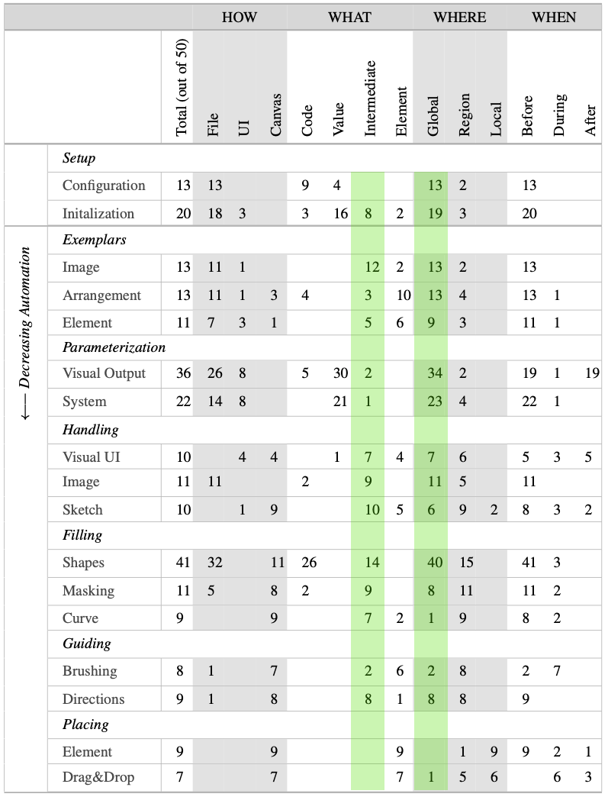]
.right-even[

* Global control through intermediate representations

]

???

.task[COMMENT:]  

* This tables shows that global control is most commonly enabled through intermediate representations, such as example images. 

---
.header[Analysis of the State of the Art]

### Prevalence of Control Mechanisms

.left-even[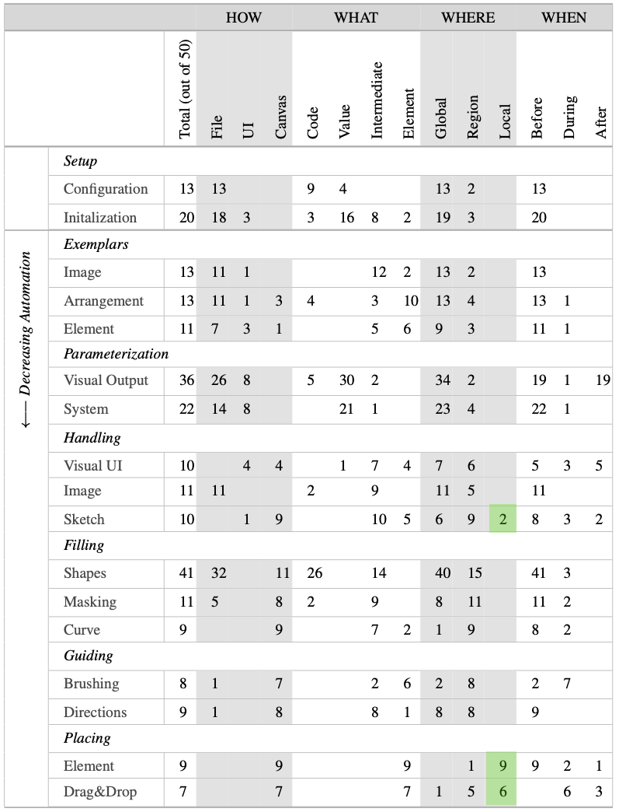]
.right-even[

* Global control through intermediate representations

]

???

* At the other end of the spectrum, placing elements as part of the actual output is most often local and manual with little automation supporting the artist throughout the creation process

---
.header[Analysis of the State of the Art]

### Prevalence of Control Mechanisms

.left-even[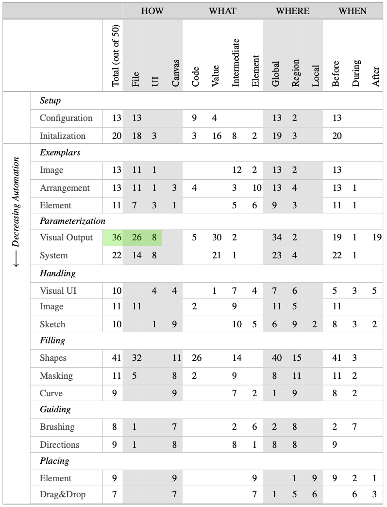]
.right-even[

* Global control through intermediate representations
* Parameterization through File and Value

]

???

.task[COMMENT:]  

* The dominant control mechanisms in the Parameterization category, File and Value, both require abstracted input from an artist, such as a text value or the use of a slider.

---
.header[Analysis of the State of the Art]

### Prevalence of Control Mechanisms

.left-even[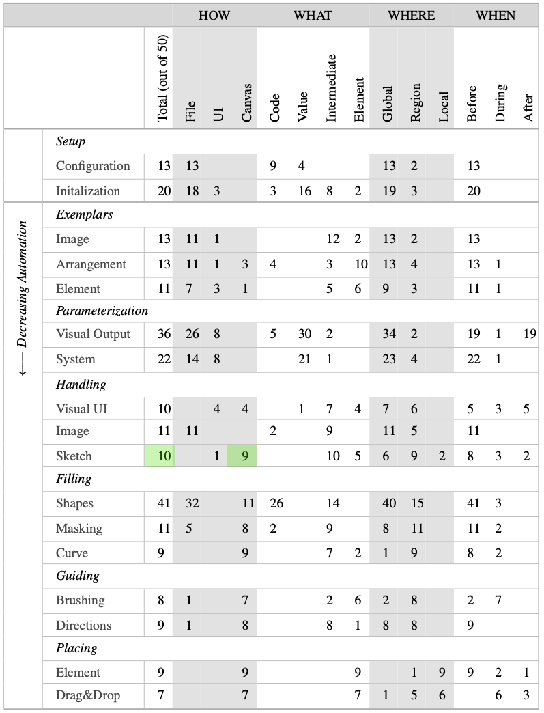]
.right-even[

* Global control through intermediate representations
* Parameterization through File and Value
* Curves and brushing on-canvas but only in a limited region

]

???

.task[COMMENT:]  

* Sketch-based controls move the interaction onto the canvas and can make smaller-scale adjustments. 

---
.header[Analysis of the State of the Art]

### Prevalence of Control Mechanisms

.left-even[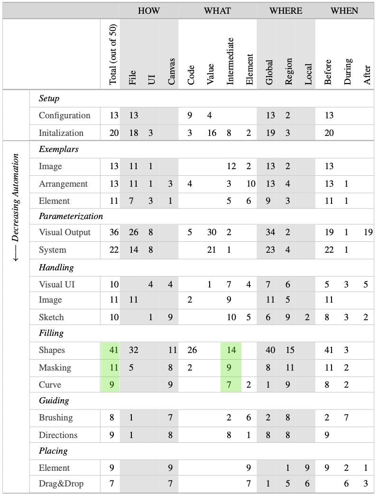]
.right-even[

* Global control through intermediate representations
* Parameterization through File and Value
* Curves and brushing on-canvas but only in a limited region

]

???

.task[COMMENT:]  

* Spaces to fill, curves to follow, and masking areas are also usually done directly on the canvas, but only influence the output indirectly. 

---
.header[Analysis of the State of the Art]

### Prevalence of Control Mechanisms

.left-even[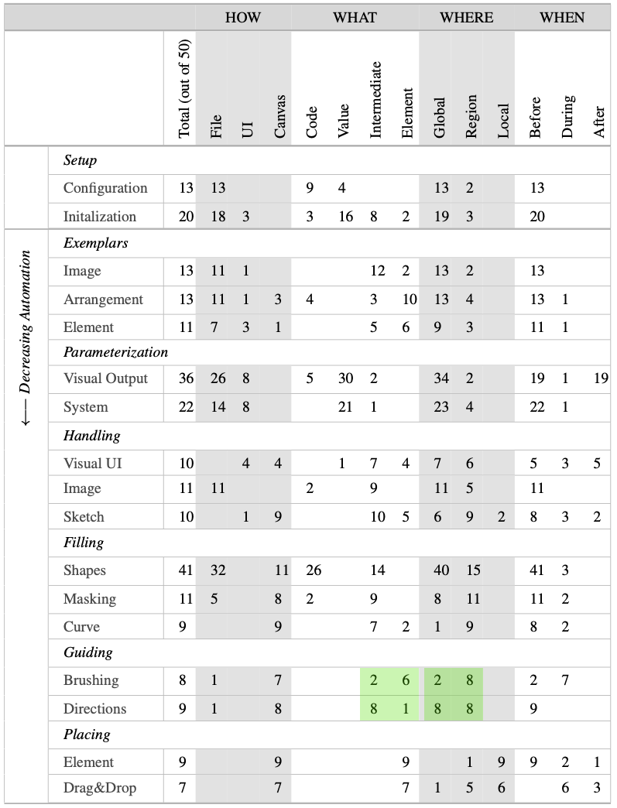]
.right-even[

* Global control through intermediate representations
* Parameterization through File and Value
* Curves and brushing on-canvas but only in a limited region

]

???

.task[COMMENT:]  

* Brushing creates the output directly on the canvas, but can only do so in a limited region depending on the brush size - unless used to brush intermediate control lines.

---
.header[Analysis of the State of the Art]

### Prevalence of Control Mechanisms

.left-even[]
.right-even[

* Global control through intermediate representations
* Parameterization through File and Value
* Curves and brushing on-canvas but only in a limited region

Focus on one control type, leading to trade-offs.
]

???

.task[COMMENT:]  

So all, in all, this classification of control mechanisms in regard to a creation process underlines that a focus on one control type, as is often done so research, leads to the common trade-off between global automation and local manual manufacturing.

---
template:inverse

Analysis of the State of the Art | Discussion

## Means for Enabling Creativity

???
.task[COMMENT:]  

* We now discuss various techniques’ characteristics and potential to support a creative workflow, clustered into the most common types of control. This discussion of the means for enabling creativity, namely Navigation, Transparency, Variation and Stimulation, is still quite interpretive and somewhat subjective. However, we believe this to be a steps towards a more realistic discussion of terms like “artist-usable” and “creatively controllable”.

---
.header[Analysis of the State of the Art]

## Means for Enabling Creativity

Discussion is clustered into the most common control types

* Example-Based Control
* Shapes and Masks
* Fields
* Curves and Brushing
<!-- * Element Placement -->

---
.header[Analysis of the State of the Art | Means for Enabling Creativity]

## Example-Based Control

???

.task[COMMENT:]  

* Goal-oriented control

    * Example-based approaches change the design task into a data-driven image gen- eration task, such as taking a photograph or designing a sample in an application such as Adobe Photoshop or Illustrator. 

---
.header[Analysis of the State of the Art | Means for Enabling Creativity]

## Example-Based Control

* Navigation
    * Performance
    * Initialization requirements
* Transparency
    * Matching quality
* Variation
    * Size of the design space
    * Spatial Influence
* Stimuli

???

.task[COMMENT:]  

* The investigation of example-based techniques shows valuable achievements in goal-oriented control and in increasing design space size within specific contexts. With regard to creative control, crucial steps are increasing variability and improving navigability with interactive performance. However, many techniques still require considerable non-creative effort for an artist, such as working with a power spectrum or predicting how changes in the exemplar, such as element arrangements, affect the output.
* The motivation behind using these techniques is mainly to gener- ate a specific and predictable output as efficiently as possible. This type of control stands in contrast to exploration.
--

### Outlook

* Regions
* Layering

???

.task[COMMENT:]  

* Overall, the presented work focuses on global designs, such as the whole canvas and repeating regions. Methods for which regions could be defined, models layered or the placement of single elements integrated constitute valuable directions for example-based methods as creative control.

---
.header[Analysis of the State of the Art | Means for Enabling Creativity]

## Shapes and Masks

--

* Navigation
    * Performance
* Transparency
    * Often not predictable
* Variation
    * Global to regional control
* Stimuli
    * Editing of control guides

???
.task[COMMENT:]  

* Sophisticated masks and growth constraints lead to visually interesting and complex designs, such as the packing patterns. However, it is not completely predictable exactly how a space will be filled. Because the interactive performance of many of the presented methods is quite limited, even a basic trial and error exploration is hardly feasible. The navigation of the design space becomes cumbersome, and stimulation becomes hindered. The techniques with the most transparent navigations are also the one with the most restricted design space. In terms of stimuli, the editing of shapes and masks have been shown to be enjoyable. And for example 

--

### Outlook

* Elastic curves, drag & drop
* Hierarchies

???
.task[COMMENT:]  

* the elastic curves such as we have seen are promising directions because they are intuitive and enjoyable to use and encourage exploration. 
* In terms of control mechanisms for a more complex design goal, shapes and masks could be take further to build hierarchical structures and with that open up a design space within certain techniques.

---
.header[Analysis of the State of the Art | Means for Enabling Creativity]

## Fields

--

* Navigation
    * Performance
* Transparency
    * Intuitive through a visual representation
    * On-canvas, abstracted
* Variation
    * Global to regional control
    * Directionality and alignments
* Stimuli

???
.task[COMMENT:]  

* Fields (in the context of this survey, usually vector fields) constitute a powerful tool for combining automatic procedural filling with the option to direct the process in specific regions, usually with direct control on the canvas. Several solutions use streamlines of a field to structure overall how a space is filled and with that implement somewhat a gloabel layout. Using a vector field to control, e.g., directionality, can greatly decrease the manual work needed to fill a space in its entirety because a few curves can define the entire field. 
* The discussed work shows that fields allow for greater visual variation by opening the design space and providing transparent control for filling a space automatically. While fields are still an absteaction of the pattern itself, they are intuitive to understand, e.g., through a visual representation.  

--

### Outlook

* Combination of automatic filling with manual control on-canvas
* Structures in combination with alignments
* More sophisitcated mappings of field properties to visual pattern elements

???
.task[COMMENT:]  

* Thus, using flow within a vector field to design is a suitable control mechanism, especially for designs that aims to align their elements to the space, which can be futher investigated.

---
.header[Analysis of the State of the Art | Means for Enabling Creativity]

## Curves and Brushing

--

* Navigation  
    * Potentially tedious  
* Transparency  
    * Familiar  
    * Direct control over the final result  
    * On-canvas  
* Variation  
    * Anything is possible  
    * Potentially un-structured  
    * Missing distribution techniques 
* Stimuli  
    * Easy and direct usage

???
.task[COMMENT:]  

* Curves and hand-drawn paths give an artist direct control over the final result, putting the control directly onto the canvas. 
* Curves and sketch-like methods offer well-communicated, transparent navigation. The discussed techniques are mostly interactive, and artists are familiar with their functionality from the real world and how they work directly on the canvas. The ease and directness of usage also constitute a foundation for possible immersive flow of work. 
* On the downside, curves and brushing could lead to tedious manual creation which can be hindering for a creative flow. 

--

### Outlook

* Incorporation of procedural creation principles into a data-driven process

???
.task[COMMENT:]  

* While brushes let artists draw almost anything, depending only on their drawing capabilities, for creative pattern generation, however, structure, pattern hierarchies, and distribution techniques also need to be supported. And it is worthwhile to investigate further how to merge procedural principles on a global scale with local brushing

---
template:inverse

# Outlook

---
.header[Outlook]

## Machine Learning

--

* Increasing performance

.caps[Ritchie, Daniel, Thomas, Anna, Hanrahan, Pat, and Goodman, Noah D.] **Neurally-guided Procedural Models: Amortized Inference for Procedural Graphics Programs Using Neural Networks**. *Proceedings of the International Conference on Neural Information Processing Systems*. Curran Associates Inc., 2016, 622–630  

???

.task[COMMENT:]  

* increasing performance up to 10 times. Reported performances are overall below 3 seconds.

---
.header[Outlook]

## Machine Learning

* Increasing performance
* Inverse procedural modeling

.caps[Guo, Jianwei, Jiang, Haiyong, Benes, Bedrich, et al.] **Inverse Procedural Modeling of Branching Structures by Inferring L- Systems**. *ACM Transactions on Graphics* 39.5 (2020)  

---
.header[Outlook]

## Machine Learning

* Increasing performance
* Inverse procedural modeling
* Design variations and suggestions

--
* Support of a personal style

---

.header[Outlook]

## Mixed-Initiative Interfaces

--

.caps[Deterding, Sebastian, Hook, Jonathan, Fiebrink, Rebecca, et al.] **Mixed-Initiative Creative Interfaces**. *Proceedings of the CHI Conference Extended Abstracts on Human Factors in Computing Systems* (2017), 628–635  

 > [...] put human and computer in a tight interactive loop where each suggests, produces, evaluates, modifies, and selects creative outputs in response to the other.
 
--

.caps[Heer, Jeffrey.] **Agency plus automation: Designing artificial intelligence into interactive systems**. *Proceedings of the National Academy of Sciences* 116.6 (2019), 1844–1850

???

.task[COMMENT:]  

*  To achieve this, AI enables computer agency, and novel interfaces enable collaboration between computers and human users. On the topic of agency and automation, HEER [Hee19] discusses three case studies and poses several open questions for further developments.

---

.header[Outlook]

## Collaboration

--

* Browser-based tools, cloud-based storage

--

* Navigation is crucial

--

* Stimulating creativity

--

.caps[Talton, Jerry O., Gibson, Daniel, Yang, Lingfeng, et al.] **Exploratory Modeling with Collaborative Design Spaces**. *ACM Transactions on Graphics* 28.5 (2009), 1–10

.caps[Salvati, Gabriele, Santoni, Christian, Tibaldo, Valentina, and Pellacini, Fabio.] **MeshHisto: Collaborative Modeling by Sharing and Retargeting Editing Histories**. *ACM Transactions on Graphics* 34.6 (2015), 205:1–205:10

.caps[O’Leary, Jasper, Winnemöller, Holger, Li, Wilmot, et al.] **Charrette: Supporting In-Person Discussions Around Iterations in User Interface Design**. *Proceedings of the CHI Conference on Human Factors in Computing Systems*. ACM, (2018), 535:1–535:11

---
template:inverse

# Conclusion

---

# A Survey of Control Mechanisms for Creative Pattern Generation

> How to support artists in their work with meaningful control mechanism?

???
.task[COMMENT:]  

* The overall challenge addressed in this survey is to show how to support artists in their work with meaningful control mechanisms.
* Two-dimensional creative pattern designs, which we belive is a complex design challenge and an overall representative and insightful scenario.

* Procedural models and the computation of designs offer novel approaches to create content and provide benefits over traditional manual manufacturing. However, providing control mechanisms that are intuitive to use and allow individual designs is an ongoing research challenge.

---

# A Survey of Control Mechanisms for Creative Pattern Generation

> How to support artists in their work with meaningful control mechanism?

For more complete and meaningful solutions aspects of both data-driven and procedural techniques are needed and must be merged into a unified whole.   

???
.task[COMMENT:]  

* For more complete and meaningful solutions aspects of both data-driven and procedural techniques are needed and must be merged and unified.  

* This is the basis for developing innovative tools that further the ability of artists to create and to creatively express themselves.

---
template:inverse

# Thanks

## ...to all authors of the state of the art!

#### ...to my co-authors!