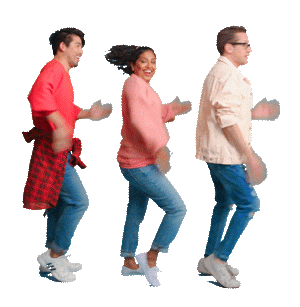
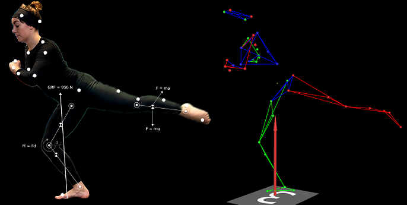
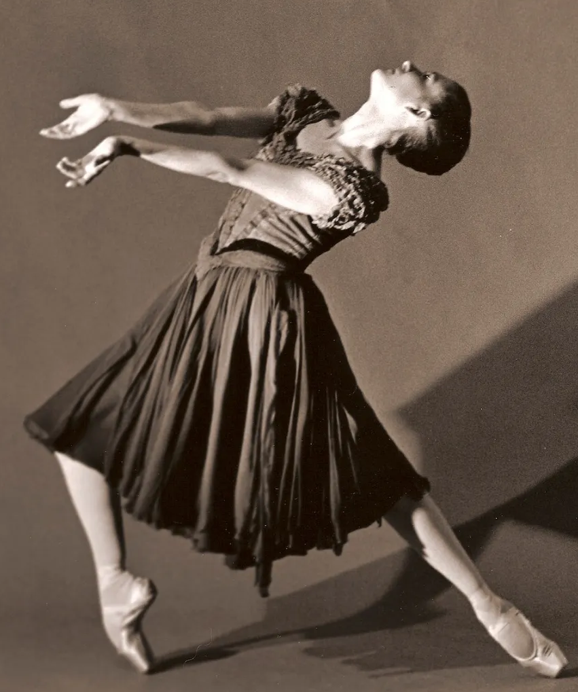
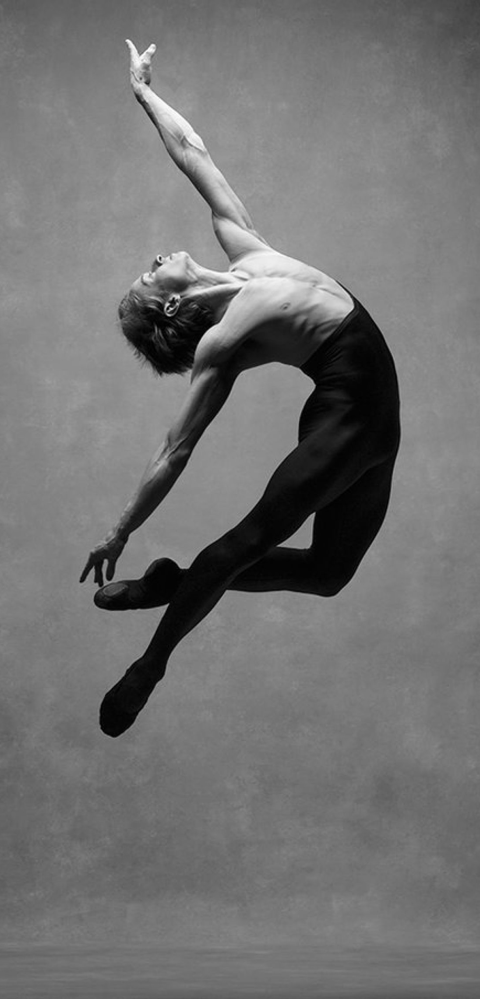
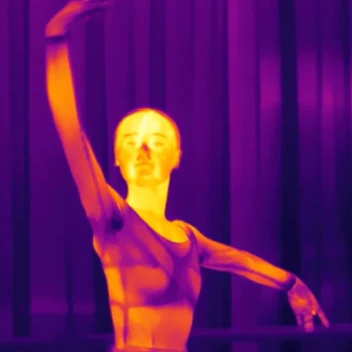
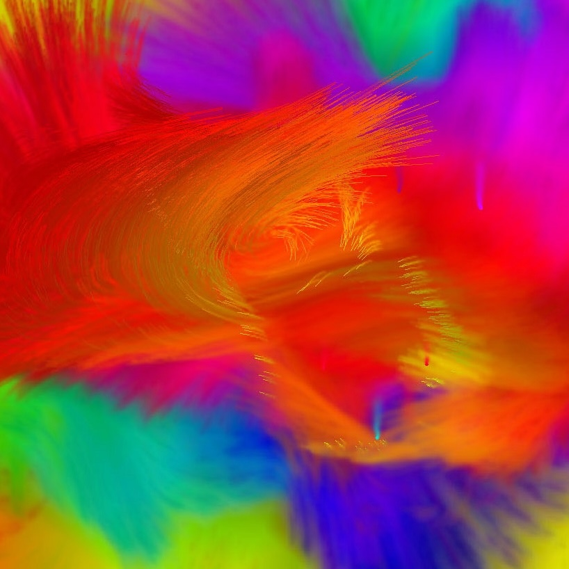
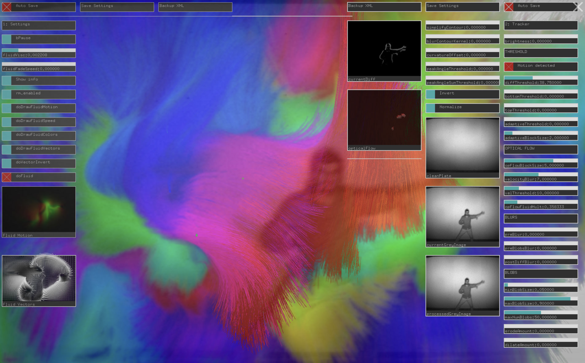
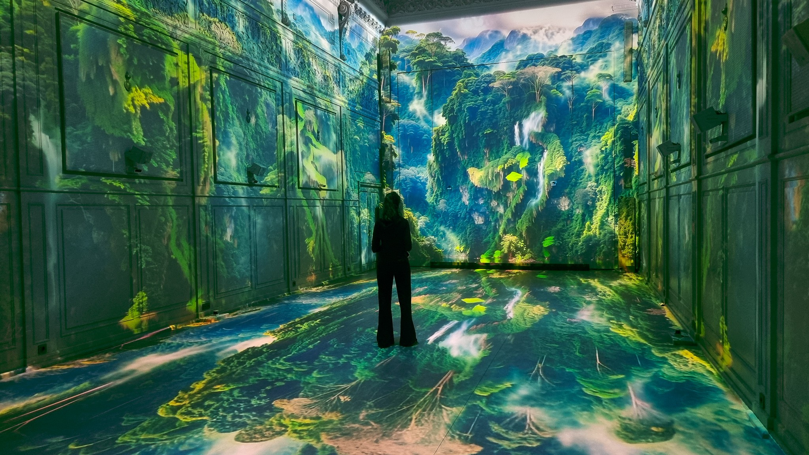
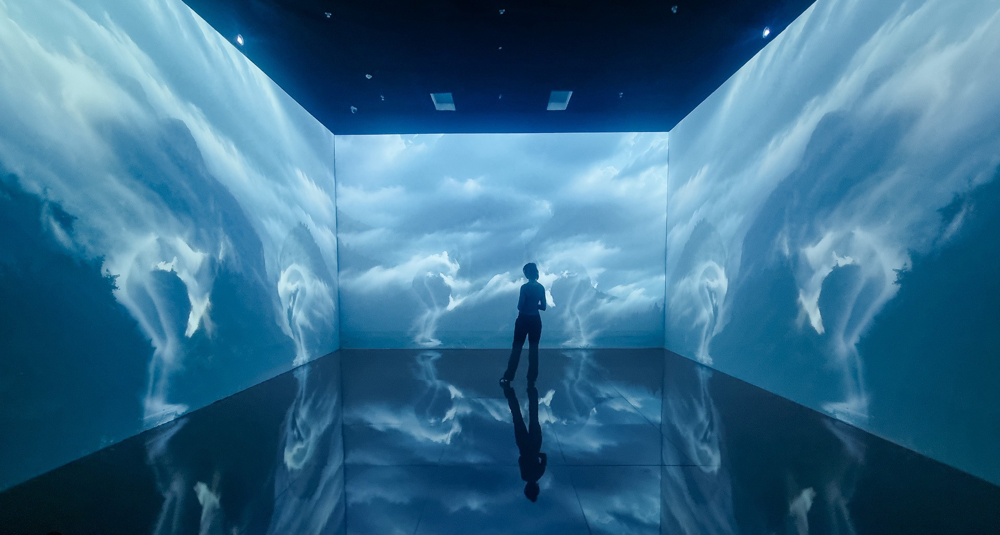

name: inverse
layout: true
class: center, middle, inverse
---

### From Gesture to Code to Space:
# Translational Media

 
### Prof. Dr. Lena Gieseke | l.gieseke@filmuniversitaet.de  

#### Film University Babelsberg KONRAD WOLF

???
* Goal: Give a usable mental model for how pipelines translate phenomena into computational worlds. 
* Thesis: translation is not transfer. It produces a third space with its own rules and consequences.

---
layout: false

.center[] .imgref[[Image: [Martin J. Levy](https://blog.cloudflare.com/randomness-101-lavarand-in-production/)]]

---

.center[].imgref[[Image: Rafik Anadol. 2021. Machine Hallucinations — Nature Dreams. https://refikanadol.com/works/machine-hallucinations-nature-dreams/]]

---

.center[].imgref[[Image: Memo Akten and Katie Hofstadter. 2025. Superradiance. https://superradiance.net/]]

---
template: inverse

### *Computational translation constructs new spaces with their own rules.*

???
Computational representations are new objects, **not copies**.  

*Translation produces a structured space.
*That space has its own rules.
*That space can shape perception and behavior.
*Therefore, translation is not neutral.

---
template: inverse

### *Designing those spaces is world-building.*

???

Pipeline design is **world-building**, not just engineering and it is not a neural act.

*Translation produces a structured space.
*That space has its own rules.
*That space can shape perception and behavior.
*Therefore, translation is not neutral.

---

## Agenda

* Translation  
    * Example: Lavarand  
* The Third Space
    * Example: Gesture → fields  
    * Example: Data → fields  
    * Example: Gesture & Data → fields  
* World-Building

???
* Goal: Give a usable mental model for how pipelines translate phenomena into computational worlds. 
* Thesis: translation is not transfer. It produces a third space with its own rules and consequences.

"it is a working theory, useful in many systems".

---
template:inverse

# Translation

---
.header[Translation]

## Pipeline From World to Algorithmic Space

Source →  

* Capture / Encode →  
* Model / Transform →  
  
Third space 

???

TODO:
Examples:
- body → tracking → simulation → field
- building → segmentation → graph → navigable model
- data → embedding → synthesis → environment

---
.header[Translation | From World to Algorithmic Space]

.center[ ] .imgref[[Images: [By HaeB - Own work, CC BY-SA 4.0](https://commons.wikimedia.org/w/index.php?curid=116926170), [Martin J. Levy](https://blog.cloudflare.com/randomness-101-lavarand-in-production/)]]

.footnote[[Walmsley, Alexander. 2026. Live Stream.]]

???
A simple translation with surprising stakes. This is the "hello world" of third spaces.

* Consider what happens when we try to bring something from the real world into computation. 
* Take randomness as a first example. Random numbers play a key role in computational processes ranging from the generation of secure cryptographic keys to the random initialization of weights during AI network training. Yet computers cannot produce true randomness. They simulate it using deterministic algorithms — PRNGs — and that simulation is structurally different from the thing it mimics. It has period lengths, statistical biases, seeds. In other words, the move from real-world phenomenon to computational representation is not a neutral transfer. Something changes in the crossing.
* One response to this problem is to extract seeds from highly complex physical processes. True random number generators (TRNGs) draw on the latent entropy in chaotic physical phenomena: atmospheric noise, radioactive decay, or — perhaps most evocatively — lava lamps. In the San Francisco offices of the internet security firm Cloudflare, a wall of lava lamps is filmed around the clock, providing cryptographic keys for roughly 20% of the world's internet traffic. Known as Lavarand, the system translates frames from the live feed into numeric seeds for a PRNG. The lamps' chaotic fluid motion, combined with atmospheric and lighting conditions, makes the seeds practically impossible to predict algorithmically. Objects designed purely for human visual pleasure become, in this context, operational instruments for computation.

* https://blog.cloudflare.com/randomness-101-lavarand-in-production/
  
From Alex:  
Random numbers play a key part of computational processes from the generation of secure cryptographic keys to the random initialising of weights during the training of an AI network. While the generation of random numbers with a sufficient level of unpredictability using deterministic pseudo-random number generator (PRNG) is suitable for many purposes, increasingly true random number generators (TRNG), which make use of the latent entropy in chaotic physical processes like atmospheric noise (https://www.random.org/) or radioactive decay (https://www.fourmilab.ch/hotbits/), are used to generate random numbers that are practically impossible to predict using an algorithm. 

This distinction is particularly salient in the area of cryptography, which is involved in the study of securing communication across networks (Rivest, 1990). The security of the world’s internet traffic relies to a large extent on the ability to generate cryptographic keys with a degree of unpredictability high enough to make them difficult if not practically impossible to guess. In such cases, a PRNG is often initialised with a truly random seed in order to quickly and efficiently produce a random key. In the San Francisco offices of the internet security firm CloudFlare there is a wall of lava lamps filmed 24 hours a day in order to provide cryptographic keys for some 20% of the world’s internet traffic (Fig. 1). Known as the Lavarand, the idea is based on an original patent by the US company Silicon Graphics in 1996 (Noll *et al.,* 1996). Whenever a key is required, the CloudFlare systems translate a frame from the live feed into a numeric value that is then fed as a seed into a PRNG, generating the key (Leebow-Fieser, 2017). Due to the highly chaotic movement of the liquid in the lamps, as well as the atmospheric and lighting conditions that eventually become rendered as pixels in the image, the seeds are extremely difficult to predict. The images, despite their use of brightly coloured objects made for human entertainment, are made to be purely operational for the computational process of pseudo-random number generation.

---
## Translation

--

> Not just "moving content" between media.

--

 
Translation as a pipeline that

--
* captures or encodes a phenomenon

--
* transforms it via an algorithmic model

--
* into a *third space* with a new structure.

???
We translate behavior into signals, signals into models, models into spaces.
The result belongs fully to neither side.

---
.header[Translation]

## Lavarand

Pipeline: Source →  Capture / Encode →  Model / Transform → Third space 

--

 

* **Source**: Chaotic physical process (fluid, light, heat)  
* **Capture**: Camera frames → pixel values  
* **Transform**: Hashing / extraction → seed  
* **Third space**: Pseudo-random numbers (PRNG output)

???
After the camera captures the lava lamps, you have a large array of pixel values. That image contains physical entropy, but in a messy, structured form.

In the transform step, the system first extracts the raw pixel data and converts it into a binary string. Then it runs that data through a cryptographic hash function, such as SHA-256. A hash function deterministically maps any input to a fixed-length output and spreads small differences widely across the result. This helps remove bias and produce a uniformly distributed bitstring.

That resulting bitstring becomes the seed for the pseudo-random number generator. The hash does not create randomness. It reorganizes physical entropy into a clean numerical form that a PRNG can use.

* Key idea: computers simulate randomness, so we import entropy from physics.
* The "randomness" we get is not lava and not true randomness.
* It is a new operational object.

---
template:inverse

# The Third Space

---
## The Third Space

--

The third space is the model-generated *world* created by the pipeline.

--

* It might have its own rules.
* It might produces its own behaviors.
* It can affect its environment, e.g. the analog space.

 

> Not the physical source. Not a mere digital copy.

???
* Think of it this way: When you simulate fluid, you do not have water. But you do not have a picture of water either. You have a system with viscosity, diffusion, attractors. That is the third space.

* It is where the translation lives...

* It is computational, but it behaves. And behavior is ontology.

---
## The Third Space

???
Before we look at more examples, we need a way to describe and compare third spaces.
Not all of them behave in the same way. Some are built for systems, others for humans. Some are tightly controlled, others produce open-ended behavior.

To make that difference more understandable, we can position them along two continuous dimensions.

If we take the third space seriously as a model-generated world, then we need criteria to evaluate it. Not in terms of taste, but in terms of behavior, consequence, and meaning.

--

Two continuous dimensions describing the *type* of the third space:

--
- **Operational** (used by systems) ↔ **Experiential** (lived by humans)

--
- **Deterministic** (mostly predictable) ↔ **Generative** (open-ended outcomes)

???
Operational: used by systems (security, robots, infrastructure).
Experiential: lived by humans (interaction, perception, art).
Deterministic: mostly predictable mapping.
Generative: produces open-ended outcomes.

---
## The Third Space

Four properties describing how the third space *behaves*:

* **Structure (ontology)**
    * The existing entities and rules.
    * Do new internal patterns or laws emerge?

???
* Ontology is the study of what exists and what counts as real within a system.  
* It defines its own kinds of objects, rules, and relationships that did not exist in the source domain.
* Nodes, vectors, fields, attractors — these are ontological commitments.

--
* **Production (dynamics)**
    * How entities and rules generate behavior over time.
    * Are states produced that the source could not?

--
* **Influence (feedback)**
    * How the third space affect the original domain.
    * Does it change behavior, decisions, or perception?

--
* **Meaning (interpretation)**
    * Semantic resonance
    * Does the translation articulate a coherent conceptual claim?
    * Does it reorganize how we understand the source?

We could score per item: 0 (weak), 1 (some), 2 (strong)

???

The following four properties help us distinguish when a translation merely represents something and when it actually builds a world.

- This is not about “beauty.”
- It is about whether the translation means something structurally, not just aesthetically.
- Does the mapping itself carry an argument?

---
.header[The Third Space of Lavarand]

.center[] .imgref[[Images: [Code Golf - Simplistic Lava Lamp](https://codegolf.stackexchange.com/questions/171984/simplistic-lava-lamp)]]

---

## The Third Space of Lavarand

- Operational ↔ Experiential? Operational ✓
- Deterministic ↔ Generative? Generative ✓ (in its output behavior)

???

* The algorithm is deterministic, but the output stream is open-ended and practically unpredictable.
* Nobody inhabits the PRNG; it functions as infrastructure.

It demonstrates that translation produces a third space even when it is purely operational.

---

## The Third Space of Lavarand

* Emergent structure
* Production over time beyond source
* Influence
* Meaning

---

## The Third Space of Lavarand

* Emergent structure: **some**
    * Statistical properties (distribution, period, seed-dependency)
    * Limited internal dynamics
* Production over time beyond source
* Influence
* Meaning

---

## The Third Space of Lavarand

* Emergent structure: **some**
* Production over time beyond source: **strong**
    * Extends physical entropy into a vast executable number stream
* Influence
* Meaning

---

## The Third Space of Lavarand

* Emergent structure: **some**
* Production over time beyond source: **strong**
* Influence: **strong**
    * Shapes cryptographic systems and global communication infrastructure
* Meaning

---

## The Third Space of Lavarand

* Emergent structure: **some**
* Production over time beyond source: **strong**
* Influence: **strong**
* Meaning: **weak**
    * Instrumental rather than interpretive
    * No conceptual claim
    * Does not reorganize how we understand randomness

---

## The Third Space of Lavarand

* Emergent structure: **some**
* Production over time beyond source: **strong**
* Influence: **strong**
* Meaning: **weak**

???
This matters: Lavarand is powerful but not "artful" in itself.
It does not reorganize how we understand randomness experientially. It instrumentalizes it.

--

> Lavarand produces an operational third space: algorithmically structured and highly generative in its output, globally influential as infrastructure, yet weak in semantic resonance because it functions instrumentally rather than conceptually.

---

template: inverse
### Example
# Gesture → Fields

???
We have described the third space in abstract terms: a model-generated world with its own entities, dynamics, influence, and meaning. That can sound theoretical. So let us ground it in something immediate.

What happens when we translate the human body?

We now move into spaces that can be inhabited, played, and felt.
The key shift is not prettier output. It is new rules.

---

.center[].imgref[[Images: [giphy](https://giphy.com/stickers/originals-dancing-3ohhwxtchVEHfSPj0c)]]

???
* What happens when we translate the human body?
* Technically, we can capture kinematics: joints, velocities, trajectories.
* But is that enough for a third space that aims to be meaningful?

Movement is not only displacement in space. It carries intention, emotion, and context. When we translate a body computationally, we risk reducing expression to coordinates.

Those layers of significance beyond pure joint transformations are what we call gestures. And it is precisely in translating gesture, not just motion, that artistic third spaces become interesting.

---
## Body Capture Cheat Sheet

Marker-based
* Optical mocap (Vicon, OptiTrack)
* Inertial mocap (Xsens, Rokoko)

Markerless
* Depth sensors (LiDAR, structured light, e.g. Azure)
* Multi-camera volumetric
* Video-based pose estimation (ML-driven, MediaPipe, OpenPose)

???
CS lens: these are different sensor models with different error profiles.
Noise is not a bug. It changes the third space.

---
## Body Capture Technologies

.center[ ] .imgref[[Images: [University of Eastern Finland, HUMEA lab](https://sites.uef.fi/humea/humea-laboratory/human-motion-and-performance-analysis/)]]

---

.center[
 <video width="1060" controls>
  <source src="./img/majorlazer_01.mp4" type="video/mp4">
</video> 
]

.footnote[[Major Lazer – Light it Up (feat. Nyla & Fuse ODG)](https://www.youtube.com/watch?v=r2LpOUwca94)]

---
## The Third Space of *Light It Up*

- Operational ↔ Experiential? Experiential ✓

???

The output is designed for perception and cultural consumption.
It is not infrastructure. It is aesthetic media.
The third space is primarily lived through viewing.

It demonstrates translation as stylistic transformation rather than system-level world-building.

--
- Deterministic ↔ Generative: (Mainly) Deterministic  ✓

???
* The motion capture data is recorded.
* The retargeting process maps joints to another rig.
* The choreography does not evolve dynamically.

There is transformation, but not open-ended production.
This is a controlled translation, not a generative system.

---
## The Third Space of *Light It Up*

* Emergent structure: **weak**  
    * Rig constraints and stylization alter perception  
    * No new internal behavioral laws emerge  

???
Low to Moderate
	•	The rig mapping introduces constraints.
	•	Surface textures and stylization alter perception.
	•	The CG body may exaggerate or smooth motion.

However:
	•	No new dynamic laws emerge.
	•	The choreography remains fundamentally the dancer’s.

This is structural transformation, not structural emergence.

--

* Production over time beyond source: **weak**  
    * Re-expresses captured motion  
    * Does not generate new trajectories  

???
The animation unfolds over time, but:
	•	It does not generate new motion.
	•	It re-expresses captured motion.
	•	The temporal structure remains largely identical to the source performance.

The third space extends style, not behavior.

---
## The Third Space of *Light It Up*

* Influence: **some**  
    * Cultural and aesthetic impact  
    * No structural or infrastructural feedback loop  

???
Weak to Moderate

Locally:
	•	It may influence fashion, dance trends, aesthetics.

Systemically:
	•	It does not restructure infrastructure or embodied practice in real time.

Feedback exists culturally, not structurally.

--

* Meaning: **weak**  
    * Raises questions of body shapes, digital identity and mediated performance  

???
Moderate to Strong

This is where it becomes interesting.

The translation:
	•	Separates movement from biological identity.
	•	Applies new surfaces and materials.
	•	Potentially reframes dance as stylized, augmented embodiment.

It makes a conceptual move:
The body becomes transferable, skinnable, modular.

If read critically, it participates in discussions about:
	•	Virtual embodiment
	•	Digital identity
	•	Mediation of performance

However, this depends on interpretation. The semantic resonance is not structurally embedded as strongly as in Superradiance.

---
## The Third Space of *Light It Up*

> The Major Lazer video produces an experiential but largely deterministic third space: structurally transformed yet not dynamically generative, culturally influential rather than infrastructural, and moderately resonant in meaning through its reframing of embodied identity.

???
* Not every translation produces strong emergence.
* Not every third space is generative.
* Not every aesthetically rich output is dynamically rich.

It is a transformation of embodiment, but not a new behavioral world.

---
## Beyond Joint Movement

.center[  ] .imgref[[Images: [Lucas, A. 2014. Breathe Life Into Your Ballet Performance | Dance Advantage. Accessed at illusionsofamisadventurer](https://illusionsofamisadventurer.wordpress.com/2014/04/10/expression-and-communication-through-dance/), [NYC Dance Project. Accessed at Creative Boom](https://www.creativeboom.com/inspiration/the-art-of-movement-breathtaking-photographs-of-incredible-dancers-in-motion/), [freepik](https://www.freepik.com/premium-photo/beautiful-sensitive-hands-concept_29662593.htm#from_element=cross_selling__photo)]]

???
Gesture is embodied, continuous, intentional, and unrepeatable. It carries weight, hesitation, momentum — properties that belong to a body in time.

---
## What is a Gesture?

    

> A movement usually of the body or limbs that expresses or emphasizes an idea, sentiment, or attitude 
[...]

.footnote[[[Merriam-Webster Dictionary: gesture](https://www.merriam-webster.com/dictionary/gesture)]]

???
-> raised his hand overhead in a gesture of triumph
* the use of motions of the limbs or body as a means of expression
* something said or done by way of formality or courtesy, as a symbol or token, or for its effect on the attitudes of others. 
-> a political gesture to draw popular support …— V. L. Parrington

---
## Gesture As Source

.left-even[
Gesture
* Embodied
* Continuous in time
* Intentional (often)
* Context-bound
* Hard to repeat exactly
]

???
Think "signal plus meaning plus body".
Capturing gesture always throws something away.

--

.right-even[
Common encodings:
- Joints (skeleton pose)
- Silhouettes / optical flow
- Inertial measurements (IMUs)
]

--

 

Encodings are **abstractions**, not neutral measurements.

???

Every encoding smuggles assumptions:
what is a joint, what counts as motion, what counts as noise.

---
## Gesture As Source

Encodings reduce gesture to discrete measurements.

--

 

> What kind of space do we reconstruct from those measurements?

--

How do we transform motion data into a rich spatial system?

???
When we encode gesture, we fragment it into coordinates, vectors, or signals. We turn lived movement into discrete measurements.

But measurements alone do not form a world. They are isolated data points.

One powerful answer is the field.

The body disappears.
Velocity remains.
And velocity becomes environment.

---

.center[ .imgref[[Image: [Asia News - Turning data into art](https://asianews.network/turning-data-into-art/)]]]

???

---
## A Field as Target

A field assigns a value to each point in space (and often time):
* Velocity 
* Density 
* Potential 
* Force 

Fields are great because they:
* Persist
* Can be integrated
* Can produce trajectories

???
Fields are "gesture after it becomes physics".
That is already a philosophical crime. A useful one.

A potential field assigns a scalar value to each point in space that represents stored influence or “energy.”
Potential is stored influence.
Force is the push or pull that results from that influence.

The field continues to exist independently of the original input event.

---
## *Body Paint* (Memo Akten, 2009)

--

???
* The translation in action
Akten's infrared camera does not record the body — it records movement. Speed, acceleration, curvature, and size of motion are extracted and fed into a fluid simulation, producing strokes, drips, spirals, and splashes on a projected canvas. Show the installation image alongside the output field. Crucially: the system does not see people at all, only movement. Anything moving — living or not — triggers the same response. The body has already been abstracted away.
--
 → 
--
 →   
.imgref[[Images: [xinfrared](https://www.xinfrared.com/pl/blogs/blog/the-capabilities-and-limitations-of-thermal-camera?srsltid=AfmBOopnv_2JS-e1YbCx1qtqDB4wCziekN6YMK5WAq72denV_wbsOUeO), [numerical-tours](https://www.numerical-tours.com/matlab/graphics_5_fluids/), Memo Atken. 2009. [Body Paint](https://www.memo.tv/works/bodypaint/)]]

--
> The system does not see "people", it sees "movement".

???
Key line: the system does not see "people", it sees "movement".
So the ontology changes: person → motion agent.

---
.header[Body Paint (Memo Akten, 2009)]

.center[] .imgref[[Image: [Creative Applications: Body Paint – Gestures and dance into evolving compositions](https://www.creativeapplications.net/project/body-paint-openframeworks/)]]

---
.header[Body Paint (Memo Akten, 2009)]

.center[
 <video width="960" controls>
  <source src="./img/bodypaint_01.mp4" type="video/mp4">
</video> 

]
.footnote[[https://www.memo.tv/](https://www.memo.tv/works/bodypaint/)]

???

* https://www.creativeapplications.net/project/body-paint-openframeworks/

The fluid field produced by Body Paint has viscosity, diffusion rates, attractor behavior, gradient flows — properties that are physically well-defined but were never properties of the original gesture. A side-by-side: gesture (embodied, singular, temporal) versus field (spatial, persistent, iterable, generative). Akten's own framing supports the argument directly: what matters is not the painting at the end, but the sensation of playing. The output has escaped the input. It is a new kind of object.

---
.header[Body Paint (Memo Akten, 2009)]

## The Pipeline

* **Source**: Moving bodies (gesture)  
* **Capture**: Motion signal (via depth camera, flow, tracking)  
* **Transform**: Motion → velocity vectors → fluid simulation parameters  
* **Third space**: Animated painterly field (viscosity, diffusion, memory)

???
Key line: the system does not see "people", it sees "movement".
So the ontology changes: person → motion agent.

---
.header[Body Paint (Memo Akten, 2009)]

## Field Specific Properties

- **Persistence**: memory in the field
- **Spatial extension**: values everywhere, not only on the body
- **Dynamics**: diffusion, turbulence, attractors
- **Composability**: multiple agents superpose

???
This is the third space doing third-space things.
It has its own grammar.

---
## The Third Space of *Body Paint*

- Operational ↔ Experiential? Experiential ✓
- Deterministic ↔ Generative? Generative ✓

???

Primarily experiential:
Participants inhabit the system.
The output exists as an interactive environment.

Generative:
The fluid simulation produces patterns and trajectories
that are not explicitly scripted.

Multi-user dynamics emerge:
Participants influence one another through the field.

Important for CS:
Interaction emerges from coupling,
not from hard-coded choreography.

---
## The Third Space of *Body Paint*

* Emergent structure: **strong**  
    * Fluid simulation introduces internal dynamics  
    * Patterns arise that were not present in the original gesture  

???
Strong

The field has real internal laws. (viscosity, diffusion, attractors)
It accumulates memory.
It develops vortices and flow structures.

The gesture does not contain these dynamics.
They arise from the simulation.

This is structural emergence, not stylistic transformation.

--

* Production over time beyond source: **strong**  
    * Generates trajectories and forms no body performed  
    * The field continues evolving beyond the initiating gesture  

???
The system does not replay motion.
It produces new motion.

The field integrates over time.
It extends and transforms the input.

This is genuine generativity, not re-expression.

---
## The Third Space of *Body Paint*

* Influence: **some**  
    * Immediate embodied feedback  
    * Participants adjust movement in response to the evolving field  
    * Overall setup is very popular 

???
Local but real feedback

Users respond to what the field does.
Movement changes because of the simulation.

However:
The feedback is immediate and embodied,
not infrastructural or systemic.

The loop is tight but local.

--

* Meaning: **some**  
    * Reframes gesture as material  
    * Makes us re-experience movement

???
Strong semantic resonance

The translation carries a clear conceptual claim:
Movement is not only expression.
Movement becomes world.

The body dissolves into dynamics.
Play becomes co-creation.

The conceptual argument is embedded in the computational structure.

---
## The Third Space of *Body Paint*

> *Body Paint* produces an experiential and generative third space: dynamically emergent, locally interactive, and aesthetically resonant through its transformation of gesture into environment.

???

Why:
- the field has real internal dynamics (attractors, diffusion, memory)
- the system produces forms no gesture alone could produce
- users adjust movement in response
- the mapping carries an argument: movement becomes material, play becomes world

Semantic resonance here is structural:
the translation does not just look painterly, it *reframes gesture* as environment.
This is computational meaning-production.

Unlike *Light It Up*:

- It does not merely stylize motion.
- It produces a behavioral system.
- It embeds its conceptual claim structurally.

This is not re-skinning embodiment.
It is re-ontologizing it.

Exercise:

Prompt: "Translate *clapping* into a field."

Three choices:
1) amplitude envelope → scalar field
2) onset detection → impulse field
3) spectral centroid → color + turbulence

Same source, different third spaces.

OUT:
## (Bridge) New capture, new third spaces

Emerging encodings:
- neural representations (NeRF, Gaussian splatting)
- intent signals (EMG, EEG, physiological proxies)

Point: richer encodings do not reduce ambiguity.
They multiply design choices.

???
Avoid deep tech dive.
Keep it as a bridge: better capture increases responsibility, not neutrality.

# Architecture → Navigation

???
Now translation creates a space that predicts and shapes movement.
We shift from bodies-in-a-room to people-in-a-city.

## Architectural space as source

Buildings are:
- continuous geometry
- constrained movement
- layered semantics (doors, thresholds, visibility)

Navigation needs:
- discrete structures
- costs
- decisions

Translation is unavoidable.

???
This is the classic continuous-to-discrete problem.
Also known as: graphs ate my building.

## Two translation options (pick one as your main)

Option A: **Space syntax** (visibility, accessibility, integration)  
Option B: **SLAM / robotics** (occupancy grids, pose graphs)

Both yield: **graph-like** structures + metrics.

???
For this talk, you can lead with space syntax (fits media/architecture),
and mention SLAM as the CS cousin.

## Pipeline: layout → graph

**Source**: floorplan / urban layout  
**Capture**: segmentation into cells, lines, visibility, adjacency  
**Transform**: construct graph (nodes, edges, weights)  
**Third space**: navigable model with centrality, paths, flow predictions

.center[

]

.footnote[[Replace with a space syntax / visibility graph image + credit]]

???
The graph has properties the building does not:
betweenness, centrality, shortest paths, predicted flows.
These are not "in" the walls. They are in the representation.

## What the graph has that the building does not

- **Discrete decisions** (turn left vs right)
- **Global metrics** (centrality, integration)
- **Predictive capacity** (flow as a derived object)
- **Algorithmic manipulability** (optimize signage, routes, safety)

???
This is where CS students usually nod: "yep, graphs".

## Façade-tilted bird’s-eye view (your research hook)

Problem:
- 2D maps hide vertical information
- 3D perspective hides overview

Translation move:
- tilt façades outward with height-dependent displacement

Third space:
- a hybrid view that makes façades legible while retaining ground references

.center[

]

.footnote[[Replace with your figure + credit]]

???
This example is gold because it shows a translation is a design argument.
You choose what must be preserved.

## Architecture → navigation: matrix placement

Operational ✔ (used for planning, routing, safety)  
Experiential ✔ (humans perceive and act via the representation)  
Deterministic-ish ✔ (mostly)  
Generative: **1** (models can simulate many trajectories)

???
It sits near the middle: operational and experiential at once.
That makes feedback effects likely.

## Architecture → navigation: rubric score

1) Emergent structure: **2** (graph metrics emerge)  
2) Generativity beyond source: **1** (many simulated paths)  
3) Feedback potential: **2** (maps change how people move)  
4) Semantic resonance: **1**

Why:
- structure and prediction are strong
- feedback is infrastructural
- semantic resonance is moderate: the translation reframes architecture as network and flow,
  but primarily toward instrumentality (navigation, prediction, optimization)

???
It reorganizes understanding, but toward efficiency and control.
This is epistemically strong, aesthetically restrained.

Now imagine replacing the dancer with a dataset. Millions of images instead of limbs. Statistical similarity instead of muscle tension.

The input is no longer embodied intention. It is aggregated data.

In this configuration, data performs the role gesture previously held: it becomes the animating force of the third space.

---
.header[Machine Hallucinations — Nature Dreams (Rafik Anadol, 2021)]

.center[
 <video width="960" controls>
  <source src="./img/machineHallucinations_02.mp4" type="video/mp4">
</video> 

]
.footnote[[https://refikanadol.com/works/machine-hallucinations-nature-dreams/](https://refikanadol.com/works/machine-hallucinations-nature-dreams/)]

???
It is data, and the translation makes "data-space" feel real.

TODO: make slide for
Common move:
- high-dimensional features
- dimensionality reduction or manifold learning
- render as navigable space or evolving field

Key claim:
the embedding is not "the data".
It is a *world model*.

Data are not inherently spatial. We make them spatial.

Gesture → field
Data → field

Embodiment dissolves.
Distribution replaces intention.

---
## *Nature Dreams* (Rafik Anadol, 2021)

> A giant data sculpture displaying machine-generated, dynamic pigments of nature.

 

--

> [...] to commemorate the beauty of the earth we share.

---
## *Nature Dreams* (Rafik Anadol, 2021)

The pipeline has four distinct stages:

* Data collection

.footnote[Refik Anadol. 2021. [Machine Hallucinations — Nature Dreams.](https://refikanadol.com/works/machine-hallucinations-nature-dreams/)]

???

* 300 million publicly available nature photographs of flowers, trees, mushrooms, landscapes, water, clouds, etc

---

.footnote[Refik Anadol. 2021. [Machine Hallucinations — Nature Dreams.](https://refikanadol.com/works/machine-hallucinations-nature-dreams/)]

---

.footnote[Refik Anadol. 2021. [Machine Hallucinations — Nature Dreams.](https://refikanadol.com/works/machine-hallucinations-nature-dreams/)]

---

.footnote[Refik Anadol. 2021. [Machine Hallucinations — Nature Dreams.](https://refikanadol.com/works/machine-hallucinations-nature-dreams/)]

---

.footnote[Refik Anadol. 2021. [Machine Hallucinations — Nature Dreams.](https://refikanadol.com/works/machine-hallucinations-nature-dreams/)]

---

.footnote[Refik Anadol. 2021. [Machine Hallucinations — Nature Dreams.](https://refikanadol.com/works/machine-hallucinations-nature-dreams/)]

???

* Data collection
    * 300 million publicly available nature photographs of flowers, trees, mushrooms, landscapes, water, clouds, etc

---
## *Nature Dreams* (Rafik Anadol, 2021)

The pipeline has four distinct stages:

* Data collection
* Feature extraction and filtering (ResNeXt)

.footnote[Refik Anadol. 2021. [Machine Hallucinations — Nature Dreams.](https://refikanadol.com/works/machine-hallucinations-nature-dreams/)]

???

* A CNN architecture, producing a high-dimensional feature vector per image
* Vectors encode semantic content
* Xie, S., Girshick, R., Dollár, P., Tu, Z., and He, K. 2017. Aggregated Residual Transformations for Deep Neural Networks. In Proceedings of the IEEE Conference on Computer Vision and Pattern Recognition (CVPR), 1492–1500. https://doi.org/10.1109/CVPR.2017.634

--

* Dimensionality reduction and spatial clustering (UMAP)

???

* Projection of high-dimensional feature vectors into three-dimensional space using UMAP, preserving local and global structure of the data manifold, where proximity equals semantic similarity. 
* McInnes, L., Healy, J., and Melville, J. 2018. UMAP: Uniform Manifold Approximation and Projection for Dimension Reduction. arXiv preprint arXiv:1802.03426. https://arxiv.org/abs/1802.03426

--

* Generative synthesis (StyleGAN2-ADA)

???

* Thematically clustered subsets train a StyleGAN2-ADA model, producing 1024-dimensional embeddings
* A custom Latent Space Browser (developed since 2017) enables navigation and interpolation through the learned distribution
* Sampled GAN outputs — color fields, forms, textures that exist nowhere outside the model — serve as Anadol's "data pigments"
* These pigments feed a GPU-accelerated fluid dynamics solver (vvvv / Fuse library), where they become color and form attributes driving a particle simulation of up to 100 million elements
* Karras, T., Aittala, M., Hellsten, J., Laine, S., Lehtinen, J., and Aila, T. 2020. Training Generative Adversarial Networks with Limited Data. In Advances in Neural Information Processing Systems (NeurIPS), Vol. 33, 12104–12114. https://arxiv.org/abs/2006.06676

???
The pipeline has four distinct stages:
1. Data collection — 300 million publicly available nature photographs gathered over three years. The scale matters: this is not a curated art dataset but a mass-scraped collective visual memory of how humans have photographed nature.
2. Feature extraction and filtering (ResNeXt) — Each image is passed through ResNeXt, a CNN architecture that extends ResNet via grouped convolutions, producing a high-dimensional feature vector per image. These vectors encode semantic content — not pixels, but learned representations of what the image means to the network. The vectors are then used to qualitatively filter the dataset, removing noise and semantic outliers. (Xie et al., 2017, CVPR)
3. Dimensionality reduction and spatial clustering (UMAP) — The feature vectors, still high-dimensional, are projected into three-dimensional space using UMAP, which preserves both local and global structure of the data manifold. The result is a navigable, real-time 3D "data universe" where proximity equals semantic similarity. This is the step where data becomes space. (McInnes et al., 2018, arXiv:1802.03426)
4. Generative synthesis (StyleGAN2-ADA) — Thematically clustered subsets train a StyleGAN2-ADA model. The ADA variant is specifically designed to prevent discriminator overfitting on smaller training sets — relevant because thematic clusters, despite originating from 300M images, are relatively small after filtering. A latent space browser then allows navigation and interpolation through the learned distribution. (Karras et al., 2020, NeurIPS)
The quantum computing layer mentioned in the project description is not documented with sufficient technical specificity to be cited reliably — best left aside.

This two-stage synthesis is the crucial technical detail for your talk: the GAN is not the final output layer but a material generator feeding a separate spatial simulation system. The translation chain is longer than it appears — and the final aesthetic space is the product of at least two distinct computational domains in dialogue.:

5. Latent space navigation (custom software) — The studio has developed a proprietary Latent Space Browser since 2017. This tool allows navigation and interpolation through the trained GAN's latent space, extracting sequences of generated images — what Anadol calls "data pigments": color fields, forms, and textures that exist only in the model's learned distribution. The output here is not a finished image but a stream of generative material.
6. Fluid particle simulation (vvvv / Fuse) — The data pigments are fed into a GPU-accelerated fluid dynamics solver implemented in vvvv, a visual programming environment developed by the German developer collective, using their Fuse library for GPU computation. The StyleGAN outputs become color and form attributes assigned to particles in a fluid simulation — essentially the GAN paints the fluid. The Fluid Dreams variant at MoMA used approximately 100 million particles with real-time ray-traced lighting. Notably, at that scale the simulation cannot run in real time and must be pre-rendered — even on Anadol's custom-built computing infrastructure.

* Data collection
    * 300 million publicly available nature photographs of flowers, trees, mushrooms, landscapes, water, clouds, etc
* Classification: Complied dataset is fed into an image recognition algorithm, ResNext, for feature vectorization. Those computed features are then to qualitativly filter the dataset.
* Image Cluster: The UML-UMAP algorithm is used in a real time explorable, and three-dimensional data universe with a custom software.
* Style Gan2, with adaptive descriptor augmentation (ADA) with a latent space browser

---
.header[Machine Hallucinations — Nature Dreams (Refik Anadol, 2021)]

## The Pipeline

* **Source**: 300M publicly available nature photographs  
* **Capture**: Feature extraction → high-dimensional image embeddings  
* **Transform**: Dimensionality reduction + generative synthesis → latent navigation + fluid particle simulation  
* **Third space**: Large-scale animated data field (abstract, immersive, continuously evolving)

---
.header[Machine Hallucinations — Nature Dreams (Refik Anadol, 2021)]

## The Third Space of *Nature Dreams*

- Operational ↔ Experiential? Experiential ✓
- Deterministic ↔ Generative? Generative ✓

???

Primarily experiential:
The work is immersive and perceptual.
It is encountered as environment rather than tool.

Generative:
The system synthesizes novel visual states from latent space.
Outputs are not present in the original dataset.

However:
There is no live interaction.
The generativity is model-driven, not participant-driven.

---
.header[Machine Hallucinations — Nature Dreams (Refik Anadol, 2021)]

## The Third Space of *Nature Dreams*

* Emergent structure: **some**  
    * Latent space organizes images by similarity  
    * Fluid simulation introduces visual continuity  

???

Moderate emergence

The embedding creates structure: clusters, manifolds, transitions.
The fluid system produces continuous transformation.

However:
No complex behavioral laws arise beyond interpolation and flow.
Structure is statistical and aesthetic, not dynamically autonomous.

--

* Production over time beyond source: **strong**  
    * Generates images never captured  
    * Produces continuous morphing sequences  

???

Strong generativity

The GAN synthesizes novel forms.
The dataset is metabolized into new configurations.

The third space produces states the source never contained.

---
.header[Machine Hallucinations — Nature Dreams (Refik Anadol, 2021)]

## The Third Space of *Nature Dreams*

* Influence: **weak/some**  
    * Shapes perception of "data as pigment"  
    * Hugly popular, culturally influential?

???

Influence is perceptual, not structural.

It may alter how audiences think about data,
but it does not change systems, decisions, or embodied practice.

Feedback is cultural, not infrastructural.

--

* Meaning: **some**  
    * Aestheticis of data?

???

Moderate semantic resonance

The work proposes a conceptual move:
Data becomes landscape.
Latent space becomes environment.

However:
The mapping does not strongly articulate a structural argument.
The meaning depends largely on framing rather than interaction.

---
.header[Machine Hallucinations — Nature Dreams (Refik Anadol, 2021)]

## The Third Space of *Nature Dreams*

> *Nature Dreams* produces an experiential and generative third space: statistically structured and visually immersive, perceptually influential yet only moderately resonant in meaning through its transformation of data into environment.

???

Why:
- It metabolizes vast datasets into synthetic imagery.
- It generates novel visual states.
- It embeds statistical structure into spatial experience.
- But it lacks strong feedback loops or deeply embedded conceptual coupling.

Unlike *Body Paint*:
The body does not steer the system.
Data replaces gesture.

The third space is beautiful and generative,
but less behaviorally emergent and less tightly conceptually bound.

* Very beautiful moving abstract imagery

> The translation is complete, but the space produced has no grammar of its own.

???
* No new logic, no emergent behavior the audience can inhabit, no feedback loop.
* Nature imagery that has never existed — latent pigments, shapes,  
  patterns distilled from 300M photographs into a navigable dream
* The dataset is not displayed — it is *metabolized*
* Important distinction from Superradiance: no body, no gesture. The data itself is the sole source domain.
* UMAP is the crucial step for your argument: it is where high-dimensional data *becomes space* — literally a spatial translation operation.
* "Data as pigment" — Anadol's own framing — rhymes deliberately with Body Paint.
* Anadol is useful precisely as a limit case: 
  he shows the translation operation with unusual clarity,
  then stops short.
* Body Paint: audience inside the system, co-producing the space
* Superradiance: viewer's body collapsed into the ecological argument
* Anadol: spectacular, but you watch it from the outside
* This sets up the question Datamorphism attempts to answer

---
.header[Superradiance (Memo Akten & Katie Hofstadter, 2025)]

.center[
 <video width="960" controls muted>
  <source src="./img/superradiance_01.mp4" type="video/mp4">
</video> 
]
.footnote[[Superradiance](https://superradiance.net/)]

???
* NO AUDIO
* What do you intuitively think about the third space, the world that is build here?

---
## *Superradiance* (Memo Akten & Katie Hofstadter, 2025)

Memo Akten and Katie Hofstadter, 2025:

> We know that we are deeply entangled within complex, interdependent networks and assemblages of life, composed of and embedded within expansive scales of intelligence, unfolding across multiple boundaries of self.
  

---
## *Superradiance* (Memo Akten & Katie Hofstadter, 2025)

Memo Akten and Katie Hofstadter, 2025:

> We know that **we are deeply entangled within complex, interdependent networks** and assemblages of life, composed of and embedded within expansive scales of intelligence, unfolding across multiple boundaries of self.
  
--
  
 
> It’s one thing to intellectually know this, but how can we feel it, in our bodies?

???
* https://www.roborantreview.com/reviews/superradiance-memo-akten-and-katie-hofstadter-gray-area
* You are only made of non-you elements.
* Memo Akten and Katie Hofstadter have produced something profound and rare: imagery none of us have ever seen before. Katie’s dancing body is the centerpiece of this work, which appropriately, we never see. Instead, her liquid movements materialize nebulae, plankton, trees, worms, and mushrooms that seamlessly blend into video backdrops of earth’s beauty. 
* Literalism can be the bane of good art, but in this case, it’s a literalism that most of us have forgotten and desperately need to restore.

---
  
.footnote[Memo Akten and Katie Hofstadter. 2025. Superradiance. https://superradiance.net/]

---
  
.footnote[Memo Akten and Katie Hofstadter. 2025. Superradiance. https://superradiance.net/]

---
  
.footnote[Memo Akten and Katie Hofstadter. 2025. Superradiance. https://superradiance.net/]

---
  
.footnote[Memo Akten and Katie Hofstadter. 2025. Superradiance. https://superradiance.net/]

---
## The Making of Superradiance

* Script
* Choreography
* Simulation
* Generative AI: Chapter 1 - Embodied Simulation
* Generative AI: Chapter 2 - Embodied Earth

.footnote[[Memo Akten and Katie Hofstadter. 2025. Superradiance. https://superradiance.net/]]

---
.header[*Superradiance* (Memo Akten & Katie Hofstadter, 2025)]

.center[
 <video width="960" controls>
  <source src="./img/superradiance_makingof_cutout_01.mp4" type="video/mp4">
</video> 
]

.footnote[[https://superradiance.net/]]

---
.header[Superradiance (Memo Akten & Katie Hofstadter, 2025)]

## The Pipeline

* **Source**: Dancing body + ecological imagery and themes of planetary interconnectedness  
* **Capture**: Motion, embodied performance, and environmental references via dance / choreography and sensor data → encoding of body + environment  
* **Transform**: Synthesized generative imagery, immersive video and sound through computational media (AI, simulations, latent space conditioning, custom software)  
* **Third space**: Immersive, multi-screen audiovisual environment that explores embodied connection to planetary systems

???
This work weaves dance, neuroscience, poetry, code, AI, and environment into a visceral narrative exploring embodiment and planetary consciousness. [oai_citation:0‡superradiance.art](https://superradiance.art/?utm_source=chatgpt.com)

---
## The Third Space of *Superradiance*

- Operational ↔ Experiential? Experiential ✓  
- Deterministic ↔ Generative? Generative ✓  

???

Primarily experiential:
The installation invites bodily perception beyond the skin into a sense of ecological entanglement.

Generative:
The project synthesizes visuals and sound that are not directly present in the source choreography or imagery.
---
## The Third Space of *Superradiance*

* Emergent structure: **strong**  
    * Internal visual and conceptual structures arise through computational synthesis  
    * Patterns of imagery, transformation rules, and temporal motifs emerge from the coupling of choreography, model constraints, and sonic pacing  

???
Strong emergence (in an artistic sense)

The third space is not a linear translation of a recorded dance.
It is a coupled system: body signals, environmental imagery, model priors, and audio-temporal structure interact.

“Emergent” here does not mean autonomous like a fluid solver.
It means the work generates coherent, rule-like aesthetic behavior that is not directly specified frame-by-frame:
recurring morphologies, transitions, and tempo-patterns that arise from the generative process itself.

The result has a grammar:
what kinds of transformations are possible,
how motifs recur,
how time and form cohere.

---
## The Third Space of *Superradiance*

* Production over time beyond source: **strong**  
    * Visual and sonic sequences evolve beyond any single captured performance  
    * Produces novel states and transitions that the source choreography and footage do not contain  

???
Strong production

The system does not merely restage the dance.
It synthesizes new audiovisual states and continuous transformations that exceed the source material.

Even if authored and curated, the output space is larger than the input space:
the work “produces” through generative recombination, interpolation, and transformation.

---
## The Third Space of *Superradiance*

* Influence: **strong**  
    * Alters perceptual and emotional understanding of embodiment and ecology  
    * Encourages audiences to sense themselves as entangled within broader systems  

???
Strong influence (via perception and cognition)

Influence does not need to be infrastructural to be strong.
Here the feedback loop runs through humans.

The third space changes the audience’s perceptual model:
what the body is,
where “self” ends,
how environment and organism are related.

That shift can persist after the experience and shape discourse, values, and artistic/technical imaginaries.
This is high-impact feedback through interpretation and embodied perception.

--

* Meaning: **strong**  
    * Semantic resonance is central  
    * The translation structurally embodies a coherent claim about interdependence and extended embodiment  

???
Strong meaning

The conceptual claim is not just narrated.
It is enacted by the mapping.

Body → transformation logic → ecological imagery is not arbitrary decoration.
It makes “entanglement” perceptible as a rule of the world.

Meaning is carried by structure:
the way motion steers transformation,
the way forms blend across scales,
the way the environment is not backdrop but continuity.

---
## The Third Space of *Superradiance*

> *Superradiance* produces an experiential and generative third space: visually emergent, contextually powerful, and conceptually resonant through its immersive exploration of embodiment and planetary interconnectivity.

???

Why:
- the installation synthesizes novel audiovisual states beyond any single source performance  
- internal aesthetic and temporal structures arise through generative computation  
- it encourages a felt sense of ecological entanglement and extended embodiment

It is not a passive display.
It is designed to *reframe how we perceive bodies and environment*. [oai_citation:3‡superradiance.art](https://superradiance.art/?utm_source=chatgpt.com)

This is not autonomous emergence, but authored emergence: rule-like behavior that arises from a designed generative system rather than from manual animation.”

---
.header[Superradiance (Memo Akten & Katie Hofstadter, 2025)]

.center[
 <video width="960" controls>
  <source src="./img/superradiance_01.mp4#t=97" type="video/mp4">
</video> 
]
.footnote[[Superradiance](https://superradiance.net/)]

---
template: inverse

# From Translation to World-Building

---
## The Thrid Space

A third space becomes world-like when it integrates:

* **Emergent structure** (ontology)  
* **Production beyond the source** (production)  
* **Influence** (feedback loop)  
* **Meaning** (semantic resonance)

???
Structure makes it stable.
Generativity makes it alive.
Feedback makes it consequential.
Semantic resonance makes it intelligible and culturally situated.

--

> When these properties are weak, we have a technical demonstration.  

--

> Art begins where technical translation becomes ontological, dynamic, influential, and meaningful.

???
When they are integrated and mutually reinforcing, we approach art.

---
## Technical Translation

Every pipeline decision defines the world it produces.

It decides:
* What counts as signal and what is discarded
* What entities exist in the model
* What can be measured and optimized
* Whose behavior fits the representation and whose does not

???

“what counts as signal vs noise”
* When you track a body, jitter can be filtered out. But sometimes jitter is expressive.
* When you process audio, you remove background noise. But that noise may be context.
* The filter encodes a value judgment.

“what exists as an object”
* Is a body 15 joints? 33 landmarks? A mesh? A volume?
* Is a city intersections and edges? Or visibility polygons?
* The representation defines the ontology of the third space.

“what can be optimized and controlled”
* Once something becomes a node, weight, or parameter, it can be optimized.
* Things not encoded cannot be optimized.
* You can only control what you model.

“who is included or excluded”
* Pose models trained on certain bodies work better on some bodies than others.
* Urban graphs may privilege certain mobility patterns.
* Representation shapes inclusion.

So what is the slide really saying?

Translation is an epistemic act.
It shapes what is knowable, measurable, and actionable.

---
template:inverse

## *Technical Translation as World Building*

???
A data structure is not just a structure.
A simulation is not just a tool.
A pipeline is not just implementation.

Each one defines a reality with rules. And once deployed, that reality acts back on us.

That is world building.

I am not saying engineers are secretly fantasy novelists.

I am saying:

Every time we design a model, we decide what kind of world can exist inside it.

---
.header[Technical Translation as World Building]

.center[ ] .imgref[[Images: [By HaeB - Own work, CC BY-SA 4.0](https://commons.wikimedia.org/w/index.php?curid=116926170), [Martin J. Levy](https://blog.cloudflare.com/randomness-101-lavarand-in-production/)]]

.footnote[[Walmsley, Alexander. 2026. Live Stream.]]

???

We began with lava lamps.

An operational system.  
A wall of chaotic light feeding cryptographic keys.

But look again:

* It defines what counts as randomness.  
* It creates a statistical world with rules (periods, distributions, seeds).  
* It shapes global communication infrastructure.  

This is not decoration.

It is constructed operational reality.

The PRNG was not a failed copy of randomness.  
It was a new object with real-world effects.

Same pattern:
gesture-fields, navigation-graphs, data-environments.

**Computational translation is world-building.**

Circular closure helps memory.
Also, it is funny that lava lamps are a security primitive.

---
## Sociotechnical Worlds 

???
Many systems are not purely operational.  
They are not purely artistic either.

In-between technical spaces:

--

* Social media  
* Recommendation systems  
* Navigation platforms  
* AI assistants  
* Generative AI

--

Third spaces that:

* Algorithms decide what you see, who you meet, ...
* People adapt their behavior — both consciously and unconsciously

---
## Technical Translation as World Building

> Digital structures reorganize (analog) life.  

--

That is world building in a literal sense.

---
template:inverse

### *If we are building worlds, what does that oblige us to?*

???

> You are already designing realities. You might as well understand that power.

If translation builds worlds, then:

* Model design is ontological design.  
* Data structures define what can exist.  
* Algorithms define what can happen.  
* Interfaces define how humans enter the system.  

You are not only implementing solutions.

You are constructing environments that act back on society.

Technical translation is world building.

The question is not whether we build worlds.

The question is whether we do it deliberately.

---
template:inverse 

.center[

]

# *The End*

### Prof. Dr. Lena Gieseke | l.gieseke@filmuniversitaet.de  

#### Film University Babelsberg KONRAD WOLF
