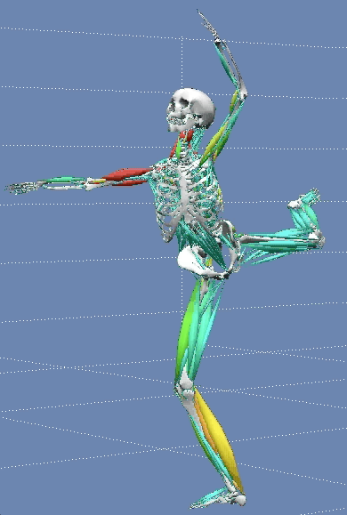
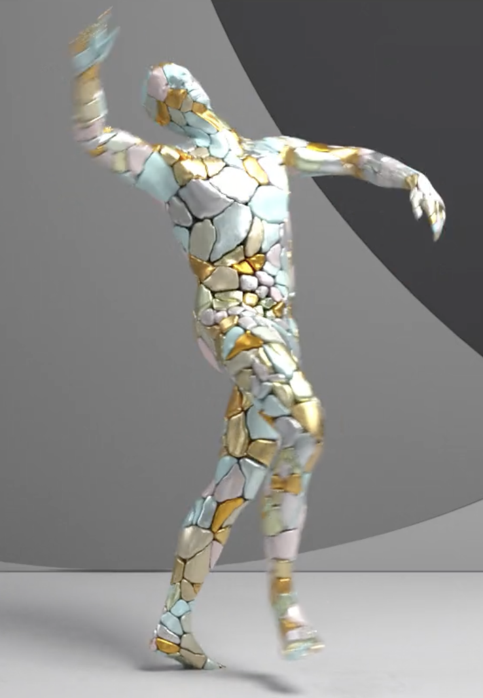
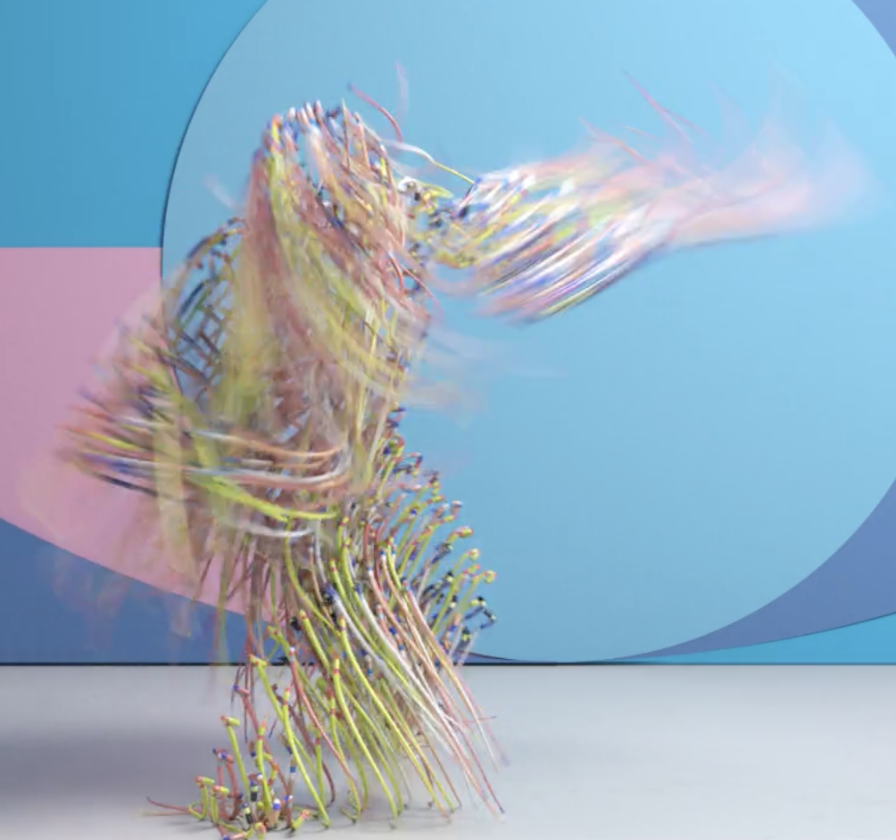
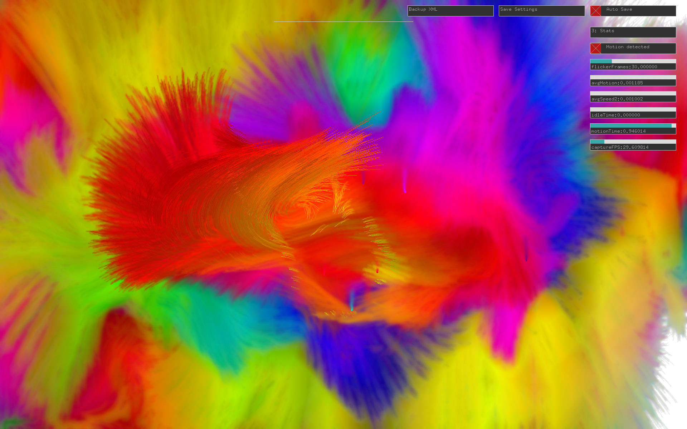
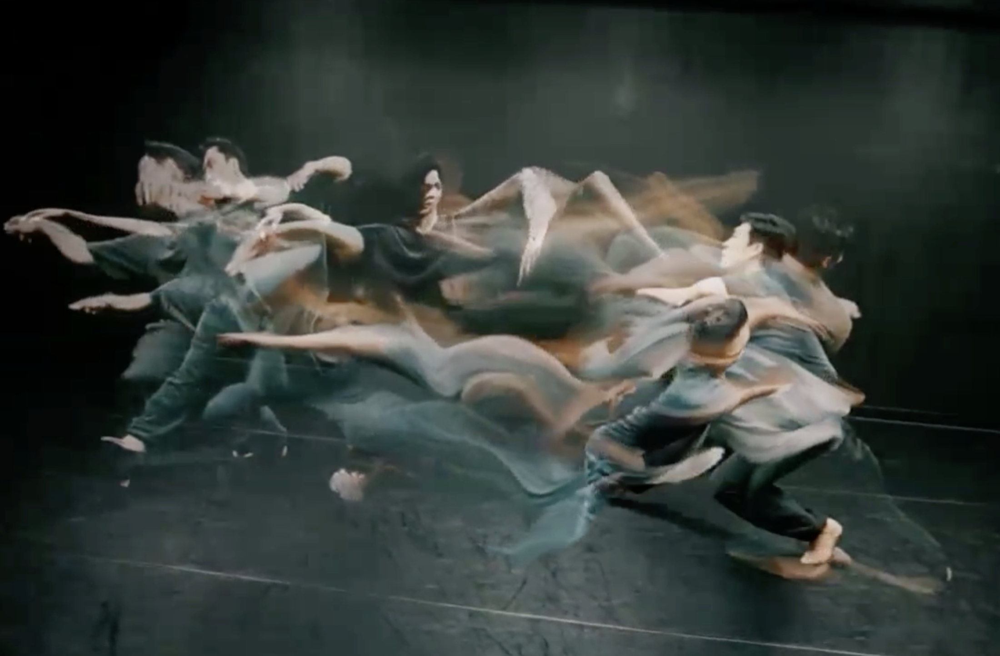
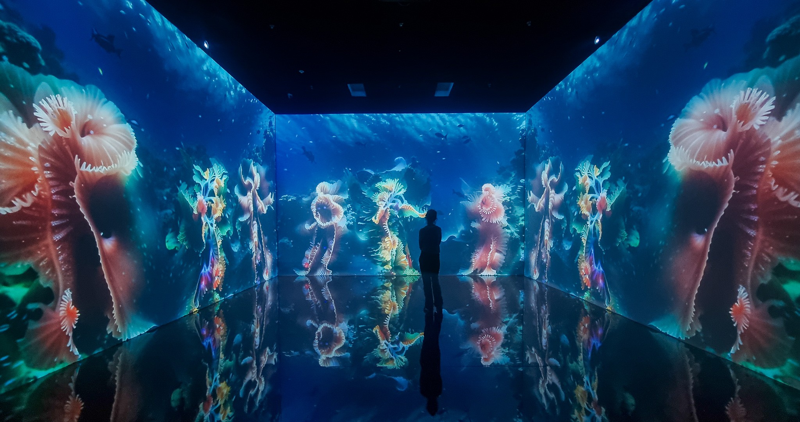
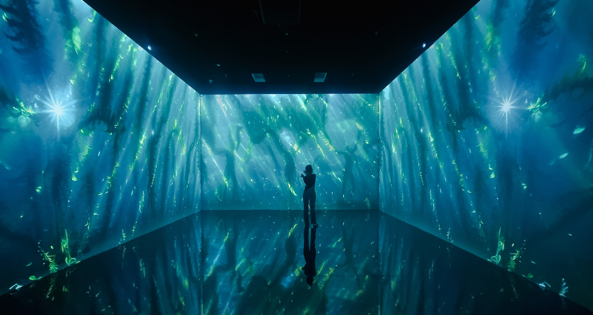
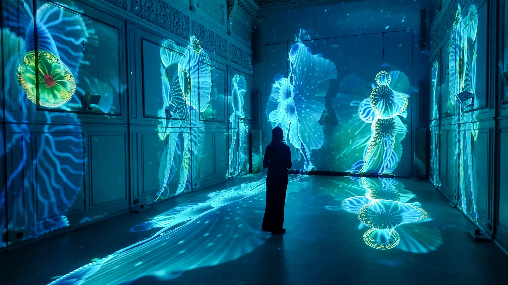
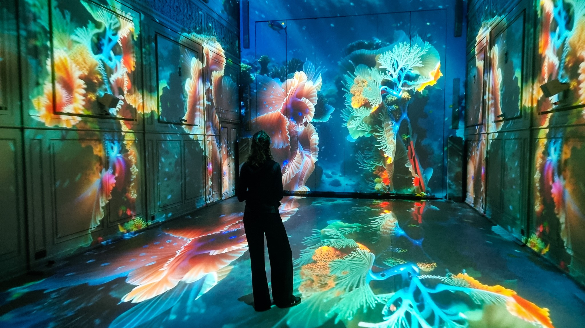

name: inverse
layout: true
class: center, middle, inverse
---

### From Gesture to Code to Space:
# Translational Media

 
### Prof. Dr. Lena Gieseke | l.gieseke@filmuniversitaet.de  

#### Film University Babelsberg KONRAD WOLF

???
* This talk examines computational pipelines that translate physical behaviour into algorithmic systems: for example, gesture into fields, architectural layouts into navigable graph structures, and performance movements into agent-based simulation logic. It explores how such translations shape aesthetics, interaction, and our understanding of space as both computational construct and experiential domain.

---

## Teaser Image "Gesture to Space"

---
## Teaser Image "Datamorphism"

---
layout:false
## Agenda

--
* Introduction

--
* Translations

???
2. Framing — What Do We Mean by Translation?

--
* Case *Gesture into Fields*

???
3. Example — Gesture into Fields
    * What is a Gesture?
    * The Capture Problem
    * Example, e.g., Body Paint (2009), Memo Akten
    * What the Field Has That the Gesture Doesn't
    * The Thinking Ocean (2024), Memo Akten & Katie Hofstadter
    * Transition Question

--
* Example *Architecture into Navigation*

???
4. Case 2 — Architectural Layout into Navigation Graphs
    * What is Architectural Space?
    * Space Syntax: The Translation Framework
    * What the Graph Has That the Building Doesn't
    * Million Dollar Blocks (2006), Laura Kurgan
    * The Façade-Tilted Bird's-Eye View

--
* Example *Data into TODO:Space*

???
5. Case 3 — Ecological Data into Navigable Space
    * A Different Kind of Source Domain
    * Julie Freeman, The Lake (2005)
    * What the Space Has That the Lake Doesn't
    * Marshmallow Laser Feast, In the Eyes of the Animal (2015)
    * Transition to Synthesis

--
* The Third Space

???
6. Synthesis —  The Properties of the Third Space (on the example of Datamorphism)
    * What Do These Three Cases Share?
    * Introducing Datamorphism
    * Three Properties of the Third Space
    * The Audience Is Already Inside
    * From Translation to World-Building

--
* World-Building, Not World-Copying

---
layout:false

## MA Creative Technologies

---
template:inverse

# Translation

???
* Going from where to where?
* This talk examines computational pipelines that translate the physical world into algorithmic systems
* I propose the perspective that we are not simply moving something across, but rather — in most cases — producing a third space that belongs fully to neither domain.

---
## From World to Algorithmic Space

* Source domain
    * TODO: Examples
* Translational Operation (incl. Hardware)
* Resulting domain
    -> Is what?

---
## What Do We Mean by Translation?

---

.center[ ] .imgref[[Images: [By HaeB - Own work, CC BY-SA 4.0](https://commons.wikimedia.org/w/index.php?curid=116926170), [Martin J. Levy](https://blog.cloudflare.com/randomness-101-lavarand-in-production/)]]

.footnote[[Walmsley, Alexander. 2026. Live Stream.]]

???

* Consider what happens when we try to bring something from the real world into computation. 
* Take randomness as a first example. Random numbers play a key role in computational processes ranging from the generation of secure cryptographic keys to the random initialization of weights during AI network training. Yet computers cannot produce true randomness. They simulate it using deterministic algorithms — PRNGs — and that simulation is structurally different from the thing it mimics. It has period lengths, statistical biases, seeds. In other words, the move from real-world phenomenon to computational representation is not a neutral transfer. Something changes in the crossing.
* One response to this problem is to extract seeds from highly complex physical processes. True random number generators (TRNGs) draw on the latent entropy in chaotic physical phenomena: atmospheric noise, radioactive decay, or — perhaps most evocatively — lava lamps. In the San Francisco offices of the internet security firm Cloudflare, a wall of lava lamps is filmed around the clock, providing cryptographic keys for roughly 20% of the world's internet traffic. Known as Lavarand, the system translates frames from the live feed into numeric seeds for a PRNG. The lamps' chaotic fluid motion, combined with atmospheric and lighting conditions, makes the seeds practically impossible to predict algorithmically. Objects designed purely for human visual pleasure become, in this context, operational instruments for computation.

* https://blog.cloudflare.com/randomness-101-lavarand-in-production/
  
From Alex:  
Random numbers play a key part of computational processes from the generation of secure cryptographic keys to the random initialising of weights during the training of an AI network. While the generation of random numbers with a sufficient level of unpredictability using deterministic pseudo-random number generator (PRNG) is suitable for many purposes, increasingly true random number generators (TRNG), which make use of the latent entropy in chaotic physical processes like atmospheric noise (https://www.random.org/) or radioactive decay (https://www.fourmilab.ch/hotbits/), are used to generate random numbers that are practically impossible to predict using an algorithm. 

This distinction is particularly salient in the area of cryptography, which is involved in the study of securing communication across networks (Rivest, 1990). The security of the world’s internet traffic relies to a large extent on the ability to generate cryptographic keys with a degree of unpredictability high enough to make them difficult if not practically impossible to guess. In such cases, a PRNG is often initialised with a truly random seed in order to quickly and efficiently produce a random key. In the San Francisco offices of the internet security firm CloudFlare there is a wall of lava lamps filmed 24 hours a day in order to provide cryptographic keys for some 20% of the world’s internet traffic (Fig. 1). Known as the Lavarand, the idea is based on an original patent by the US company Silicon Graphics in 1996 (Noll *et al.,* 1996). Whenever a key is required, the CloudFlare systems translate a frame from the live feed into a numeric value that is then fed as a seed into a PRNG, generating the key (Leebow-Fieser, 2017). Due to the highly chaotic movement of the liquid in the lamps, as well as the atmospheric and lighting conditions that eventually become rendered as pixels in the image, the seeds are extremely difficult to predict. The images, despite their use of brightly coloured objects made for human entertainment, are made to be purely operational for the computational process of pseudo-random number generation.

---
## What Do We Mean by Translation?

--
Moving something from one domain into another:
  
--
* Image capture → Pixel value → Seed for Pseudo Random Number Generator (PRNG) → Pseudo Random Number

???
* And here is where it gets interesting: what emerges on the other side is not a failed copy. The simulation is a new kind of object — one that behaves like randomness under certain conditions, but operates according to its own internal logic. It is neither the original phenomenon nor a mere approximation of it. It is something third.

--
 
*In which domain are we now?*

--

> Translation as production of a third space.

???

Computational translation is typically framed as transfer (moving something from one domain into another), but this framing obscures what is actually happening. Introduce the alternative frame: translation as production of a third space. Lead over to examples

---
template:inverse

### Example
# Gesture into Fields

---
## What is a Gesture?

???
* Anchoring the source domain
A brief phenomenological provocation: gesture is embodied, continuous, intentional, and unrepeatable. It carries weight, hesitation, momentum — properties that belong to a body in time.

---
## What is a Gesture?

.center[  ] .imgref[[Images: [Lucas, A. 2014. Breathe Life Into Your Ballet Performance | Dance Advantage. Accessed at illusionsofamisadventurer](https://illusionsofamisadventurer.wordpress.com/2014/04/10/expression-and-communication-through-dance/), [NYC Dance Project. Accessed at Creative Boom](https://www.creativeboom.com/inspiration/the-art-of-movement-breathtaking-photographs-of-incredible-dancers-in-motion/), [freepik](https://www.freepik.com/premium-photo/beautiful-sensitive-hands-concept_29662593.htm#from_element=cross_selling__photo)]]

---
## What is a Gesture?

    

> A movement usually of the body or limbs that expresses or emphasizes an idea, sentiment, or attitude 
[...]

.footnote[[[Merriam-Webster Dictionary: gesture](https://www.merriam-webster.com/dictionary/gesture)]]

???
-> raised his hand overhead in a gesture of triumph
* the use of motions of the limbs or body as a means of expression
* something said or done by way of formality or courtesy, as a symbol or token, or for its effect on the attitudes of others. 
-> a political gesture to draw popular support …— V. L. Parrington

--

*How to capture a gesture?*

.footnote[[[Merriam-Webster Dictionary: gesture](https://www.merriam-webster.com/dictionary/gesture)]]

???
-> raised his hand overhead in a gesture of triumph
* the use of motions of the limbs or body as a means of expression
* something said or done by way of formality or courtesy, as a symbol or token, or for its effect on the attitudes of others. 
-> a political gesture to draw popular support …— V. L. Parrington

---
## Body Capture Technologies

Marker-based
* Optical mocap (Vicon, OptiTrack)
* Inertial mocap (Xsens, Rokoko)

Markerless
* Depth sensors (LiDAR, structured light, e.g. Azure)
* Multi-camera volumetric
* Video-based pose estimation (ML-driven, MediaPipe, OpenPose)

???
Marker-based
* Optical mocap (Vicon, OptiTrack) — retroreflective markers + IR cameras
* Inertial mocap (Xsens, Rokoko) — IMU suits, no optical dependency

Markerless
* Depth sensors (LiDAR, structured light, ToF) — e.g. Azure Kinect
* Multi-camera volumetric capture — photogrammetric reconstruction, e.g. 4D Views
* Video-based pose estimation (MediaPipe, OpenPose) — single or multi-cam, ML-driven

---
## Body Capture Technologies

.center[ ] .imgref[[Images: [University of Eastern Finland, HUMEA lab](https://sites.uef.fi/humea/humea-laboratory/human-motion-and-performance-analysis/)]]

---
## Body Capture Technologies

.center[] .imgref[[Images: [IEEE Pulse, Decoding Dance](https://www.embs.org/pulse/articles/decoding-dance/)]]

---
## Body Shapes

.center[  ] .imgref[[Images: [IEEE Pulse, Decoding Dance](https://www.embs.org/pulse/articles/decoding-dance/), [Design Collector, Motion Capture Dance Performance for AICP Awards](https://designcollector.net/likes/motion-capture-dance-performance-for-aicp-awards)]]

---

.center[
 <video width="1060" controls>
  <source src="./img/majorlazer_01.mp4" type="video/mp4">
</video> 
]

.footnote[[Major Lazer – Light it Up (feat. Nyla & Fuse ODG)](https://www.youtube.com/watch?v=r2LpOUwca94)]

---
template:inverse
# A *Third* Space

---
## Body Paint

--

???
* The translation in action
Akten's infrared camera does not record the body — it records movement. Speed, acceleration, curvature, and size of motion are extracted and fed into a fluid simulation, producing strokes, drips, spirals, and splashes on a projected canvas. Show the installation image alongside the output field. Crucially: the system does not see people at all, only movement. Anything moving — living or not — triggers the same response. The body has already been abstracted away.
--
 → 
--
 →   
.imgref[[Images: [xinfrared](https://www.xinfrared.com/pl/blogs/blog/the-capabilities-and-limitations-of-thermal-camera?srsltid=AfmBOopnv_2JS-e1YbCx1qtqDB4wCziekN6YMK5WAq72denV_wbsOUeO), [numerical-tours](https://www.numerical-tours.com/matlab/graphics_5_fluids/), Memo Atken. 2009. [Body Paint](https://www.memo.tv/works/bodypaint/)]]

--
> What does the field offer (that the gesture doesn't)?

---
.center[] .imgref[[Image: [Creative Applications: Body Paint – Gestures and dance into evolving compositions](https://www.creativeapplications.net/project/body-paint-openframeworks/)]]

---

.center[
 <video width="1060" controls>
  <source src="./img/bodypaint_01.mp4" type="video/mp4">
</video> 
Memo Atken. 2009. Body Paint. [https://www.memo.tv/](https://www.memo.tv/works/bodypaint/)
]

???

* https://www.creativeapplications.net/project/body-paint-openframeworks/

The fluid field produced by Body Paint has viscosity, diffusion rates, attractor behavior, gradient flows — properties that are physically well-defined but were never properties of the original gesture. A side-by-side: gesture (embodied, singular, temporal) versus field (spatial, persistent, iterable, generative). Akten's own framing supports the argument directly: what matters is not the painting at the end, but the sensation of playing. The output has escaped the input. It is a new kind of object.

---
## The Third Space

  

> The joy of the movement, the sensation of play...

.footnote[[[Creative Applications: Body Paint – Gestures and dance into evolving compositions](https://www.creativeapplications.net/project/body-paint-openframeworks/)]]

???
* User-to-user interaction: throw paint, splash each other
* While the installation is suitable for a single user, when multiple users are present a new dynamic emerges between people. A user-to-user interaction is born when the audience start playing with each other through the installation, throwing virtual paint at each other, trying to splash their friends, working collaboratively to create shared artwork, or mischievously trying to vandalize others’ work.

---
## Body Capture Technologies

Neural
* Neural Radiance Fields (NeRF)
* Gaussian Splatting

???
 Neural
* Neural Radiance Fields (NeRF) for dynamic body reconstruction
* Gaussian Splatting for real-time volumetric representation
  
Emerging
* Radar-based (no camera, through walls)
* EEG/EMG — capturing intent before visible movement occurs

---
.center[
 <video width="1000" controls>
  <source src="./img/gaussiansplat_01.mp4" type="video/mp4">
</video> 
Masaki Mizuno. 2026. 3D Gaussian Splatting. [X](https://x.com/MIZNOM/status/2023421414163013995?ref_src=twsrc%5Etfw%7Ctwcamp%5Etweetembed%7Ctwterm%5E2023421414163013995%7Ctwgr%5E6f47b56b09a9834c7d8b448b38bcf38c16c0dcf0%7Ctwcon%5Es1_&ref_url=https%3A%2F%2F80.lv%2Farticles%2Fmagical-animation-with-afterimage-made-from-3d-gaussian-splatting)
]

---
## The Third Space

.center[] .imgref[[Image: Masaki Mizuno. 2026. 3D Gaussian Splatting. [X](https://x.com/MIZNOM/status/2023421414163013995?ref_src=twsrc%5Etfw%7Ctwcamp%5Etweetembed%7Ctwterm%5E2023421414163013995%7Ctwgr%5E6f47b56b09a9834c7d8b448b38bcf38c16c0dcf0%7Ctwcon%5Es1_&ref_url=https%3A%2F%2F80.lv%2Farticles%2Fmagical-animation-with-afterimage-made-from-3d-gaussian-splatting)]]

---

.center[
 <video width="1080" controls>
  <source src="./img/superradiance_01.mp4" type="video/mp4">
</video> 
Memo Akten and Katie Hofstadter, 2025. [Superradiance](https://superradiance.net/)
]

???
* NO AUDIO
* What could be the third space?

---
## Superradiance

Memo Akten and Katie Hofstadter, 2025:

> We know that we are deeply entangled within complex, interdependent networks and assemblages of life, composed of and embedded within expansive scales of intelligence, unfolding across multiple boundaries of self.
  

---
## Superradiance

Memo Akten and Katie Hofstadter, 2025:

> We know that **we are deeply entangled within complex, interdependent networks** and assemblages of life, composed of and embedded within expansive scales of intelligence, unfolding across multiple boundaries of self.
  
--
  
 
> It’s one thing to intellectually know this, but how can we feel it, in our bodies?

???
* https://www.roborantreview.com/reviews/superradiance-memo-akten-and-katie-hofstadter-gray-area
* You are only made of non-you elements.
* Memo Akten and Katie Hofstadter have produced something profound and rare: imagery none of us have ever seen before. Katie’s dancing body is the centerpiece of this work, which appropriately, we never see. Instead, her liquid movements materialize nebulae, plankton, trees, worms, and mushrooms that seamlessly blend into video backdrops of earth’s beauty. 
* Literalism can be the bane of good art, but in this case, it’s a literalism that most of us have forgotten and desperately need to restore.

---
## Superradiance

The following images are all from:
  
 
  
Memo Akten and Katie Hofstadter. 2025. Superradiance.  
https://superradiance.net/

---

---

---

---

---

---

---

---

---

---
## The Making of Superradiance

* Script
* Choreography
* Simulation
* Generative AI: Chapter 1 - Embodied Simulation
* Generative AI: Chapter 2 - Embodied Earth

.footnote[[Memo Akten and Katie Hofstadter. 2025. Superradiance. https://superradiance.net/]]

---

.center[
 <video width="1080" controls>
  <source src="./img/superradiance_makingof_cutout_01.mp4" type="video/mp4">
</video> 
]

.footnote[[Memo Akten and Katie Hofstadter. 2025. Superradiance. https://superradiance.net/]]

---
## The Third Space

The Primary Gesture: The Dancing Body

???
* generative latent space
* Dancer's movement captured and fed into ControlNet as pose skeleton data
Bodily gesture becomes a latent space constraint — the choreography steers the generative diffusion process
The gesture is preserved structurally while the visual world around it is transformed
* Superradiance: body gesture → ControlNet pose skeleton → steers diffusion latent space → rendered environment. The ML model is a translation layer — the gesture constrains what the latent space can express.
* the body steers the latent space

--

The Ecological Gesture

???
* Natural processes (waves, root growth, wind, tidal movement) are framed as gestural — the planet moves, and the work renders those movements as cognate to bodily movement

--

The third space is not a copy of either domain — it is a system with its own rules.

---
## Machine Learning

https://refikanadol.com/works/unsupervised/

Superradiance → the body steers the latent space
           ↓
Anadol     → data IS the latent space, rendered as environment
           ↓
Datamorphism → naming the operation: 
               any domain can be translated into inhabited space 
               via ML as the translational engine

Superradiance: body gesture → ControlNet pose skeleton → steers diffusion latent space → rendered environment. The ML model is a translation layer — the gesture constrains what the latent space can express.
Then Anadol flips the input: instead of a body, the source is pure data — millions of images, climate records, neural signals — fed directly into ML models, and the latent space is rendered as architectural-scale visual space. The gesture disappears; data becomes the gesture.

---
template:inverse

## The End

# 💧 🌊 💦
