name: inverse
layout: true
class: center, middle, inverse
---

## Introduction to Virtual Production Techniques

 
### Prof. Dr. Lena Gieseke | l.gieseke@filmuniversitaet.de  

#### Film University Babelsberg KONRAD WOLF

???

This talk offers an introduction to virtual production and its toolset. It outlines how real-time engines, LED volumes, performance capture and in-camera visual effects reshape the relationship between physical sets and digital environments. Through practical examples, the talk considers the creative and organisational implications of virtual production, showing how these techniques influence aesthetic and narrative decisions in contemporary filmmaking.

---
layout:false

.header[Introduction to Virtual Production Techniques]

.center[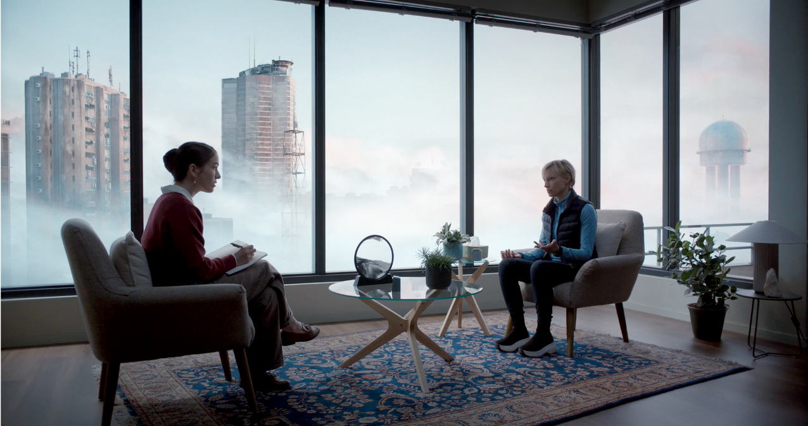].imgref[[Image: Der Turm - Filmuniversität]]

---

.header[Introduction to Virtual Production Techniques]

.center[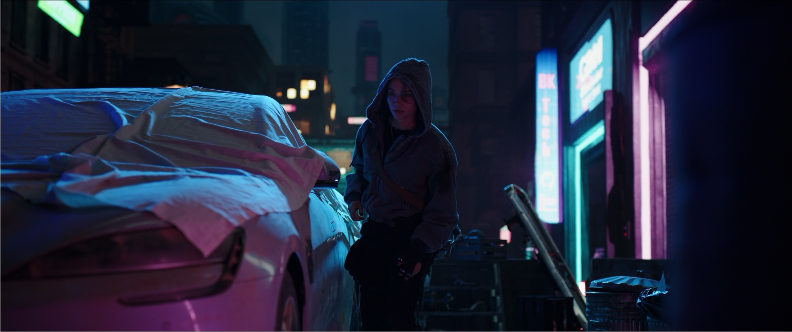].imgref[[Image: Interconnections - Filmuniversität]]

---
.header[Introduction to Virtual Production Techniques]

.center[
 <video width="1024" controls>
  <source src="./img/mandalorian_cutout_01.mp4" type="video/webm">
</video>  
]

.footnote[[[YouTube - The Virtual Production of The Mandalorian Season One](https://www.youtube.com/watch?v=gUnxzVOs3rk), Industrial Light & Magic]]

---
.header[Introduction to Virtual Production Techniques]

.center[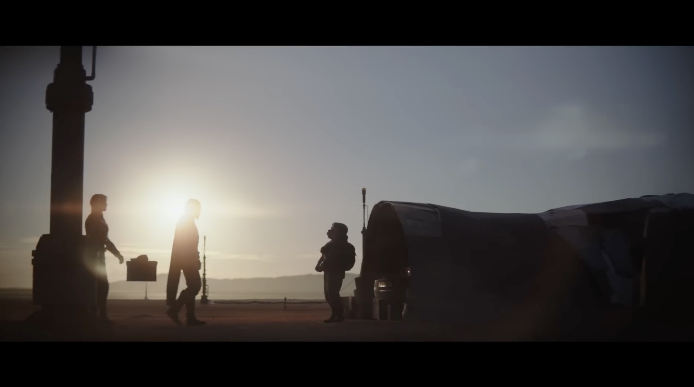]

.footnote[[[YouTube - The Virtual Production of The Mandalorian Season One](https://www.youtube.com/watch?v=gUnxzVOs3rk), Industrial Light & Magic]]

---
.header[Introduction to Virtual Production Techniques]

.center[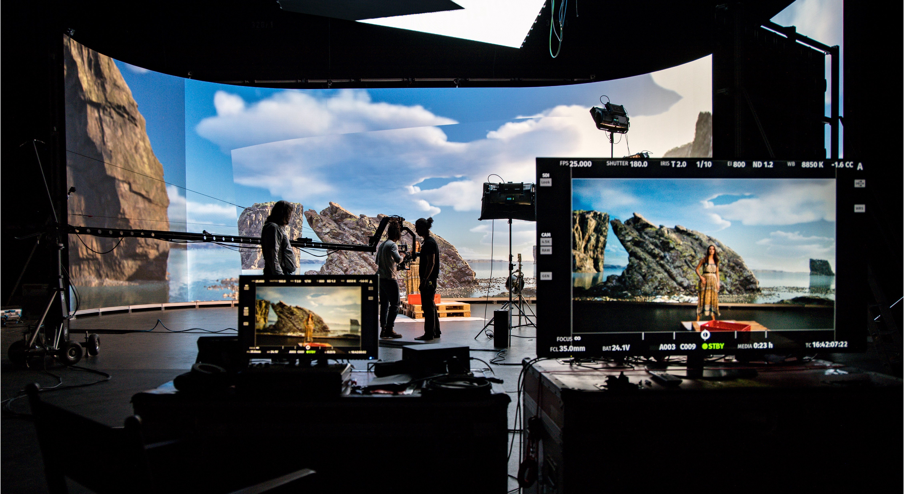].imgref[[Image: Adrian Weber & Halostage]]

---
.header[Introduction to Virtual Production Techniques]

.center[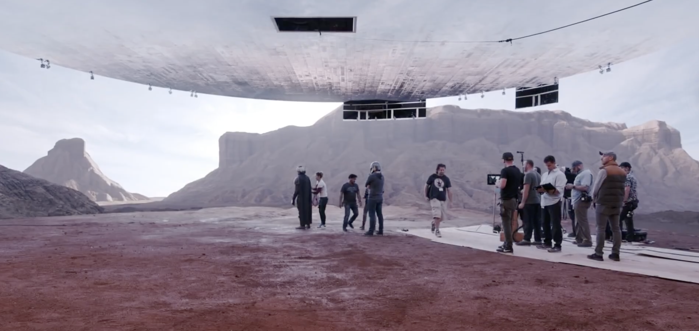]

.footnote[[[YouTube - The Virtual Production of The Mandalorian Season One](https://www.youtube.com/watch?v=gUnxzVOs3rk), Industrial Light & Magic]]

---
## Who am I?

--

* Master in Fine Art (MFA Dramatic Media)
* 6 years in the industry (VFX, R&D, Software Development)
* Phd in Computer Science (Dr. rer. nat. Computer Graphic)

--

 

* Film University Babelsberg KONRAD WOLF, Potsdam, Germany
* Professor for Image-based Media Technologies
* MA Creative Technologies

--

> Computer Science meets Creativity, Art & Film...

???
.center[]

.center[]

---
## Film University Babelsberg KONRAD WOLF

--

* Largest film school in Germany (established 1954), now public university

--

* About 100 in-house film productions yearly

--

* State-of-the-art equipment and environments (2 studios, 150 and 300 sqm)

???
* e.g., Sony F55, ARRI Alexa, Panasonic VariCam, Harrison MPC4D console with Dolby Atmos
* ceiling lighting rigs

---
## Film University Babelsberg KONRAD WOLF

.left-quarter[
Neighbor: Babelsberg Film Studio, oldest large-scale film studio in the world, producing films since 1912.
]
.right-quarter[ .imgref[[Image: [Studio Babelsberg](https://www.metropolitanbacklot.com/galerie/)]]]

???
* Hundreds of films, including Fritz Lang's Metropolis and Josef von Sternberg's The Blue Angel were filmed there. More recent productions include V for Vendetta, Captain America: Civil War, Æon Flux, The Bourne Ultimatum, Valkyrie, Inglourious Basterds, Cloud Atlas, The Grand Budapest Hotel, The Hunger Games, Isle of Dogs and The Matrix Resurrections. 

---
template:inverse

# Introduction to Virtual Production Techniques

---
## Agenda

--

* Visual Effects
* Real-time Engines

--

* Virtual Production
    * LED Walls

--
* Implications

???

The tools of virtual production: Realtime Engines, LED Walls, Hybrid Green Screens

---
template:inverse

# Visual Effects

???
Let's assume we are talking about movie making that includes computer generated imagery (CGI)

---
.header[Visual Effects]
.center[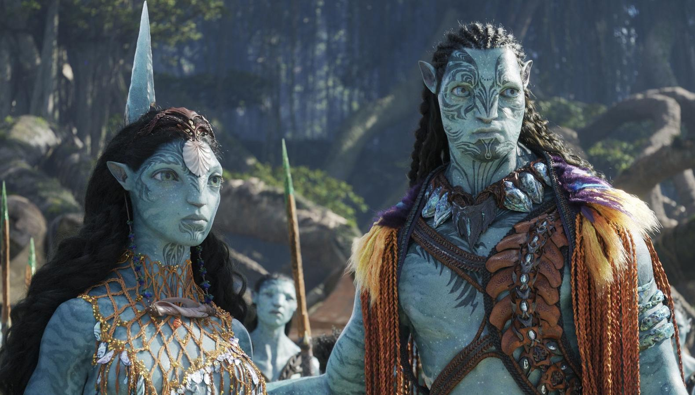].imgref[[Image: *Avatar: The Way of Water*, Disney via [Backstage](https://www.backstage.com/magazine/article/create-digital-effects-film-project-13748/)]]

---
.header[Visual Effects]
.center[].imgref[[Image: *House of the Dragon* Credit: Ollie Upton/HBO via [Backstage](https://www.backstage.com/magazine/article/create-digital-effects-film-project-13748/)]]

---
.header[Visual Effects]
.center[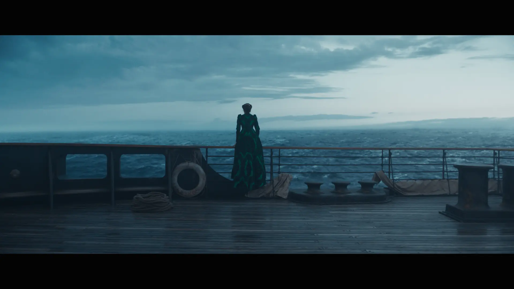].imgref[[Image: *1899 Virtual Production*, [Framestore](https://www.framestore.com/work/1899-virtual-production)]]

---

## Visual Effects

--

.left-even[
* VFX

]

.right-even[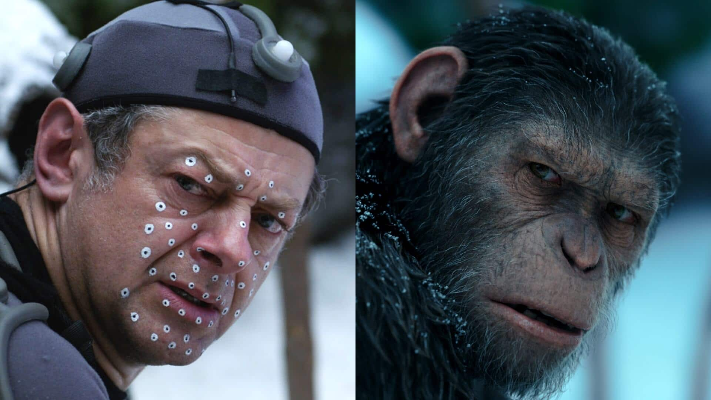 .imgref[[Image: studiobinder](https://www.studiobinder.com/blog/what-is-vfx/)]]

---
## Visual Effects

.left-even[
* VFX
* Computer-generated imagery (CGI) or manipulated images integrated into live-action footage

]

.right-even[ .imgref[[Image: studiobinder](https://www.studiobinder.com/blog/what-is-vfx/)]]

---
## Visual Effects

.left-even[
* VFX
* Computer-generated imagery (CGI) or manipulated images integrated into live-action footage
* **Post-Production** step
]

.right-even[ .imgref[[Image: studiobinder](https://www.studiobinder.com/blog/what-is-vfx/)]]

---
## Visual Effects

.center[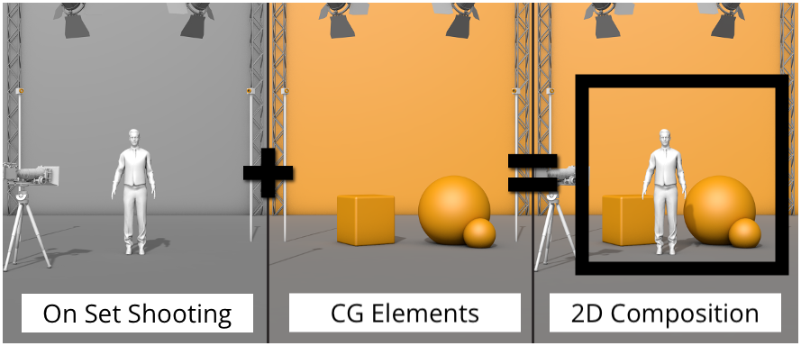].imgref[[Image: Adrian Weber & Halostage]]

???

Live action plus CG elements.
* Gravity  
* The Mandalorian

Full CG productions.
Mocap with live preview.
* The Lion King  
* The Jungle Book  
* Ready Player One

Live action and CG characters.
Live preview of characters.
* Real Steel  
* Hulk (MCU)

---
.header[Visual Effects]

## 2D Compositing

.center[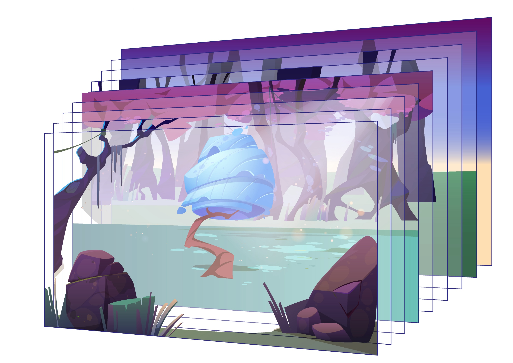].imgref[[Image: [freepik](https://www.freepik.com/free-vector/parallax-background-2d-landscape-with-fantasy-tree_21133686.htm#fromView=keyword&page=1&position=0&uuid=ded0997d-7f07-48a2-aca5-d62e5071c9b6&query=Cgi+animation+portfolio)]]

---
.header[Visual Effects]

## On Set Shooting: Green Screens

.center[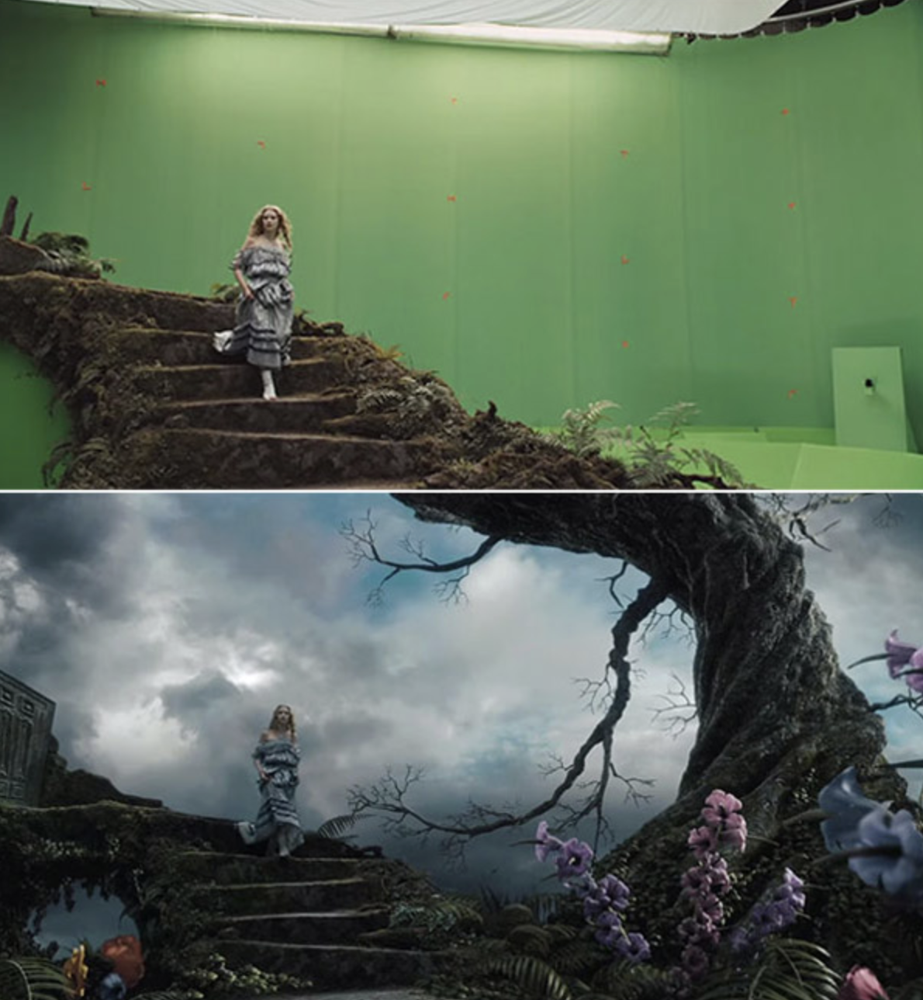  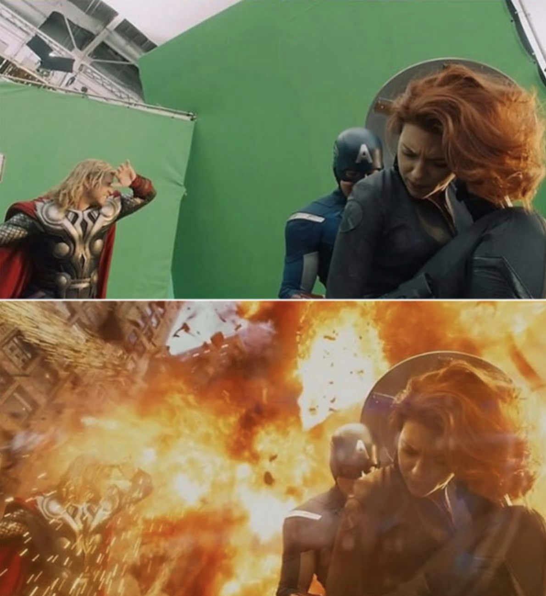.imgref[[Images: [digitalsynopsis](https://digitalsynopsis.com/design/movies-before-after-green-screen-cgi/)]]]

---
.header[Basics]

## Visual Effects

.left-even[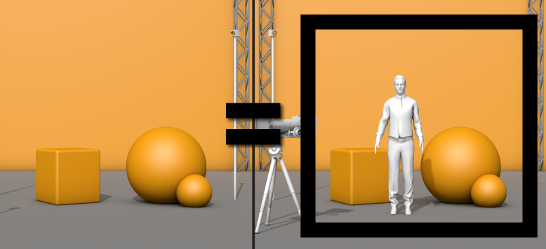  
.imgref[[Image: Adrian Weber & Halostage]]]

--

.right-even[
 
So far: **very long render times**...
]

---
.header[Visual Effects]

## Film Production Pipeline

.center[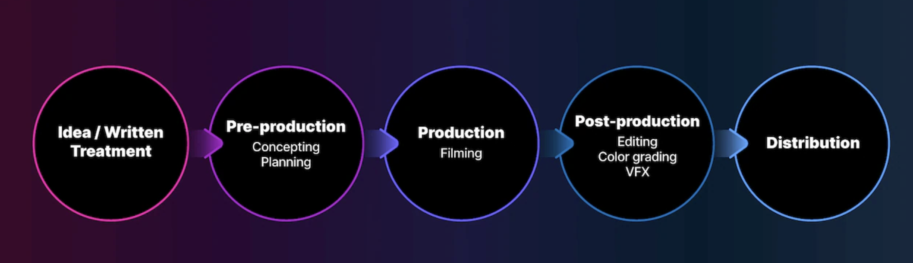].imgref[[Image: [Unreal Engine - Virtual Production](https://www.unrealengine.com/en-US/explainers/virtual-production/what-is-virtual-production)]]

---
.header[Basics]

## Visual Effects

.left-even[  
.imgref[[Image: Adrian Weber & Halostage]]]

.right-even[
 
Not anymore: ~~very long render times~~...
]

---
.header[Basics]

## Real-time Engines

--
> How can we make use of real-time render engines during film production?

---
.header[Basics]

## Real-time Engines As VFX?

Not yet...

.center[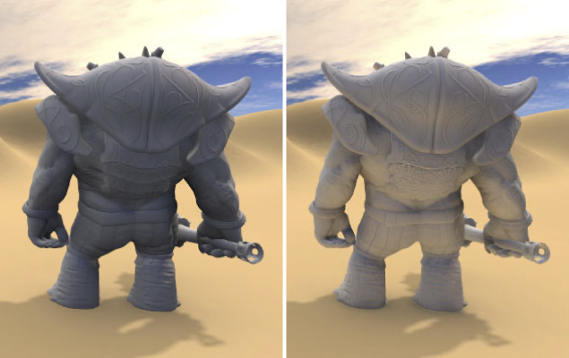]

---
.header[Basics]

## Real-time Engines As VFX?

Not yet...

.center[]

---
.header[Basics]

## Real-time Engines As VFX?

Not yet...

.center[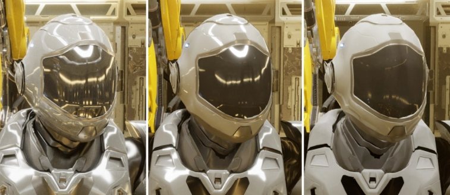]

???

Path traced, ray traced, rasterized

---
.header[Basics]

## Real-time Engines As VFX?

Not yet...

.center[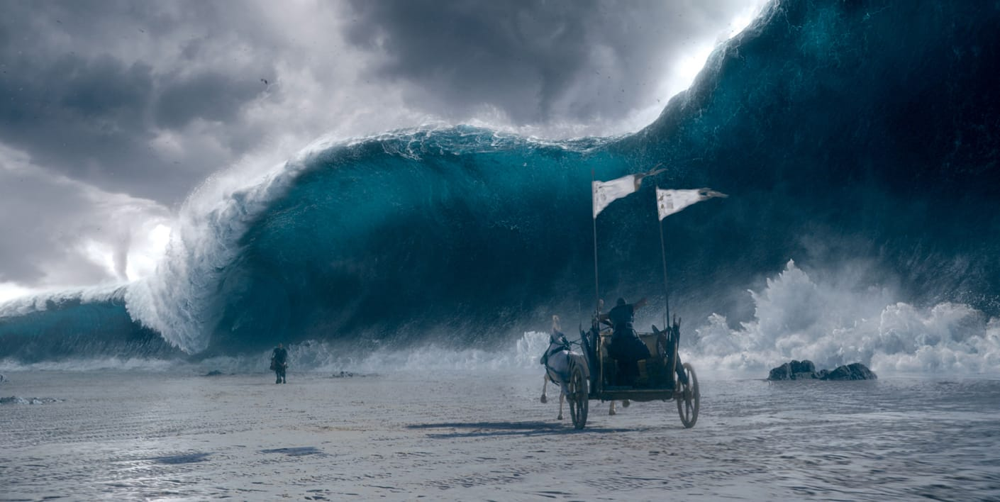]

.footnote[Exodus: Gods and Kings by ScanlineVFX]

---
.header[Basics | Real-time Engines]

## Application Scenarios

--

.left-quarter[
* Preproduction  
    * Previs
    * Stuntvis
    * Techvis
    * …
]

???
Techvis (technical visualization) is the process of digitally pre-planning how a shot will be physically executed on set.

---
.header[Virtual Production]

## Application Scenarios

.left-quarter[
* Preproduction  
    * **Previs**
    * Stuntvis
    * Techvis
    * …
]

???
Techvis (technical visualization) is the process of digitally pre-planning how a shot will be physically executed on set.

--

.right-quarter[
    <video width="720" controls>
        <source src="./img/videomatic_01.mp4" type="video/webm">
    </video>  
]

--

.footnote[Lord of the Rings: The Fellowship of the Ring - Behind the Scenes (2001)]

---
.header[Virtual Production]

## Application Scenarios

.left-quarter[
* Preproduction  
    * **Previs**
    * Stuntvis
    * Techvis
    * …
]

.right-quarter[
    <video width="720" controls>
        <source src="./img/mandalorian_previs_cutout_01.mp4" type="video/webm">
    </video>  
]

.footnote[[[The Mandalorian - The Third Floor - Visualization Reel](https://www.youtube.com/watch?v=0uUbFz-_-T8&t=48s)]]

---
.header[Virtual Production]

## Application Scenarios

.left-quarter[
* Preproduction  
    * Previs
    * Stuntvis
    * **Techvis**
    * …
]

.right-quarter[
    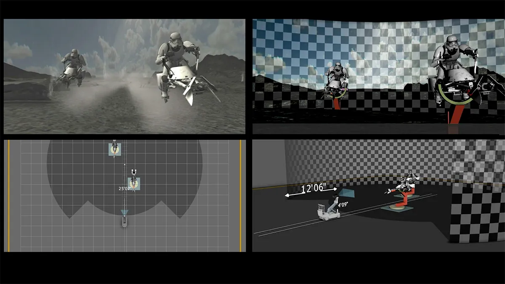
]

.footnote[[[The Mandalorian - The Third Floor - Visualization Reel](https://www.youtube.com/watch?v=0uUbFz-_-T8&t=48s)]]

---
.header[Virtual Production]

## Application Scenarios

.left-quarter[
* Preproduction  
    * Previs
    * Stuntvis
    * **Techvis**
    * …
]

.right-quarter[
    <video width="720" controls>
        <source src="./img/techvis_01.mp4" type="video/webm">
    </video>  
]

.footnote[[[The Mandalorian - The Third Floor - Visualization Reel](https://www.youtube.com/watch?v=0uUbFz-_-T8&t=48s)]]

???
Techvis (technical visualization) is the process of digitally pre-planning how a shot will be physically executed on set.

---
.header[Virtual Production]

## Application Scenarios

.left-even[
* Production - On Set Previews
    * Visual Effects
    * Motion & facial capture
    * ...
  
]

---
.header[Virtual Production]

## Application Scenarios

.left-even[
* Production - On Set Previews
    * Visual Effects
    * **Motion & facial capture**
    * ...
  
.footnote[[[CGW - The House of Moves](https://www.cgw.com/Publications/CGW/2012/Volume-35-Issue-3-April-May-2012/Motion-Capture-Mania.aspx)]]
]

.right-even[
    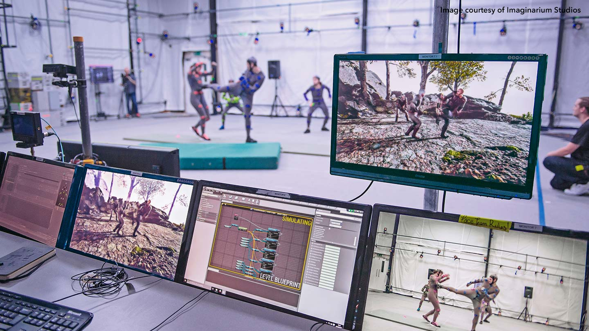
]

---
template:inverse

# Virtual Production

---
## Virtual Production

> Virtual production refers to film production processes that use real-time rendering engines.

???
Anything digitally created to simulate script

ChatGPT: Virtual production is a filmmaking approach that combines real-time rendering and physical production so that visual effects can be created and viewed live during filming rather than added later in postproduction.

--

* That is just one possible definition...
* Term is ill-defined

---
.header[Virtual Production]

## Virtual Camera

.center[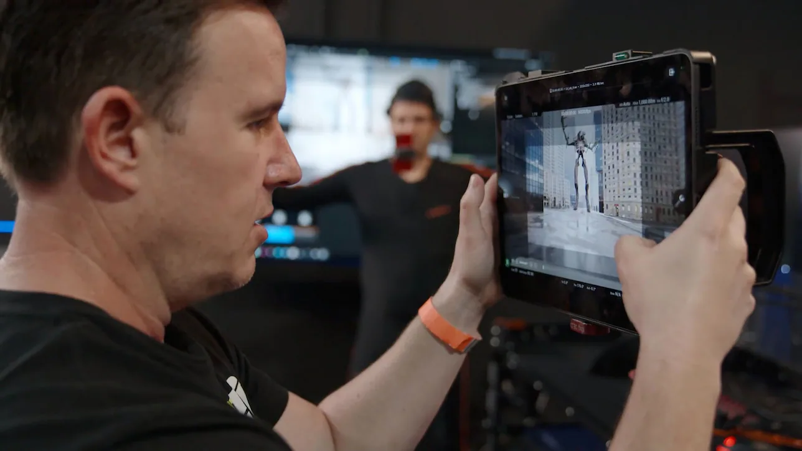]

.imgref[[Image: [Unreal - Virtual Production](https://www.unrealengine.com/en-US/explainers/virtual-production/what-is-virtual-production)]]

---
.header[Virtual Production]

## Virtual Camera

.center[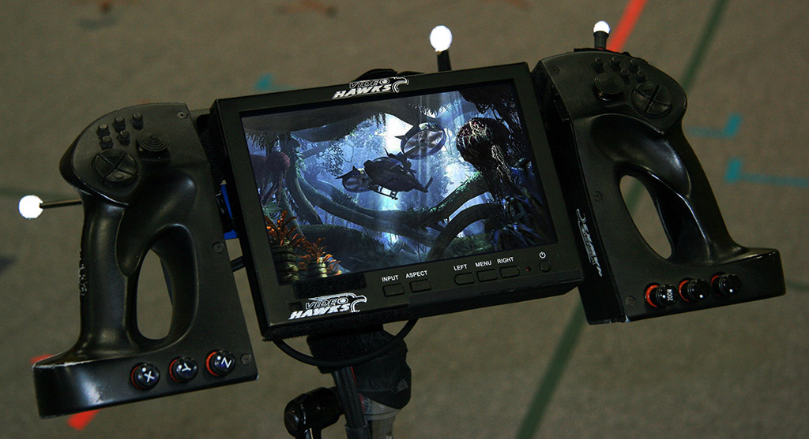]

.imgref[[[Image: Stephen Rosenbaum](https://www.stephenrosenbaum.net/project/avatar)]]

???
* The Virtual Camera was the real time window into Pandora. Optical mocap markers were placed on it so the operator could move the camera position just by taking a step forward or backward, move side-to-side, or angle it up or down. Because it's "virtual", the operator could also instantly change scale to, for example, emulate a crane or steadycam for larger or smoother camera moves. 

---
.header[Virtual Production]

## Virtual Camera

.center[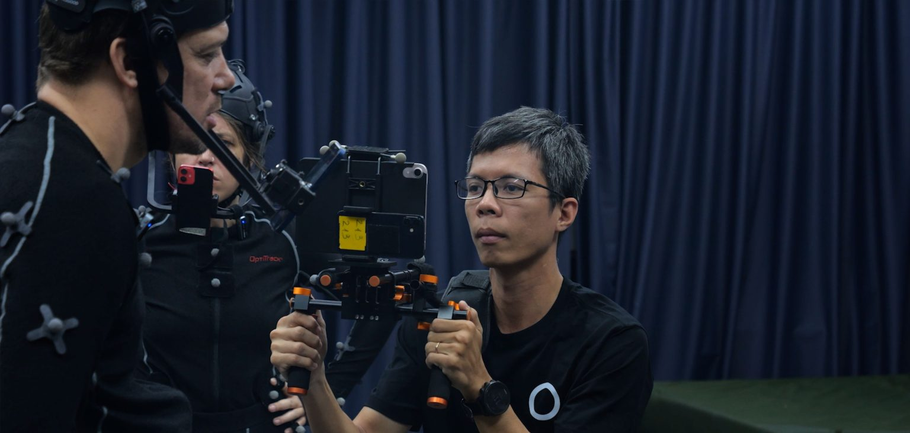]

.imgref[[[Image: Animost](https://animost.com/ideas-inspirations/virtual-production-motion-capture-studio/)]]

---
.header[Virtual Production]

## Even Better (Pre-) Views?

.center[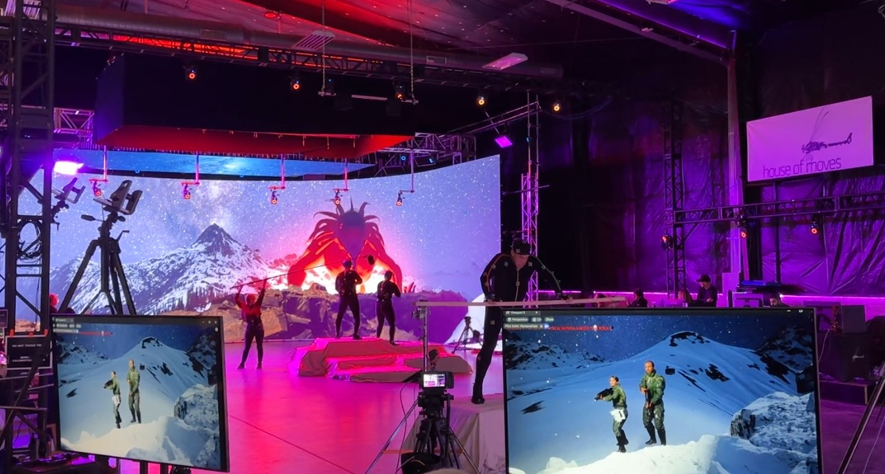]
.imgref[[[Image: moves](https://www.moves.com/wp-content/uploads/2025/05/Austin-Outpost-Shoot.jpg)]]

???
* Performers are quickly immersed in the directors vision of the story being told
* They’re enabled to look in the right spots, see and react in unison, and perform with the freedom to let the characters and story shine.
* Better staging, lines of sight, and performance, results in fewer fixes and more efficient spend in post-production. Come shoot your virtual production with us at Stray Vista Studios in Austin, Texas.

---
template: inverse

# In-Camera VFX

???
With this technique, live-action shooting takes place on a huge LED stage or volume, which displays an environment generated by the real-time engine on its walls and ceiling. The most sophisticated LED volumes are hemispherical domes that completely enclose the stage, while simpler stages might be half cubes, or even just a single wall. 

---
.header[Virtual Production]

## In-Camera VFX (ICVFX)

.center[
    <video width="720" controls>
        <source src="./img/icvfx_01.mp4" type="video/webm">
    </video>  
]

.imgref[[Image: [Courtesy of Alter Ego, Pixomondo, William F. White, Virtual Production Academy, and Caledon FC
 via Unreal - Virtual Production](https://www.unrealengine.com/en-US/explainers/virtual-production/what-is-virtual-production)]]

???
An LED volume wall is a system of linked high-end LED panels used to display video footage or 3D content to form a background behind your actors. In essence, it’s like shooting live action in front of a highly sophisticated, extremely large television screen. Used for productions ranging from streaming series to weekly episodic shows to sci-fi blockbusters, LED volume walls can consist of a mobile setup or a more permanent system (volume stage). Providers such as Orbital Virtual Studios can supply background content, production setup, and project management for your Virtual Production capture.

Volume -> aus Cabinets -> aus Modulen -> LEDs
LEDs: Pixel Pitch, Brightness, Refreshrate, Multiplexing

----------

With this technique, live-action shooting takes place on a huge LED stage or volume, which displays an environment generated by the real-time engine on its walls and ceiling. 

It’s much more than just background replacement; the real-time scene is live and interactive, and it moves in relation to the camera to create a true-to-life parallax effect, so everything appears in the correct perspective. The LED displays also cast realistic lighting and reflections on the actors, so they appear to be fully immersed in the scene.

---
.header[Virtual Production]

## In-Camera VFX (ICVFX)

.center[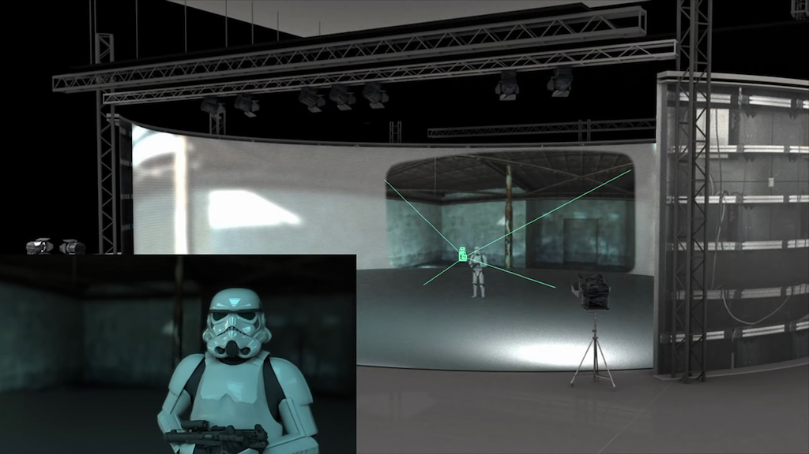 .imgref[[[Image: moves](https://www.moves.com/wp-content/uploads/2025/05/Austin-Outpost-Shoot.jpg)]]]

> In-camera VFX are visual effects created and captured directly during filming rather than added in postproduction.

---
.header[Virtual Production]

## *"The Volume"*

.center[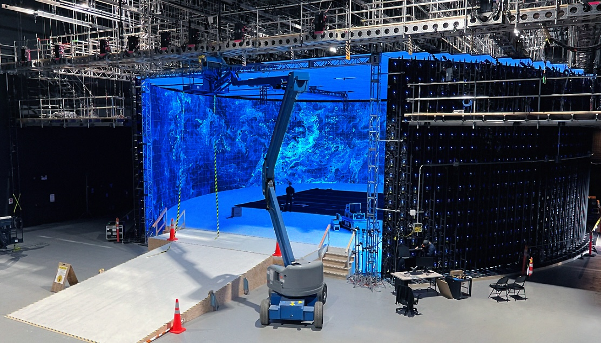 .imgref[[[Image: moves](https://www.moves.com/wp-content/uploads/2025/05/Austin-Outpost-Shoot.jpg)]]]

---
.header[Virtual Production]

## *"The Volume"*

.center[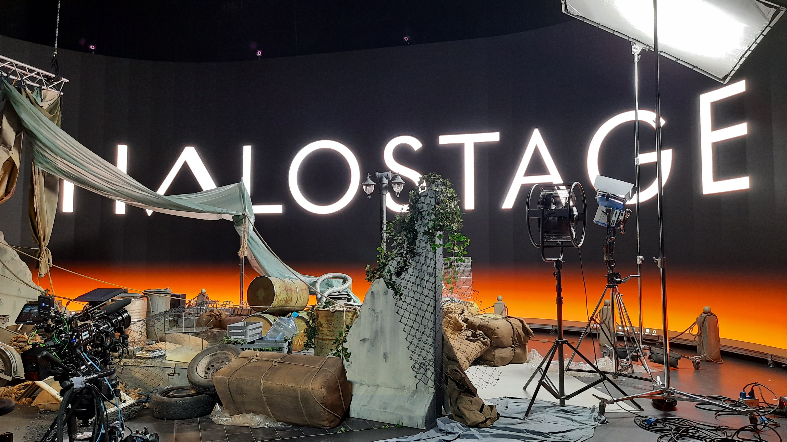]

---
.header[Virtual Production]

## *"The Volume"*

.center[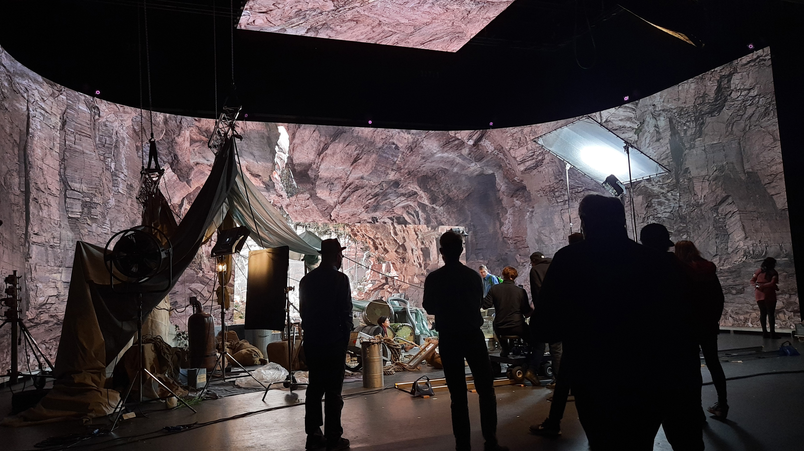]

---
.header[Virtual Production | *"The Volume"*]

.center[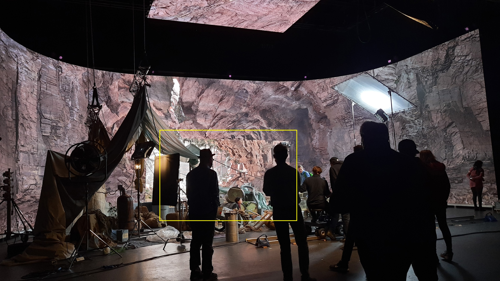]

???

Also:

In in-camera VFX with LED walls, the virtual background must update according to the camera’s tracked position. When the camera moves, the rendered scene changes perspective so that foreground actors and the LED environment show the correct parallax.

If this is not done, the background appears “flat” or glued to the wall. Correct parallax is therefore what makes the LED wall behave like a real distant environment rather than a giant television.

---
.header[Virtual Production | *"The Volume"*]

.center[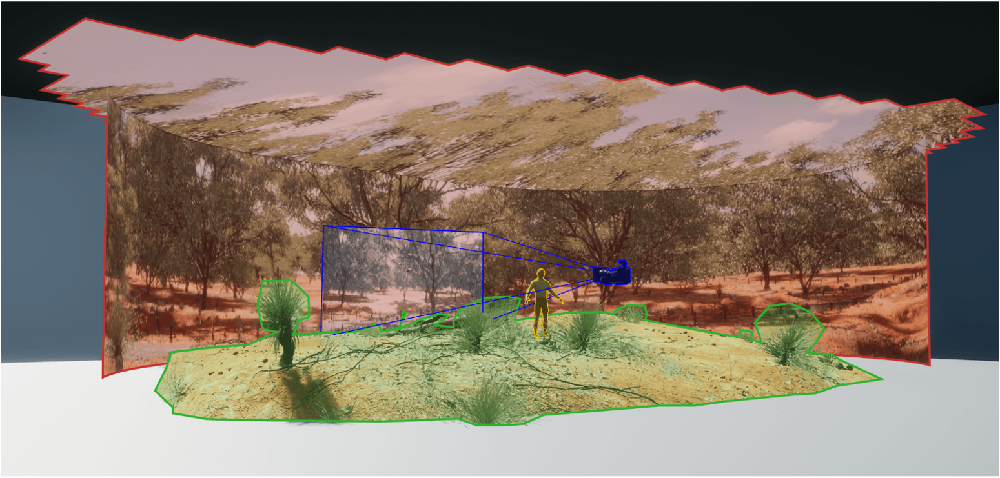]

.imgref[[Image: Adrian Weber & Halostage]]

---
.header[Virtual Production | *"The Volume"*]

.center[].imgref[[Image: Der Turm - Filmuniversität]]

---
.header[Virtual Production | *"The Volume"*]

.center[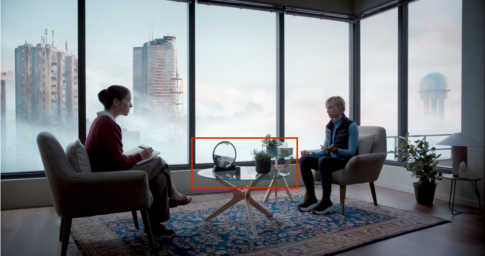].imgref[[Image: Der Turm - Filmuniversität]]

---
.header[Virtual Production | *"The Volume"*]

.center[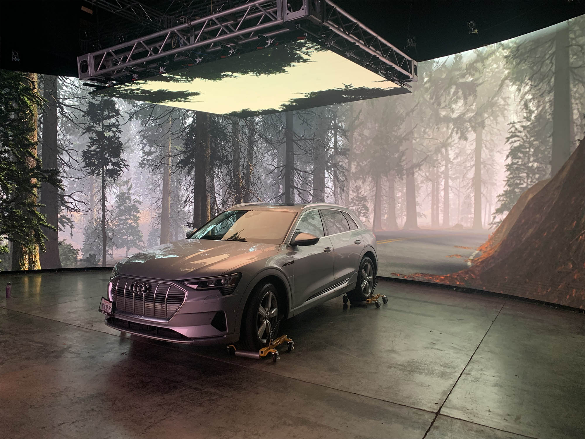].imgref[[Image: [Orbital Virtual Studios wall with ceiling panel via bhphotovideo](https://www.bhphotovideo.com/explora/video/news/intro-to-using-led-volume-walls)]]

???
.center[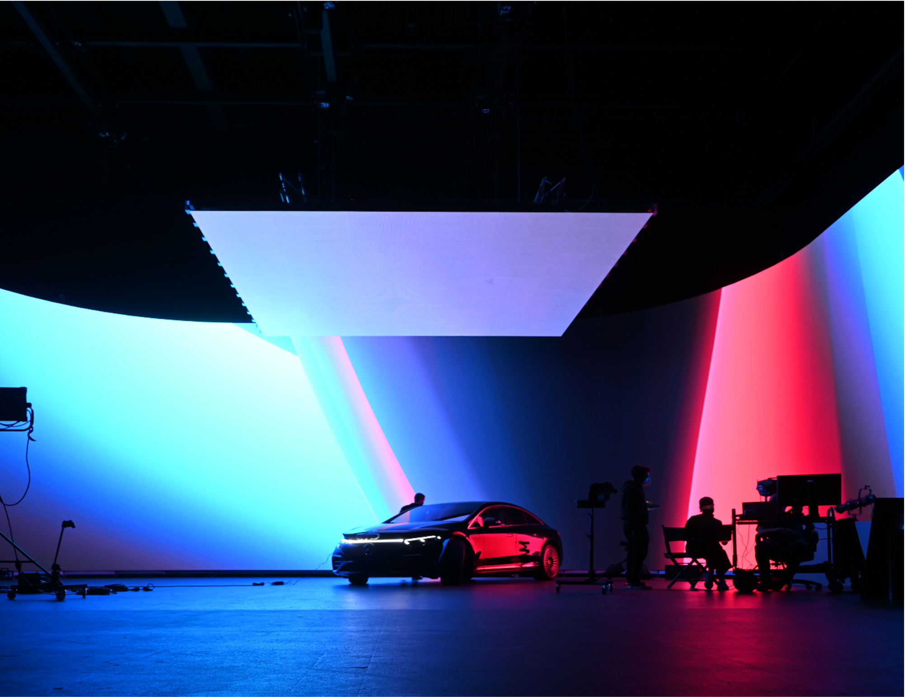].imgref[[Image: Adrian Weber & Halostage]]

---
.header[Virtual Production | *"The Volume"*]

.center[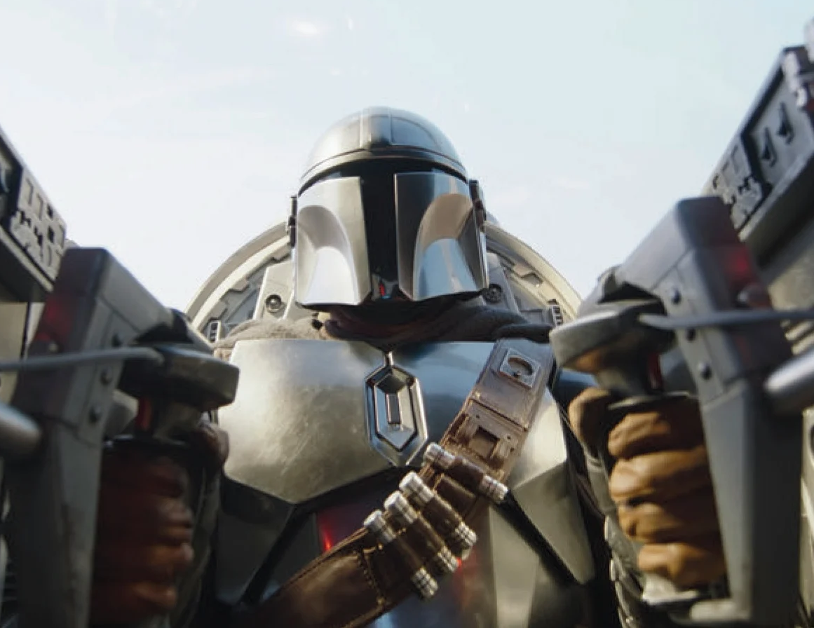 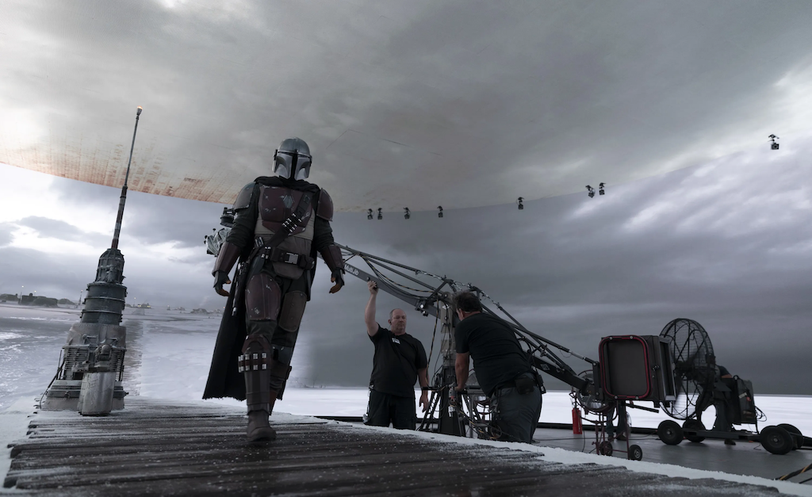].imgref[[[YouTube - The Virtual Production of The Mandalorian Season One](https://www.youtube.com/watch?v=gUnxzVOs3rk), Industrial Light & Magic]]

---
.header[Virtual Production | In-Camera VFX (ICVFX)]

## Advantages and Possibilities

--

**Creative & Visual**
* Final-quality visuals directly in camera  
* Real lighting, reflections, and large digital environments  

--

**Production**
* Flexible locations and time of day  
* Live CGI adjustments during the shoot  

--

**Planning & Sustainability**
* More predictable schedules and costs  
* Reduced travel and potential CO₂ savings  

???

ICVFX shifts complexity from postproduction into preparation and realtime systems, but in return provides immediate visual feedback and tighter creative control during the shoot.

Visual Quality & Set
* Immediate in-camera results
* Reflections, transparency, etc. (impossible with green screens)
* Gigantic sets: Large environments without physical restrictions
* Impossible sets: Floating elements, flight, extreme architecture

Comfort
* Immersive environment for the actors
* Studio shooting is often more comfortable than location shoots

Felxibility
* Shoot any location at any time of day (no night shooting)
* Change time of day during the shoot
* Modify objects live

Plannability & Budget
* Costs are fixed in advance
* Often cheaper than on-location production
* No weather days
* CO2 reduction

CO2 reduction:
* Disney estimated about 30 tons CO2 saved per avoided flight.
* Netflix reported 1.1 million tons CO2 in 2021.
* About half came from physical production.

* Shifting 10 to 20 locations into LED studio
* could save 300 to 600 tons CO2 per title.
* Reduction up to 30 percent.

---
.header[Virtual Production | In-Camera VFX (ICVFX)]

## Thechnical Challenges

There are many...

???

Artefacts & Limitations
* Scanlines, color shifts, banding, moiré
* Latency issues (sudden movements on set are challenging)
* SFX like fire, smoke, water, dust only limited

*depending on design - studio floor and ceil quickly in frame
*LEDs are not designed to be filmed - caveats:
*filmed screen? - moiré = structure of diodes filtered thr. cam sensor
*same on any dig. camera - blur
*actors close to wall
*wide angle shots
*increase res? - multiple machines
*the more the less stable system
*double res means 4x the px and machines
*poss better in future
*tracking - camera move speed
*steep -color shift

limiting camera movement

another visual artifact -  scanlines
that is because LEDs don’t dim, they just shine less often per second
get mostly fixed by synchronizing the refresh rate of the graphics cards with the cameras’ shutter
still appear on low LED wall brightness
on too high LED wall brightness the LED panels overheat and shift in color
there is a fixed range of brightness that works good

limiting camera exposure settings

next the red green and blue LEDs are only giving out narrow spectra of light 
the gabs make yellow disappear and poor skin tones
(research)
solution is to use practical light fixtures that augment the virtual environment
setting them up is tricky - any spill or bounced light
limited lighting possibilities

if all those challenges are not carefully handled on the film set - and want to “fix it in post” - you might wish later that you never shot ICVFX at all. 
I think Adam Smith will also elaborate about the pitfalls of this mentality.

Technical Dependency
* If a wall fails, production stops

Hard to quickly switch alternatives

---
.header[Virtual Production | In-Camera VFX (ICVFX) | Thechnical Challenges (Examples)]

## Synchronization

--

.footnote[[Johannes Steurer, ARRI: Outlook]]

.left-even[
**Problem**  
* Need for synchronized operations of all relevant devices (camera, camera tracking, sound, RTE, LED-wall)
]

.right-even[
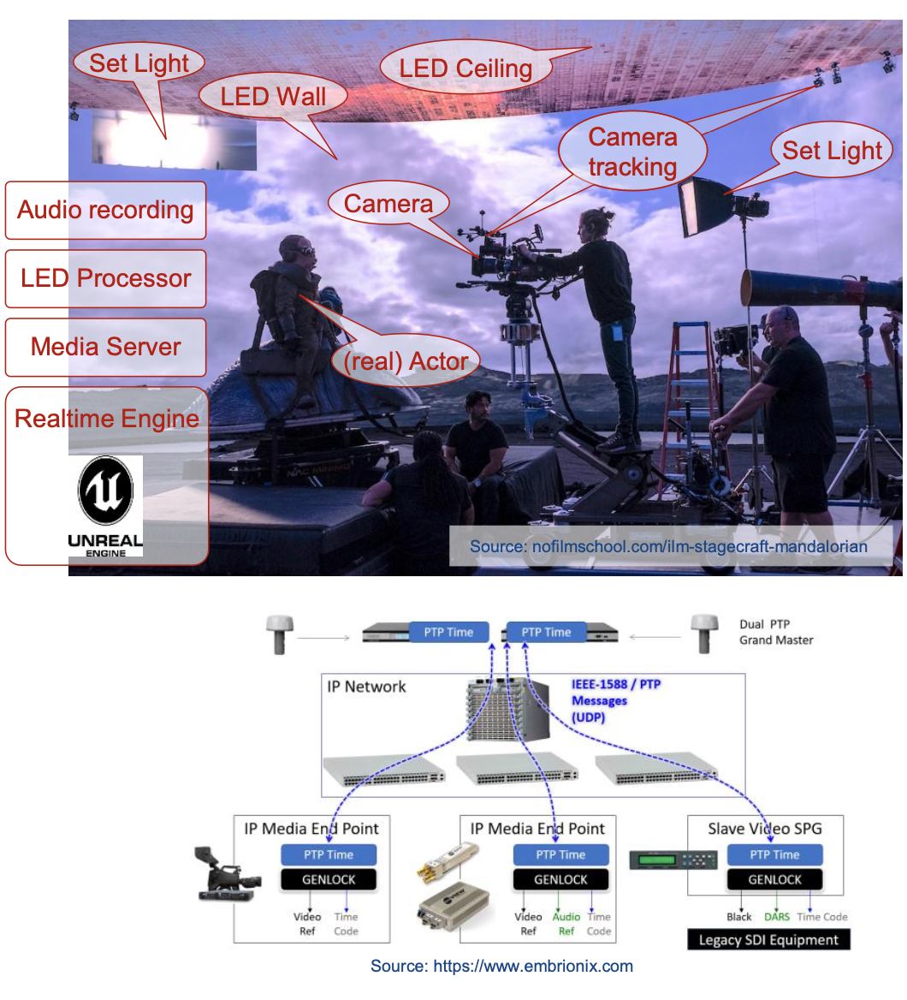
]

---
.header[Virtual Production | In-Camera VFX (ICVFX) | Thechnical Challenges (Examples)]

## Synchronization
.footnote[[Johannes Steurer, ARRI: Outlook]]

.left-even[
**Existing Approaches**
* Various solutions
* From “as fast as possible, but unsynchronized”
* To “all devices genlocked and with time-code”
* Custom fine tuning between camera and LED wall
]

.right-even[

]

---
.header[Virtual Production | In-Camera VFX (ICVFX) | Thechnical Challenges (Examples)]

## Synchronization
.footnote[[Johannes Steurer, ARRI: Outlook]]

.left-even[
**Future Solutions**
* Novel synchronization paradigm with PTP (precision time protocol)
* Higher precision, less delay, easier configuration, Internet-Protocol-based
]

.right-even[

]

???
PTP (Precision Time Protocol) is a network protocol that synchronizes the clocks of different devices to a highly precise shared time.

---
.header[Virtual Production | In-Camera VFX (ICVFX) | Thechnical Challenges (Examples)]

## Color Calibration

--

.footnote[[Johannes Steurer, ARRI: Outlook]]

.left-even[
**Problem**  
* LED wall is designed as a display with 3 peaks in the spectral power
distribution
* Illumination of the physical set should mimic the spectral power distribution
of sunlight

]

.right-even[
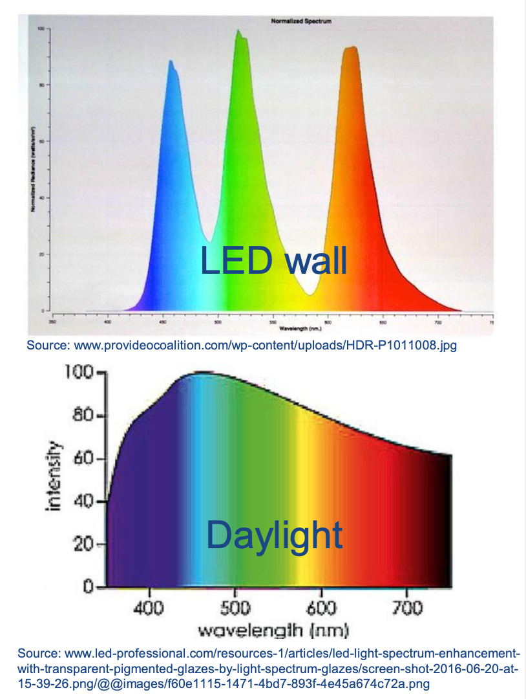
]

---
.header[Virtual Production | In-Camera VFX (ICVFX) | Thechnical Challenges (Examples)]

## Color Calibration

.left-even[
**Problem**  
* LED wall is designed as a display with 3 peaks in the spectral power
distribution
* Illumination of the physical set should mimic the spectral power distribution
of sunlight
* Skin tones will look unnatural under LED wall illumination
]

.right-even[
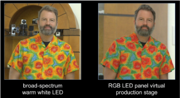.imgref[[Image: LeGendre et al. DigiPro 2022]] 

.footnote[[Johannes Steurer, ARRI: Outlook]]
]

---
.header[Virtual Production | In-Camera VFX (ICVFX) | Thechnical Challenges (Examples)]

## Color Calibration
.footnote[[Johannes Steurer, ARRI: Outlook]]

.left-even[
**Existing Approaches**
* Eyeball color calibration and grading for each setup / scene / take
]

.right-even[
.imgref[[Image: LeGendre et al. DigiPro 2022]] 
]

---
.header[Virtual Production | In-Camera VFX (ICVFX) | Thechnical Challenges (Examples)]

## Color Calibration

.left-even[
**Future Solutions**
* Full-cycle automated calibration from original background scene to LED
display to camera, including “most natural lighting” of the foreground scene
* Fully integrated lighting of physical foreground and virtual background
]

.right-even[
  

.footnote[[Johannes Steurer, ARRI: Outlook]]
]

---
.header[Virtual Production | In-Camera VFX (ICVFX) | Thechnical Challenges (Examples)]

## Moiré

--

.left-even[
**Problem**
* LED wall and imaging sensor both have rectangular pixel patterns
* During capture these patterns overlay and may cause aliasing artefacts,
depending on the distance and focus setting of the camera relative to the LED
wall
]

.right-even[
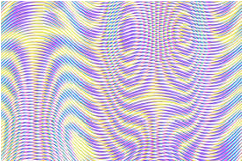  
  
.footnote[[Johannes Steurer, ARRI: Outlook]]
]

???
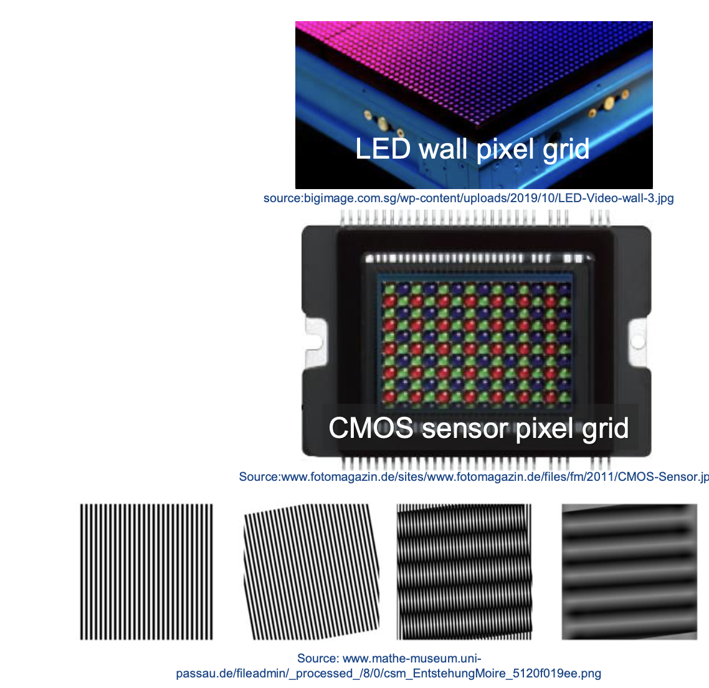

---
.header[Virtual Production | In-Camera VFX (ICVFX) | Thechnical Challenges (Examples)]

## Moiré

.left-even[
**Existing Approaches**
* Try and avoid camera positions where the moiré effect is obvious
* Fix it in post
* High quality OLPF (optical low pass filter) in the camera with optimized lenses
]

.right-even[
  
  
.footnote[[Johannes Steurer, ARRI: Outlook]]
]

---
.header[Virtual Production | In-Camera VFX (ICVFX) | Thechnical Challenges (Examples)]

## Moiré

.left-even[
**Future Solutions**
* Smaller pixel pitch on the LED wall (2.6mm / 2.3mm / 1.9mm / …)
* Further optimize the optical design of lenses
* Predict and warn when/where the moiré effect may occur
* Machine learning approaches
]

.right-even[
  
  
.footnote[[Johannes Steurer, ARRI: Outlook]]
]

???
Pixel pitch is the distance between the centers of adjacent LED clusters (pixels) on the panel, usually measured in millimeters. If the pitch is smaller, the LEDs are physically packed closer together. That means higher pixel density and a smoother image.

On LED walls, a smaller pixel pitch means the pixels are packed more densely, producing a sharper image and making the screen look smoother and less “grid-like” on camera.

---
.header[Virtual Production | In-Camera VFX (ICVFX)]

.center[
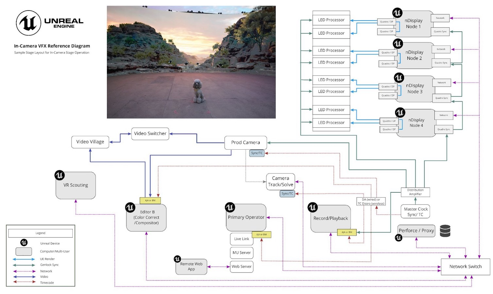 
]

---
template:inverse

# Implications

---
.header[Implications]

## New Production Workflows

* VFX starts in pre-production
* All steps are more interconnected
* Different planning and preparation times

???
Everything is more interconnected.
Requires more planning and more preparation time.

---
.header[Implications | New Production Workflows]

.center[]

.imgref[[Image: [Unreal Engine - Virtual Production](https://www.unrealengine.com/en-US/explainers/virtual-production/what-is-virtual-production)]]

???
Traditional film production is a linear process that moves from pre-production (concepting and planning), through production (filming) and finally to post-production (editing, color grading, and visual effects). Since you don’t get to see how it all comes together until the very end of the process, making changes is very time-consuming and costly; you sometimes even have to start over from scratch. The result is that filmmakers’ ability to make creative decisions on the fly is largely constrained. 

---
.header[Implications | New Production Workflows]

.center[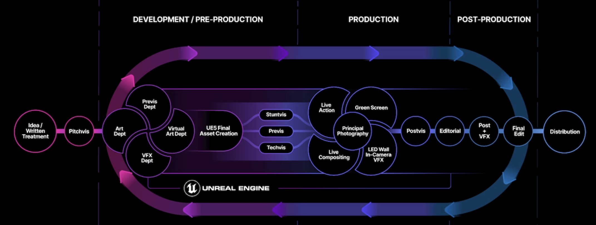]

.imgref[[Image: [Unreal Engine - Virtual Production](https://www.unrealengine.com/en-US/explainers/virtual-production/what-is-virtual-production)]]

???
In contrast, virtual production erodes the boundaries between pre-production and the final result, enabling directors, cinematographers, and producers to see a representation of the finished look much earlier on in the production process, and therefore iterate quickly and inexpensively. The result is that they can refine the narrative to reflect their creative intent, ultimately telling better stories while simultaneously saving time and money.

  
---
.header[Implications]

## New Roles and Job Profiles

???

New roles:
Many new job profiles.
They must first be established.

New set conditions:
New aspects must be considered on set.
Often not enough time allocated.

Set your expectations:
The clearer decisions are made before the shoot,
the more targeted and cost-efficient the production becomes.

--

.left-quarter[
The Brain Bar...
]

--
.right-quarter[
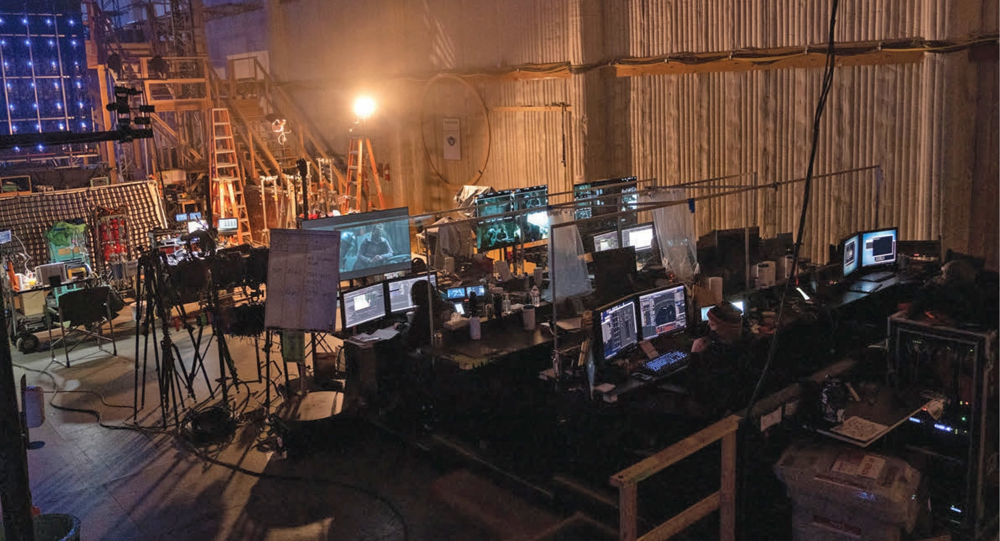 .imgref[[[theasc](https://theasc.com/articles/stages-of-color-book-of-boba-fett)]]
]

  
---
.header[Implications]

## New Roles and Job Profiles

.left-quarter[
The Brain Bar...
]

.right-quarter[
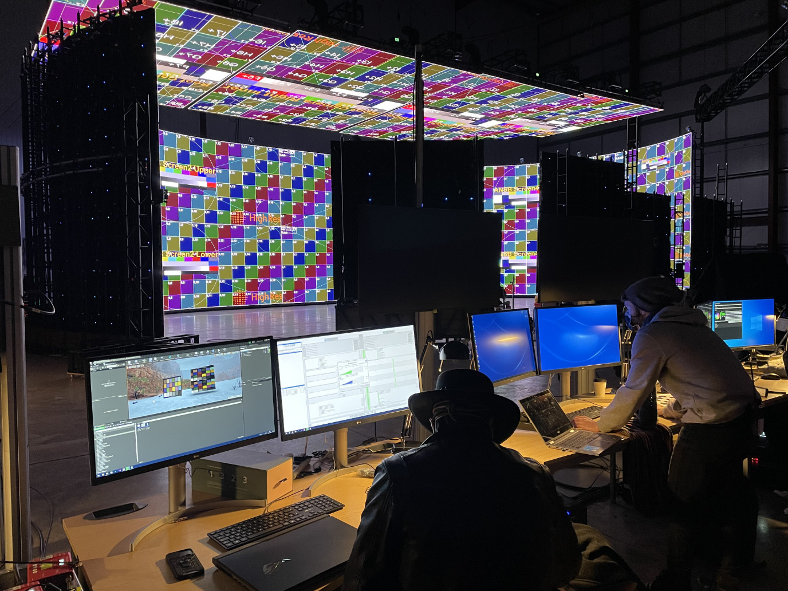 .imgref[[[Peter Canning](https://pomfort.com/article/expert-interview-virtual-production-peter-canning/)]]
]

???

New roles:
Many new job profiles.
They must first be established.

New set conditions:
New aspects must be considered on set.
Often not enough time allocated.

Set your expectations:
The clearer decisions are made before the shoot,
the more targeted and cost-efficient the production becomes.

  
---
.header[Implications | New Roles and Job Profiles]

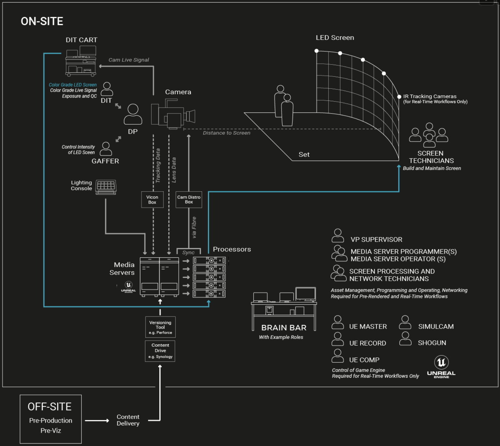 .imgref[[[Peter Canning](https://pomfort.com/article/expert-interview-virtual-production-peter-canning/)]]

???
* Near-term: AI-assisted 3D content generation for LED backgrounds, transparent LED panels, seamless floor-to-wall volumes
* The shift from tool adoption to workflow integration: the field needs codified pipelines, not just hardware upgrades

---
template:inverse

## *Is it you we are looking for?*

---
.header[Introduction to Virtual Production Techniques]

.center[
 <video width="1000" controls>
  <source src="./img/mandalorian_01.mp4" type="video/webm">
</video>  
]

.footnote[[[YouTube - The Virtual Production of The Mandalorian Season One](https://www.youtube.com/watch?v=gUnxzVOs3rk), Industrial Light & Magic]]

---
template:inverse 

.center[

]

# *The End*

### Prof. Dr. Lena Gieseke | l.gieseke@filmuniversitaet.de  

#### Film University Babelsberg KONRAD WOLF

